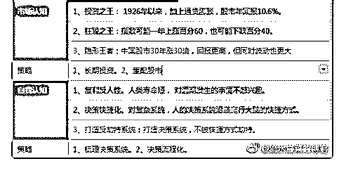

# 白菜闲谈投资 22：

流水白菜 : 白菜闲谈投资 22：股市的秘密，已经破解了

投资的道理，你必须有能力，把它想清楚。最后，用一个公 式，或者三两句话总结得出来。这样，投资世界的分辨率就 大幅提高了。

（一）

比如，股价= 估值 * 盈利；

估值提升，盈利提升。提升其中一项，你就赚钱。两项都

增，就是双击。

你还知道，好公司，就是未来盈利增速快的公司。巴菲特当

年买可口可乐，就是大概估算，可口可乐未来十年，每年增

长 15。（参见前面的 DCF 估值法）

当我们大脑有这个公式的时候，我们未来就能找到大量例子

来证明这个公式的正确。我们在买股票前，就自动用这个公

式去选取标的。

（三）

投资的收益 = 本金 * 复利 * 复利的时间。

这个公式，有人看到本金的重要性，所以他投资股市，是和

买房子一样，有首付，有月供。不断增加本金的基石。

有人看到复利的重要性，知道每提升两个点，三个点，都会

决定未来。所以，他们想尽一切办法去提高。国债只比银行

理财高 0.5-1 个点，就会被哄抢！

有人看到时间的重要性，下决心活长一些。或者更早开始投

资。

公式在哪里，每个人可以由此制定自己的大策略。但要小心

一些的是，复利不宜太高，10-15 为宜。不是再高做不到，而 是在乘法运算中，0.5 就意味要用 2 来弥补。降低预期，对于长 期投资来说，一是不会弄险去跨越高的栏杆，二是会心平气 和，看惯涨跌。

（四） 绝大多数人，都会在股市的涨跌中幻象丛生，或喜不自胜或 愁云惨淡。从指数说，股市年均增速，其实就是个位数。美 国牛市十年了，你算下来，每个月的平均涨幅都不到一个 点。

股市的投资方法，投资思路，没太多好说的。因为想明白 了，其实股市就是一张前人走了上百年的地图，已经没有秘 密。下图，就是秘密。

（五） 这两天如果有空，我还是把中国平安这几年公开日的 PPT，整 理一下，做个解释版本，帮助大家看。保险股最近受到双重 短期因素影响：股市大跌，十年期国债跌到 3。表现很差。但 既然是短期因素，就总会雨过天晴。下雨天，我们研究那些 不变的东西

2019-08-10(27 赞)

评论区：

Pippo : 股市的秘籍早已破解 “傻子 ”因“太懒惰”长期赚钱。而 “聪明人”时刻亏钱 因为聪明人 太聪明了 ，时刻都

要“动” 。是 这也懂（动）那也懂（动）。就是资产不动。[微笑]

素刚 : 感谢分享

司机 : 看语气，有欧神的风范。有点儿意思了

青木瓜 : “不是再高做不到，而是在乘法运算中，0.5 就意味要用 2 来弥补”。白老师这句话怎解？

流水白菜 : 10✖ 0.5＝5，要回到 10，要翻倍。所以投资果百分 50，要回答起点，不是涨百分 50，而是要翻倍

庄天飞 : 这张附图很有价值，期待更多类似的资料。

流水白菜 : 这个附图是我自己做的。是我思考后的归纳总结

庄天飞 : 看得出是历经沧桑后提炼出来的系统性总结[强]

关注公众号"懒人找资源"，星球资源一站式服务