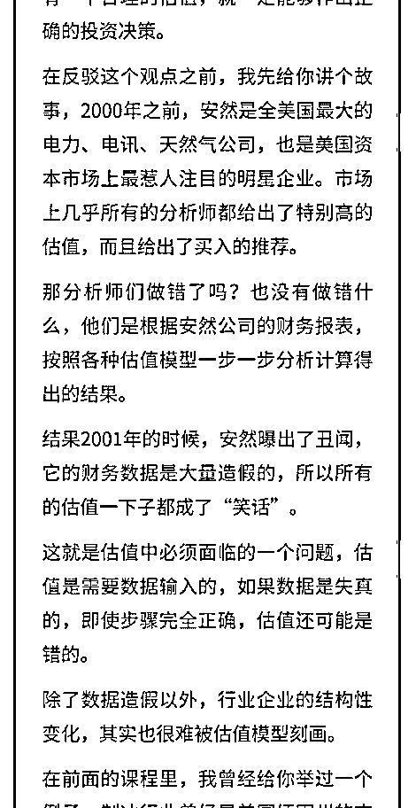

# 两种估值方法

流水白菜 : 两种估值方法

2019-08-06(14 赞)

评论区：

Henry : 帮你现在高处，重新理解财富

一蓑烟雨任平生 : 白菜老师，我不太明白为什么用未来的自由现金流折现值加和与当前市值做比较，而且每一年的折现值

都加和难道没有重复吗

流水白菜 : 股票和债券（银行理财）是一回事。只是你买股票，希望回报高些（因为有风险）比如买 1 万元，希望每年能给

你 9 个点。这个想通了，就明白了

Acisme : DCF 算法里 增长率是 ROE+股息率的和吗？

流水白菜 : 增长率就是业绩增长率。ROE 是净资产收益率

石海天 : 作为小股东，把市盈率当作回本时间。是不是还要考虑分红率？我总觉得分红给我的才算自己的。再就是卖出的

股份

流水白菜 : 市盈率就是一个估值方式，是一个视角。每个人可以有自己的方式（视角）判断价值

关注公众号"懒人找资源"，星球资源一站式服务