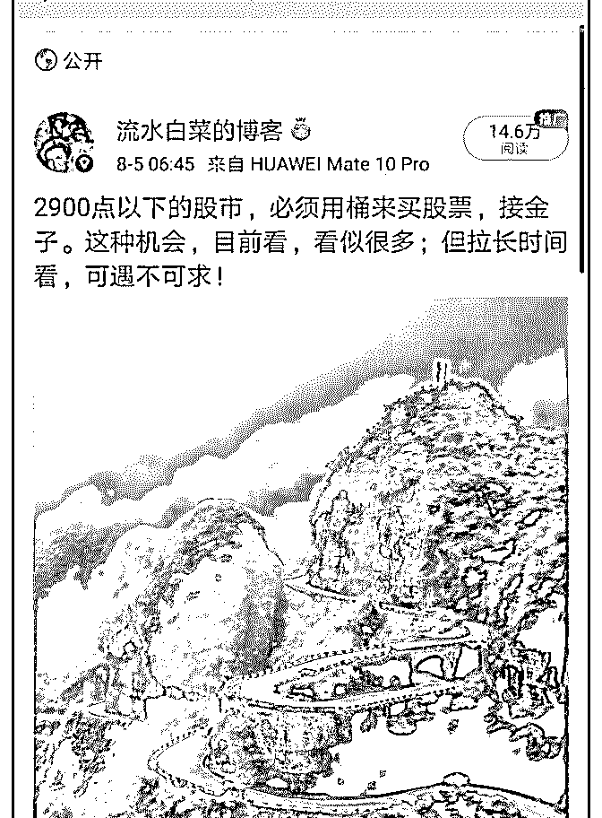
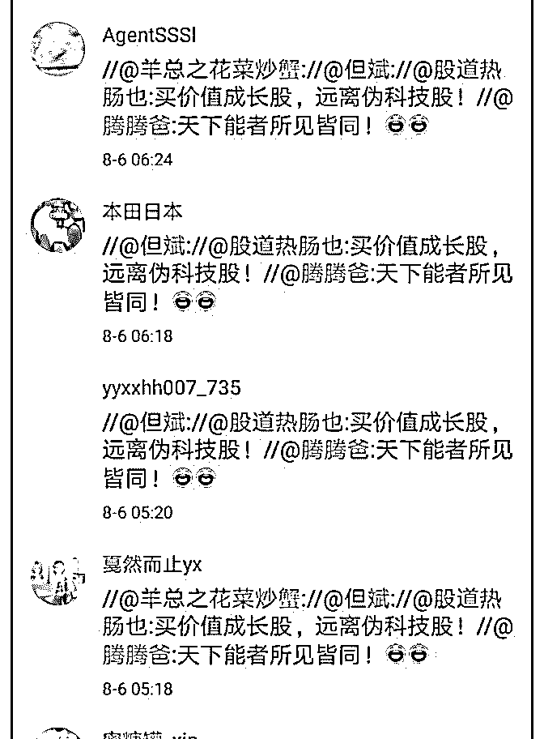

# 白菜投资闲谈 20：

流水白菜 : 白菜投资闲谈 20：市场暴跌下的三个策略

（一） 如果上一年盈利，我的习惯是心理账户清零，然后下一年， 从零开始算起。2017 年清零后，2018 年，我的心里账户成 本，变成 3300 点。一年半过去，目前成本线下降到 2900 点。 算跑赢市场百分 10。跑赢指数，在我来说，是非常有价值 的。因为合理估值下买入的指数，长期年回报 10 个点。跑赢 指数，意味着长期回报更好。

（二） 一个低估的市场，策略往往非常简单，主要有三个。第一， 股票分红再买。第二，股票中签卖出后再买。第三，有三五 年用不到的闲钱，再买。

目前就是这么一个市场。市场也许短期还会大幅下跌，但这 对于有办法再买的人，是个再买的机会。对于满仓的人，是 个休假的时候。

（三） 投资股市，我们一般赚的是企业的钱。一群人，投资一家企 业，这家企业，长期来看，每年回报百分 10，远高于存银行 买债券。很多人就乐意买，虽然有些年份无法兑现。

有些人想多赚点，说，我们来赌博吧。也许能赚得更多。于 是，一部分人加入赌局。假设他们每个人投资 100 万，每年回 报 10 万。赌下来，有些人每年回报变成了 15-20 万，有些人变 成了 1-2 万，甚至亏本。

（四） 没参加赌局的人，他们手上的股权，因为赌局，会变得有时 多有时少。但他们知道，市场即便暴跌，其实就是赌场的波 动。企业的回报，长期还是百分 10。不参加赌局的人甚至 想，当赌局造成的低价时，他们可以达顺风车买点。当赌局 造成的高价时，他们也可以达顺风车卖些。赌局，使得这些 拿企业固定回报的人，多了一份意外的收益。所以，渐渐 的，他们喜欢上“市场先生”。但他们也有痛苦的时候，有些 时候，市场大甩卖的时候，他们没钱。

（五） 股市有 100 多年历史了。人类的本性没有年，所以，股市一直 受到双重影响。一边是企业盈利，一边是人性驱动。

所以，做好投资，无非做清楚两点，看紧自己投资的企业。 理解利用市场的人性波动。

投资没有捷径，研究企业很难，理解掌控自己的操作系统也 很难。前者需要海量的时间精力，后者能做到的，一秒钟就 做到了

附：这个点位，我认为老司机们的策略都差不多：附昨天发 的微博

2019-08-06(23 赞)

评论区：

fan : 菜哥，我满仓了

茶杯 : 现在当股票跌的时候，我都想哈去年这时候股价比现在还跌蛮多，现在 2700 点，去年这时候差不多，但我的股票整体

比去年高了百分之 30 左右，股价高不高，我是看当前的净利润的，虽然去年的股价低点，比如平安保险一年后，净利润基

本涨了百分之 50 左右，所以股价我感觉和去年的现在也差不多。。。感觉好的公司如果想拿得住，肯定要跌的时候有阿 Q

精神，涨的时候就想哈历史高点。。。呵呵

流水白菜 : 嗯。只要股市以后还会关注公司的盈利，关注企业的分红，那么，我们只要对企业判断是正确的，长期，持续

的赚钱，就是必然的。

关注公众号"懒人找资源"，星球资源一站式服务