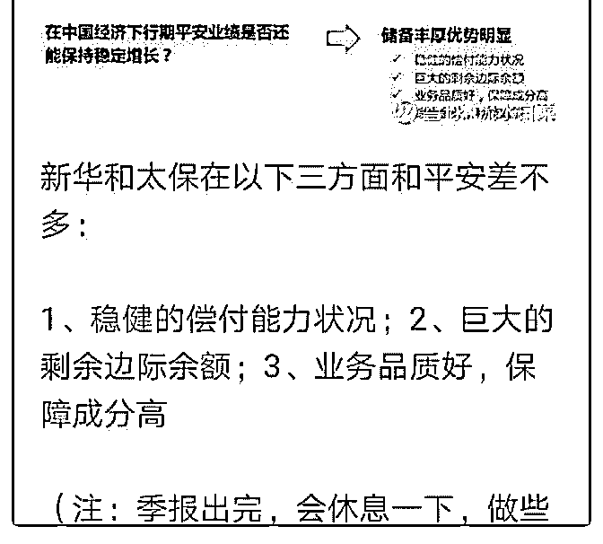

# 周末闲聊 2：我经历

流水白菜 : 周末闲聊 2：我经历过数百次市场的大跌

（一） 很对年以前，我在一个价值论坛里玩，当时交流的几位，后 来都成了名人。董宝珍，释老毛，草帽路飞。。。那时候是 11-12 年吧。贵州茅台还没跌破 150，更没跌破 150 后涨到

1000。那时候草帽兄还一直希望我能整理保险公司的数据， 还没等到不耐烦，自己去整理了，并且写了几万字的分析文 章。嗯，释老毛也还没有成为大 V。嗯，差点忘了，还有潜龙 在渊。

（二） 投资是件很有趣的事情，因为这么多年过去了，我还觉得马 上上了论坛，马上可以和他们聊天讨论。时间不觉察的过 去。我终于明白，当时我们能聊在一起，是因为即便很多方 面我们有分歧，但有一点，我们是一样的。就是我们对待投 资非常认真。

（三） 我没有什么志向，他们现在都跑去做私募基金经理了。（释 老毛很久没联系，不清楚）。而且都做得风生水起。成绩非 常好。原先我们都是偏好蓝筹，偏重业绩。14-15 年，17 年， 对我们来说，是两次翻倍的大牛市。所以，业绩好正常。

（四） 那一年，董宝珍先生和媒体打赌，说茅台很有价值，绝不可 能跌破 150。结果，世事难料。那些年，我提过很多次，每 年，中国平安都有很多场想不到原因的暴跌。投资是条荆棘 之路，我们都被股市磨得皮糙肉厚，所以，对于下跌，已

经“噢，知道了”这样的淡漠。

（五） 股市下跌的时候，有钱的，可以买那些平日里垂涎的好公 司。所谓大桶接金。满仓的，只要不是太贪心，知道买到底 部就很好了。抄底，可遇不可求。

股市最大的幻象，就是让你觉得可以很快赚钱。但我们算后 就知道，每个月只要百分 2 的收益，十年就能十倍。所以股市 的真面目，总是波动为主。

（六） 周末了，不要想股市的事情。除非是，研究公司。我把去年 股市暴跌后写的文章附在后面。

2019-08-02(31 赞)

评论区：

Pippo : 先赞后看是传统

人生的玩家 : 在参与投资的整个过程中的时候，总感觉很漫长，麻烦和曲折不断，一经历过，回头看感觉也就是那么一下

的事情[捂脸] 还很年轻 24 岁，希望白菜一样吧，专业化投资人同时也找到内心的平静。

流水白菜 : 看看股市的历史走势图，规律就在其中

朱涛 : 每次看完老师的分享都感觉醍醐灌顶

关注公众号"懒人找资源"，星球资源一站式服务