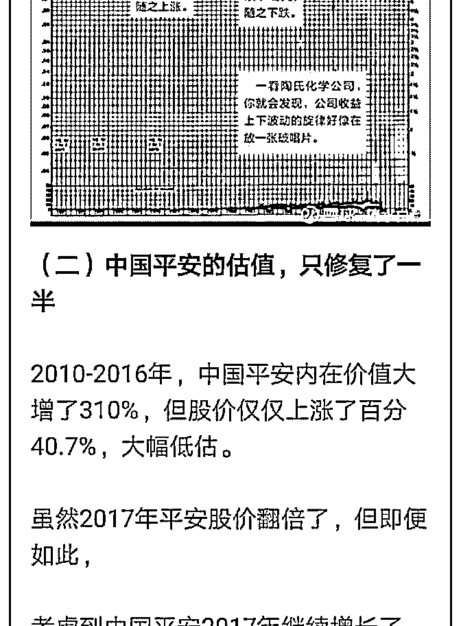

# 白菜闲聊投资 18：

流水白菜 : 白菜闲聊投资 18：什么是投资的顶级策略

（一） 三句话看懂保险股： 1.行业 5 倍以上发展空间；

2.政府持续推动行业快速发展；

3.股市相对低位，易“戴维斯双击”！

（二） 长线视角下，很多事情就很清晰，包括行业思考，也包括持 股策略：

1.我的年回报目标 10-15。

2.即便估值不回归，保险股也能满足预期。

3.只需简单持股，如果 5 年翻倍，就可以达到预期的上限。

（三） 百分 90 的人做不到长期年复利增长百分 10。百分 99 的人做不 到年复利增长百分 15。所以，这个策略，一定是顶级的策 略。

（四） 过去 20 年，我见过最顶级的策略只有两个： 1.有新不炒股，无新去买房。

过去 20 年，（18 年以前）新股年 15 的回报率。没有新股的时 候，往往是楼市的低点

2.封闭式基金打 5-7 折的时候买入。 之所以是顶级的策略，就是小学生都一看就懂，且几乎 0 风险

下完成的高收益。

如果一个策略，确定性越高，就越值钱。小学生水平都能看 透，那么，确定性就极高了。昨天提到，预期上涨百分 20， 如果概率百分 80，那么预期回报是 16。预期上涨百分 50，概 率百分 20，那么预期回报只有百分 10。前者的策略优于后 者，凭借的就是确定性。

对大多人，理解保险股不容易。但有一个小学生都能理解 的。3000 点以下，未来几年看肯定便宜。

有些人说我风格现在有点像李大霄。只不过我们都在做一件 事，找一个小学生都能理解的事，来证明投资，需要一点常 识。需要少一些贪心。毕竟，随便战胜百分 90 以上的策略， 价值就在那里。

附：去年一篇旧文，写中国平安的

2019-08-01(16 赞)

评论区：

孙乙天 Louis : 这两天一直在加太保，直到加不动为止[微笑]

陈梓涵 : 老师，图片里的文章提到： 2010-2016 中国平安内在价值增长 310%，这个的计算方法是怎么算的？想知道下目

前新华，太平，太保是多少？

流水白菜 : 是每年累计起来的。其他险企也是高增长，所以现在 EV 低。具体没算。

一蓑烟雨任平生 : 请问白菜老师，2017 年平安实现的新业务价值，到未来能得到 1350 亿元的利润，是一年释放 1350，还是分

多年释放呢

流水白菜 : 未来有一年，释放的利润必然超过 1350 亿。一个人，他赚的钱比如 5 万，花的钱一开始是 2 万 3 万，存款一直增

加。假设赚的钱不再增加，那么，存款什么时候不再增加？就是花的钱等于赚的钱

关注公众号"懒人找资源"，星球资源一站式服务