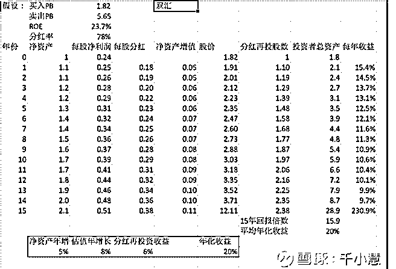
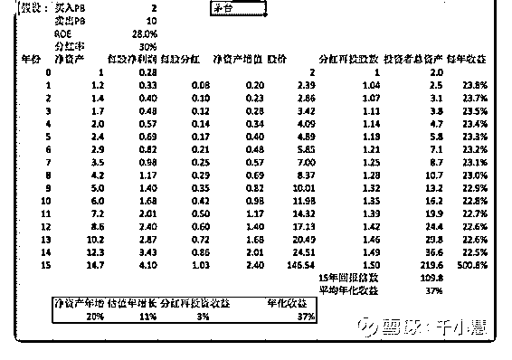

# 投资闲聊 15：立足

流水白菜 : 投资闲聊 15：立足估值，思考未来！

（一）

我一般不讨论平安银行。因为平安银行我一说，现在估值

1.08，招行 1.75，如果估值和招行一样，那么，还有百分 60 的

上市空间。那么，持有招行的朋友心里就想：你每次考试就

考个 60-70 分，我每次 90 分，能一样吗？确实，两家 ROE 还有

其他指标，距离还比较大。

但投资平安银行，我的想法可不仅仅是摇新。我还认为，平

安银行背靠平安，以零售为赛道，又持续对科技的投入。未

来，如果变身招行成功，这可是百分 60 的利润空间！靠盈利

复合增长，那可需要三四年啊。

如果没成，那 1.08PB，估计考个 70-80 分也能撑得住。

（二） 关于估值提升，我有很多思考

1、牛市的本质，是估值走牛。大多公司，只提供波动，而不 提供价值。牛市结束，估值又下来。 2、牛股的第一份利润：估值走牛。

3、牛股的第二份利润：盈利增长。

4、估值走牛的股票戴维斯双击。反之，如果牛股的盈利能力

下降，那么，估值就会下来。估值走熊，非常可怕。

5、要注意：股票涨到一定程度，高 ROE，必须借助极高分红

的股票，长期投资，可能回报会比债券好一点点。如此而

已。

6、寻找估值能提升的好公司，是投资最重要的事情。

（三） 网友千小慧的文章《查理芒格说：股票回报率等同于 ROE－

－探究 ROE 与回报关系》中，有一些整理的表格和数据，并 且得到了一些非常不错的结论：

过去 15 年贵州茅台涨了 130 倍，年化 38%。市净率 PB 从 2 涨到 了 10。年化收益率就成了 37%, 其中 ROE28%，平均分红率 30% ，估值贡献的年增长就有 11% 。（估值和盈利一起贡献 了股价增长）

五粮液，ROE 不如茅台，增长不够快 平均 15 年 roe 年均 20.8%，分红率 22%，年化回报率为 26%，其中净资产年增长 贡献 16%，估值贡献年增长 6%。（估值和盈利一起贡献了股 价增长）

双汇发展，多年平均 ROE23%，分红率 78%，十五年前 PB1.82，17 年底 PB5.65，理论计算出年化收益为 20.2%，其中 成长只贡献了 23%x(1-78%)=5%，大部分贡献来自于估值上涨

。

（四） 所以投资一只股票，核心还是这家公司的未来。未来，这家 公司的盈利前景如何，是快速增长，是合理增长，还是开始 衰退。这个道理，其实我们都懂。两个大学毕业生，月薪一 开始都是 5000，但里面肯定有能 5 万的，找出来。一群中年 人，都是月薪 5 万，有些，还在走上坡路，有些，可以维持， 而有些，前景堪忧。分辨出来。

投资，立足今天的估值，立足公司未来的盈利增长。算对 了，就赚钱。

[中](https://xueqiu.com/3837137260/111774218)[千小慧](https://xueqiu.com/3837137260/111774218)[:+](https://xueqiu.com/3837137260/111774218)[查理芒格说：股票回报率等同于](https://xueqiu.com/3837137260/111774218)[ROE](https://xueqiu.com/3837137260/111774218)[－－探究](https://xueqiu.com/3837137260/111774218)  [ROE](https://xueqiu.com/3837137260/111774218)[与回报关系](https://xueqiu.com/3837137260/111774218)[+](https://xueqiu.com/3837137260/111774218)[查理芒格说，股票的收益等大致等](https://xueqiu.com/3837137260/111774218)[...](https://xueqiu.com/3837137260/111774218) 2019-07-29(10 赞)

评论区：

如意 : 8.5 的平安银行没拿住

流水白菜 : 可惜了

流水白菜 : 刚看到一份平安银行的研究报告，顺便放在这里。

天真有邪 : 按理说农行能考个 65 分吧，兴业也能考个 70 分，但是估值还没 1.那是不是说农行和兴业相比于平安银行更具有投

资价值。

流水白菜 : 估值由未来盈利决定，平安银行未来可能会跳升到一线银行，实现逆袭。也就是，如果认为平安银行，未来考

试不能考前几，那么，目前投资价值就有限。投资其他银行股，逻辑也一样，如果认为它未来会非常出色，那么，估值就

必然大幅提高

关注公众号"懒人找资源"，星球资源一站式服务