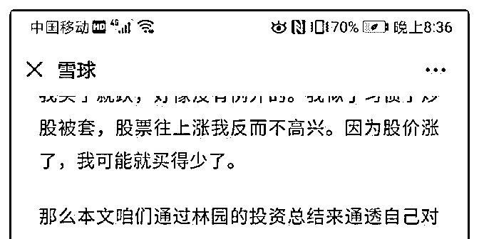
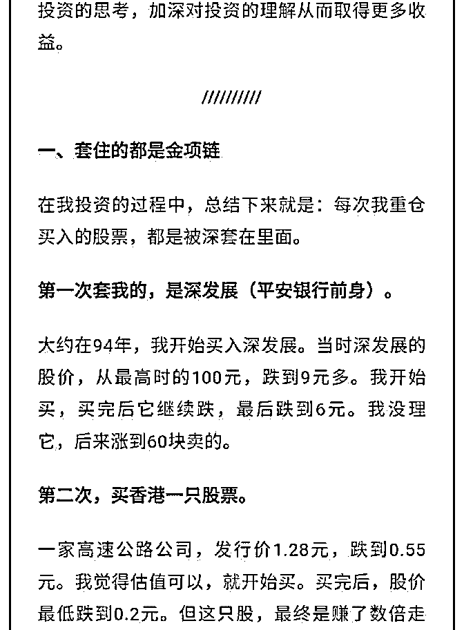
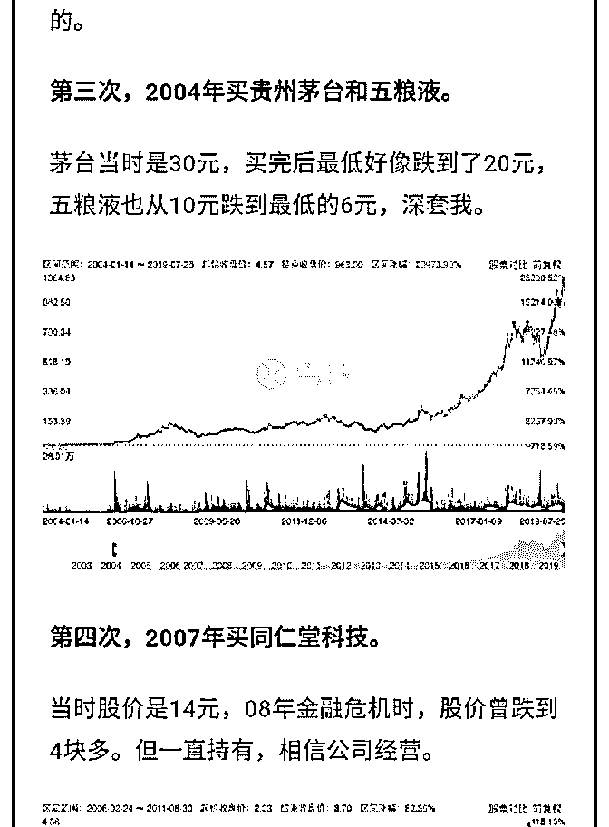
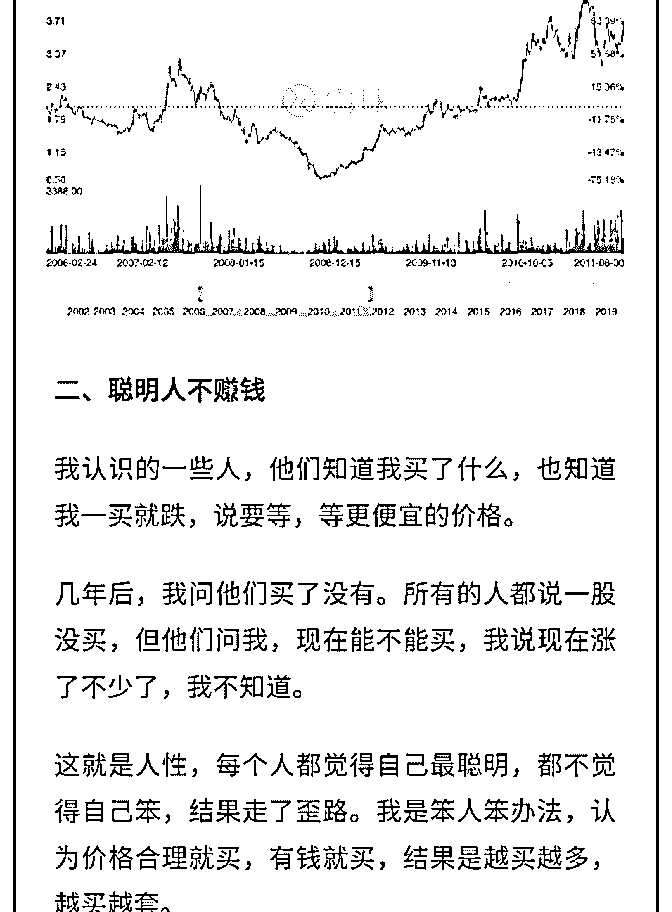
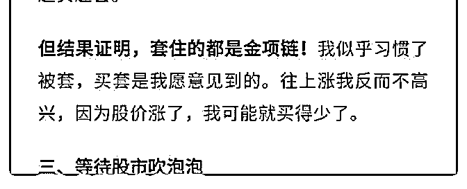

# 白菜闲聊投资 14：

流水白菜 : 白菜闲聊投资 14：股票被套住了怎么办？

股票不涨怎么办？我是做长线的，但我有时候也会迷惑，也 会惆怅，也会郁闷。做中短线的，估计有些股票几天不涨， 几周不涨，就心急如焚了。这篇文章，我只谈长线。中短线 我不懂。

（一）

2016 年 11 月份，我发了一篇文章，将它置顶，题目是：不动 如山，静等平安 3 年翻倍 (2016-11-13 20:22) ，但过了 100 个交 易日，到了 2017 年的 5 月份，平安才开始上涨（近半年多的时 间一直小幅上下波动）。半年，算快的，11-14 年，平安更是 经历了三年多的不涨，但 14 年后来涨了一下，算上去，11-15 年，每年百分 15 的复利回报。

（二） 中国平安的持股经历算不错的。2015 年底，我买入中国太 平，股价不仅不涨，还跌得让人不忍直视。到 2017 年初，中 国太平还只有 15 元多点。而我的成本价在 18-19 元左右。2017 年，中国太平从 15 元多坚持到 20 元，多次有卖出的想法，但 还是忍到 20 元才减半持有。把中国太平从总仓位的百分 40 减 到百分 20。到 32-33 元，把它减到百分 10 的仓位了。算了下， 两年，年复利回报超过百分 20。运气不错，但过程，和很多 人想的肯定不一样。

（三） 其实不只是股票，很多时候，指数也不涨。谈谈美股：1979 年的美国，由于股市多年不涨，《商业周刊》写下了“股市已

死（The Death of Equities）”的著名文章，理由是年轻人正在 远离股市，由于利率高企，买货币基金就可以轻松击败股 市，历史证明买房可以抗通胀、而买股票则会颗粒无收。这 其实和中国目前的市场情绪有着惊人的类似。但事后来看，

《商业周刊》的这个判断其实是大错特错。从 1980 年初到现 在，标普 500 指数涨幅高达 25 倍，年均涨幅高达 8.4%。而同期 持有 10 年期国债的年均回报率大约为 6.3%，货币利率均值大 约为 4.8%，而持有房产的年均回报率仅为 4.3% 。

所以，不涨，恰恰是持有或者买入的理由。

（四） 股票不涨，你要做的，第一，是确认你持有的股票是低估 的。第二，你要明白股票为什么会经常低估

低估只是股市的一种状态：就如 06 年初 1000 点，07 年底的时 候股市 6000 点。15 年 5000 点现在 3000 点不到。股市会有 1000 点的时候，也会有 6000 点的时候。低估只是波动性的一种状 态，正如高估是波动性的另外一种状态。 股票不会永远低估，也不会永远高估，价格永远围绕着价值 波动，远必拉回。有人曾经比喻上市公司的股价就是一个喝 醉酒的人，虽然他会怎么走无法判断，但因为这个醉汉的身 上绑着一根绳子，因此，他势必回到价值的这根柱子上。

（五） 其次，你要明白，低估意味着什么？

有人担心买入的股票一直被低估。但一直被低估，就意味着 持有者长期的收益一直高于债券很多，对一般投资者这是好 事情。因为每年大多人都会有收入结余，然后这些多出来的 钱有好于债券的投资品种。每年百分 10，10 年后 2.59 倍，可以 了。 每年百分 15，10 年后 1 元变 4 元，是大多人的目标。

有些人目标比这些高，那么，低估对他们来说，就是煎熬。 对于想飞的人，奔跑都是一种折磨。

（六） 最后，我们一定要明白，股票不涨，你最应该做的有三件 事：

第一，降低年回报预期。 第二，延长回报的时间。

第三，平常，多运动，看书，和家人在一起。没必要从早到 晚盯住股票----股票不是玩游戏，刷抖音，不会给你及时反 馈。

写完的时候，刚好看到雪球推一篇谈林园投资的文章，和我 的观点一样。就附在后面

2019-07-26(25 赞)

评论区：

宁静致远 : 中国太平这一段，历历在目，仿佛昨日，时光荏苒啊。

Pippo : 时光一逝永不回 往事只能回味 忆童年时竹马青梅 两小无猜日夜相随[月亮]

流水白菜 : [呲牙]

流水白菜 : 每天，我们都行走在历史中。今天的一切，都是明天的故事

石海天 : 看了这文章，我再多陪伴一下红利指数

安 di : 想起了持有平安那段刻骨铭心的日子，一路跌，一路买，等平安 20 元的时候，反而没钱买了，只能死守，好像有一两

年平安一直是低于我成本价，像个傻子一样坚持。现在想起来，还是当时买得贵，买得便宜，心理会好受点。时至今日持

有平安超过五年了，也成为我第一大持仓股，感恩，幸运!

流水白菜 : 嗯。当时持有平安，两大好处。第一，赚了很多很多钱。第二，赚了很多很多投资经验

关注公众号"懒人找资源"，星球资源一站式服务