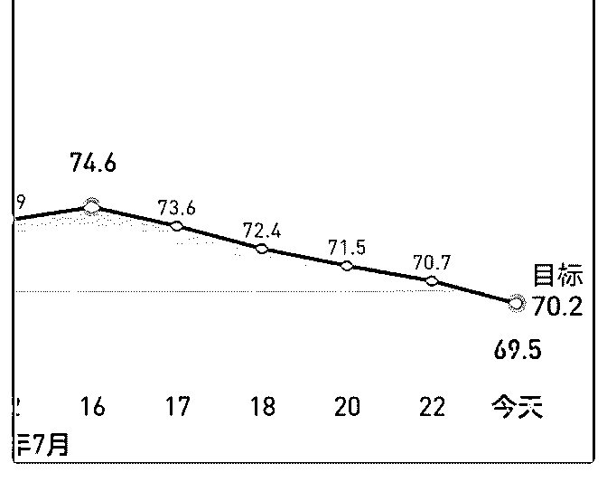
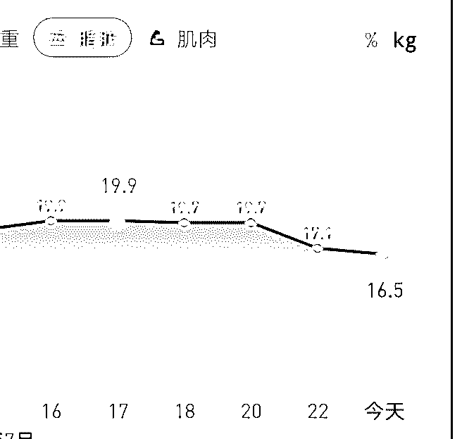
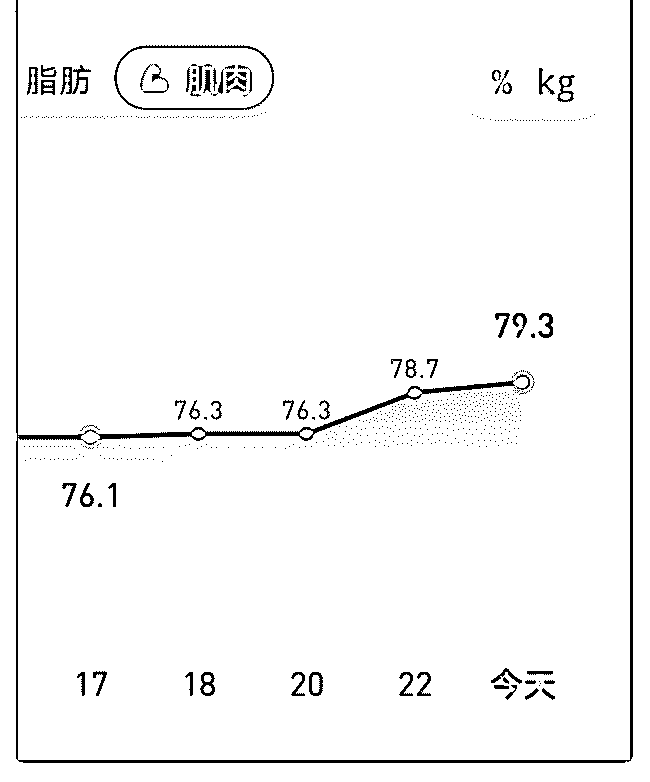

# 白菜闲聊投资 13：

流水白菜 : 白菜闲聊投资 13：减肥，戒烟，买买买

（一） 过去两个多月，生活比较没规律，一下复胖了十斤。说是复 胖，是因为去去年减了 30 近。去年减肥后，一年来，体重一 直稳定。所以一下反弹了三分一，不小心就前功尽弃。过去 8 天，认真控制了一下饮食（包括饮食结构），适当增加了运 动，减了 10 斤。减肥的同时，还增加了肌肉。

（二） 减肥其实很简单，有一本书（每周健身 4 小时），里面有几个 观点，比如减肥期间，不吃米面等白色食品，不吃水果（反 正几天不吃可以接受，想吃就吃点低糖度的），不喝饮料。 非常好用。 去年还戒了烟，有一本书（这本书能人让你戒烟），看完后 知道不要让大脑被尼古丁劫持，就戒了。 我觉得投资上，也应该和戒烟，和减肥一样，有一套简单的 方法，可以保证能安全的跑赢银行理财，让大多老百姓的钱 能跑赢通胀。因为这个世界就是这么简单啊。

（三） 我一直在探索这种简单之道。

以前我把投资比喻成这么一种情境。一个人来到一个陌生的 城市，然后，它如何快速的了解这个城市呢？ 今天，我换一个比喻。一个小伙子，到一个单位，如果他想 快速的升迁，那么，他该怎么做？其实很简单，就是用最短 的时间了解单位的尽可能详细的信息，然后看有什么方法可 以“庖丁解牛”。或者，一个中学生，他要怎么确定自己未来 要到什么城市读什么大学什么专业？

（四） 说白了，就是你要有（世界观），要了解你要做的事情，它 的全景是怎样的。了解了，你就还要（方法），找到适合你 走的路，最好走的路。

减肥简单，戒烟简单，因为道理简单。如果难，那是做难。 投资来说，有些人是卡在知上面，就是炒股多年，不知道股 市是怎样的。有些让人卡在行上。道理都懂，但总是手痒心 痒。

（五） 让投资变得简单。

我们不是迷迷糊糊的高中生了，我们不是懵懵懂懂的小年轻 了，我们要非常明确股市的规律。要非常懂得，如何克服自 己的“问题”。想清楚，做清楚，股市的回报，就不会太低。 2019-07-25(17 赞)

评论区：

Pippo : [呲牙]散户四戒：戒频繁交易 戒频繁换股 戒变换策略 戒翻看账户刷新市值

王从宝 : 老师不但投资见解说的好，健身锻练也说得好！

流水白菜 : 健身的其实就是常识。一般人都懂的，我说出来罢了

红叶 : 老师您好，有一本书（每周运动 4 小时），网上有卖的吗？

流水白菜 : 前面打错了，是每周健身 4 小时。

流水白菜 : 应该有卖。有几个网站都有电子书卖

红叶 : 老师，谢谢

牛家牛牛 : 无糖可乐，每天三瓶[尴尬]

关注公众号"懒人找资源"，星球资源一站式服务