# 白菜闲聊保险（十二

流水白菜 : 白菜闲聊保险（十二）保险股的爆发，时间点不确 定，但我们可以守株待兔

（一） 两年前我写过一篇文章，详细论证了这个结论：保险处于黄 金发展大周期：高 roa，高 roe，高分红，极高利润，极低风 险，轻资产。。。这个观点今天看，依旧非常正确。（我把 文章附录在后面）

（二） 今年保险股中期业绩暴增，有几大原因。第一，是顶层设计 上，政策对于行业的支持。由于中国的保障特点是保障面 广，但保障力度有限。因此，商业险的大发展对社会有极大 的好处。是社会保障体系的支柱。税收利好的背后是政策的 支持。政策支持的背后是国情的基础。第二，中国的股市总 体低估。我一直强调一个逻辑，看指数是高是低，看的是买 股票更合算还是买债券更合算。4000 点可能才是一个股债的 平衡点。因此，股市估值低，保险股的投资就能特别好。第 三，保险股业绩好，是过去巨额保单利润持续释放。这个看 附文。

（四） 股市投资有一个基本的逻辑：长期看，盈利翻倍，股价就翻 倍。这个逻辑，有上百年的证明。巴菲特说：价值决定价 格。也是这个意思。保险股今年中报业绩非常好，那么，为 什么估值还这么低？这个思路不对。正确的思路是，保险股 如果业绩一直很好，那么，这是一个很好的机会，买到就是 赚到。

（五） 股价什么时候上涨，是不确定的。价格回归价值，是确定 的。盯住价值，思考价值。等待价格回归，是投资唯一有效 的，百试百验的办法。低估是买入的理由和机会，买入就涨 或者买入两三个月就涨是人品太好。

只要保险股是肥兔，守株待兔，等的时间长点，又有什么关 系呢？股市毕竟不是取款机。

附录一张图：上篇文章，我们谈了保险股的高 ROE，这一 篇，继续谈这个结论：长期 ROE 决定长期股价。所有市场都 是这样（恒生指数成分股中每年选取 ROE 最高的前 10 只股 票，按等权重方式计算组合收益率，该组合从 2005 年以来年 化收益率达到 24.6%，同期恒生指数年化涨幅仅 4.7%，港股 高 ROE 策略的超额收益率约 20%。按类似的方式，以沪深 300 成分股为基础构建 A 股高 ROE 组合，A 股高 ROE 组合

2005 年以来年化收益率为 18.4%，同期沪深 300 指数年化涨 幅 9.3%，A 股高 ROE 组合相对沪深 300 超额收益率为 9.1%）

2019-07-24(20 赞)

评论区：

， : 第四条确实很难做到，人性的弱点厌恶亏损。这几天保险走得很差，每天跟市场先生买点还是每天降价，今天还是加

满仓了，依旧继续创新低，只能通过运动和读书转移注意力，默念每年 15％30 年 66 倍。从现在开始专注提升身体素质，争

取长命百岁，努力做到像捂房子一样捂股。

流水白菜 : 买房子的人，一年也就关注一两次价格。而且想的道理都很简单。我们太关注市场报价了

， : 别说一两年了，一天不看心都痒[闭嘴]

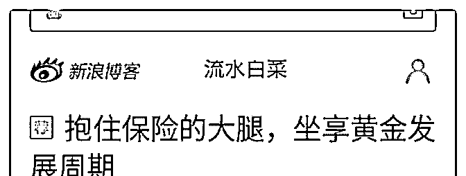

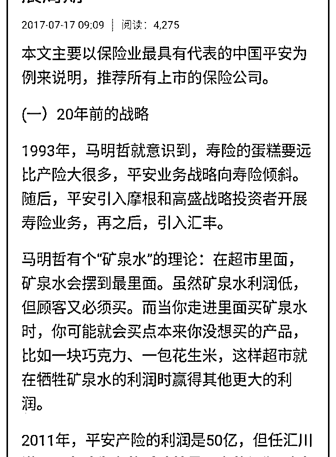

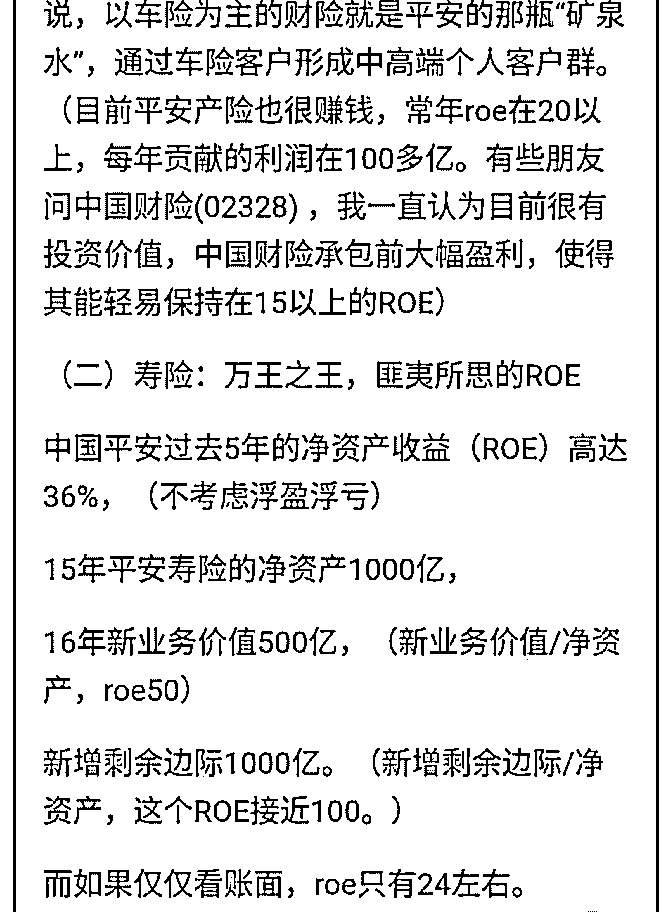

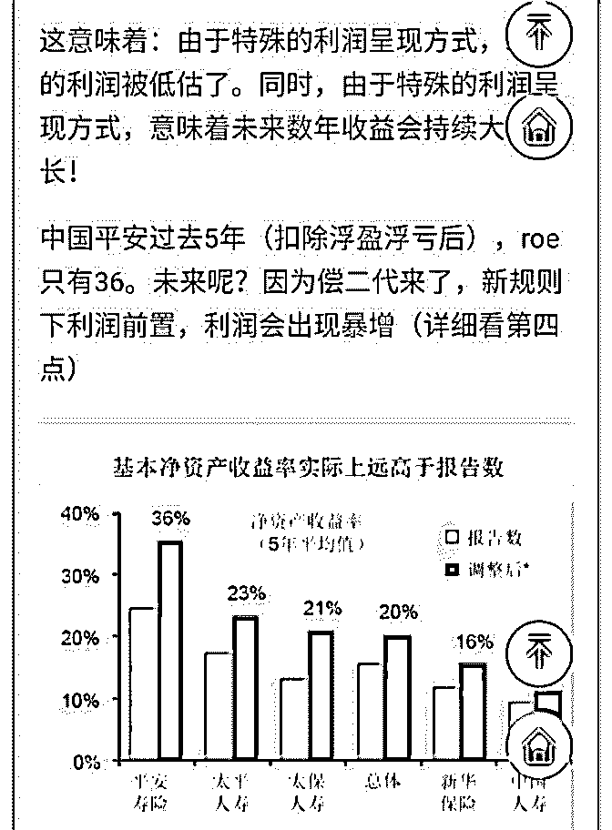

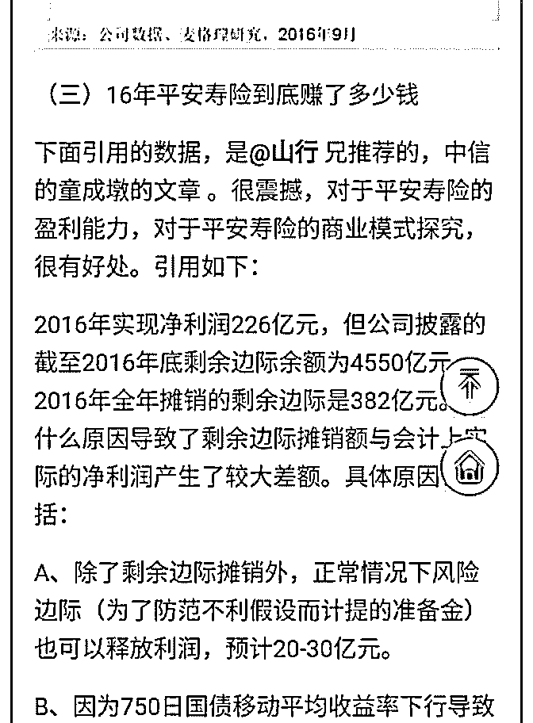

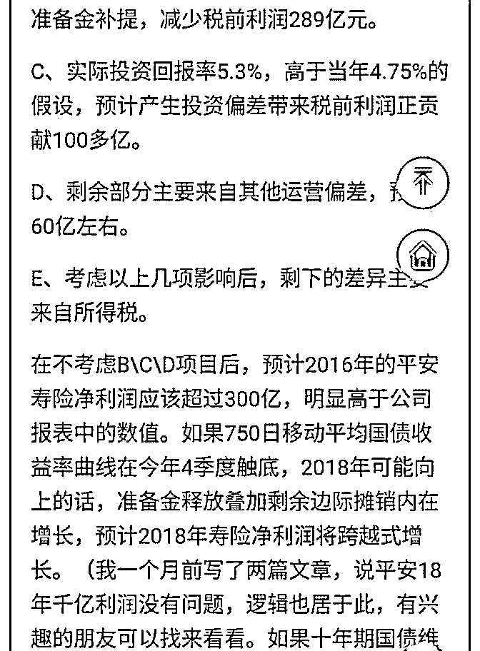

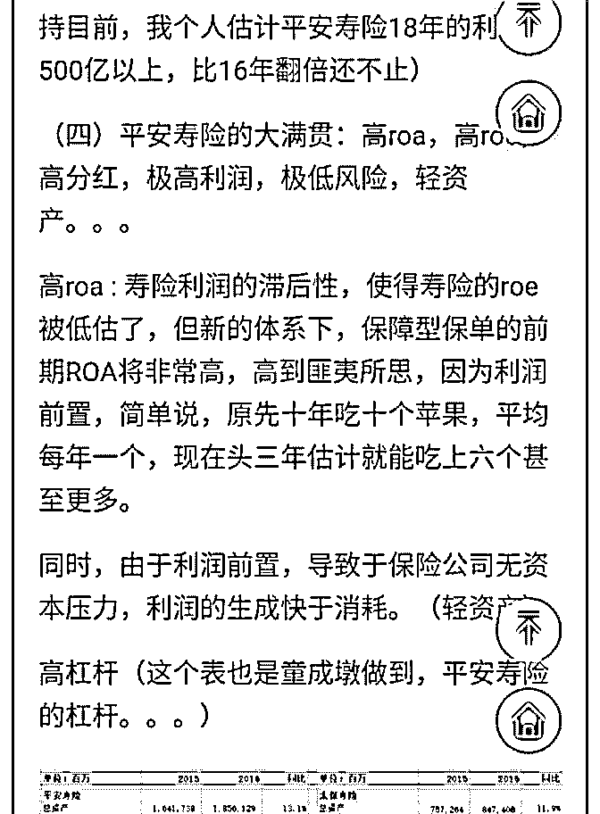

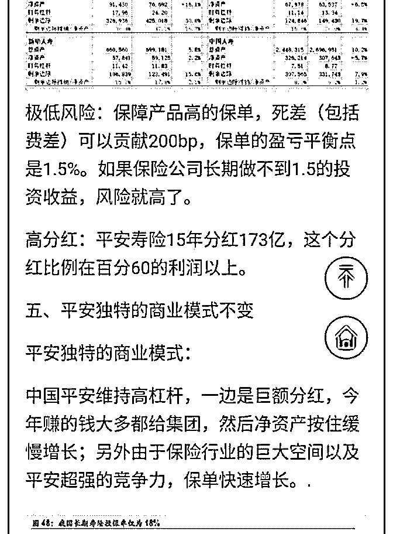

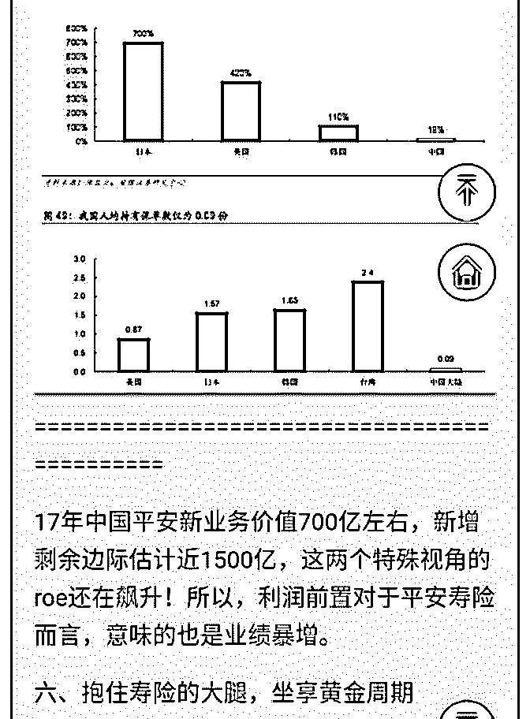

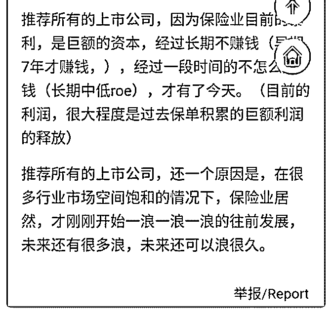

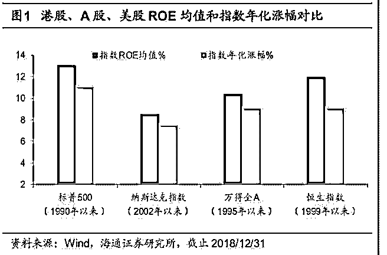

关注公众号"懒人找资源"，星球资源一站式服务