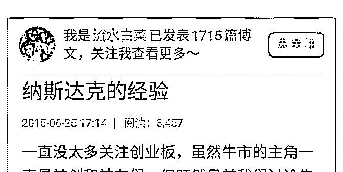
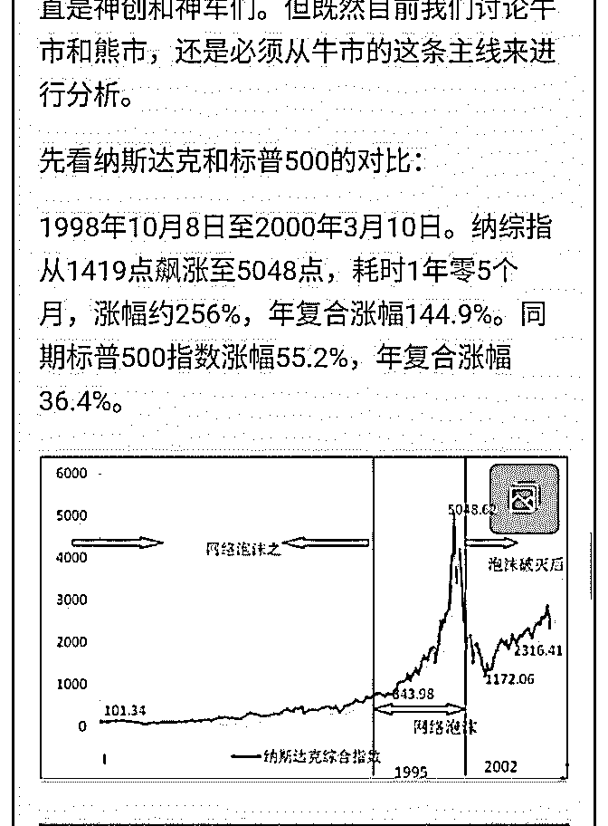
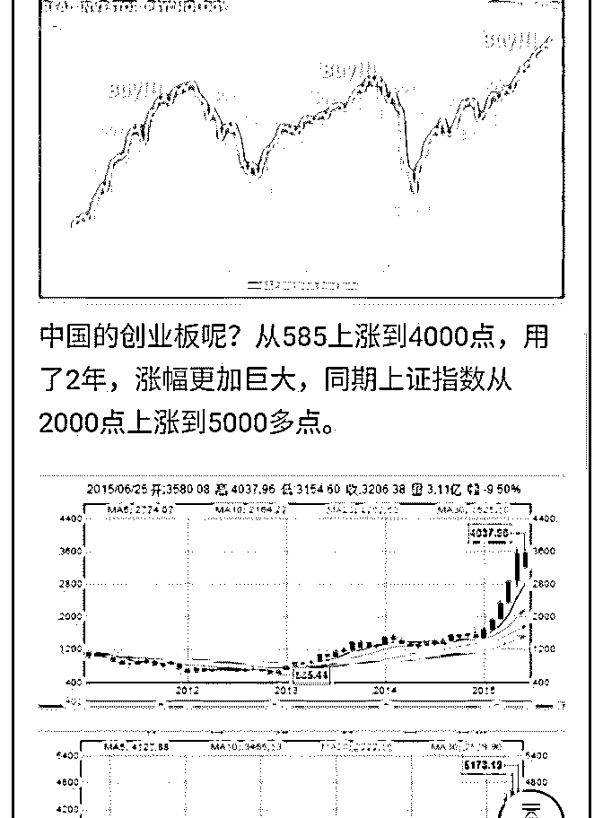
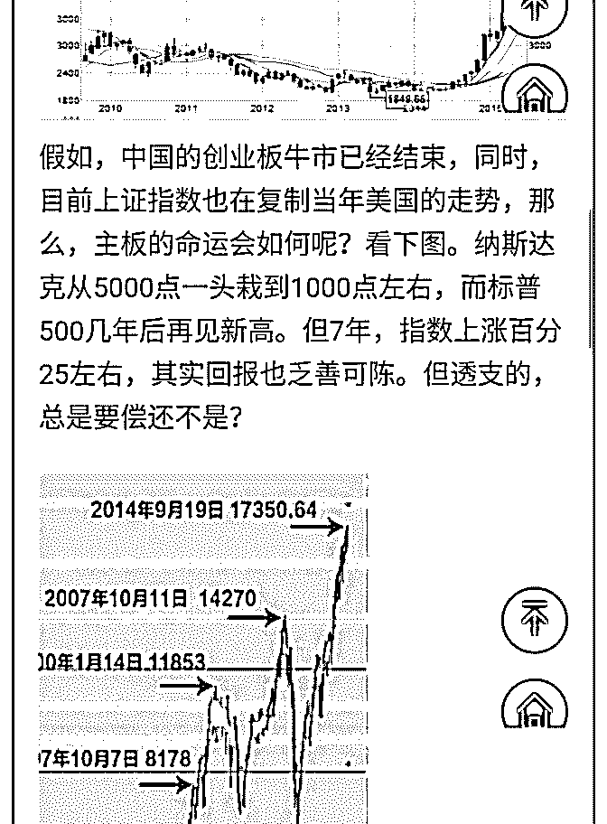
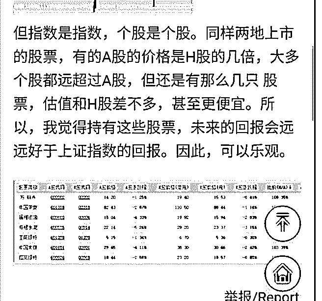
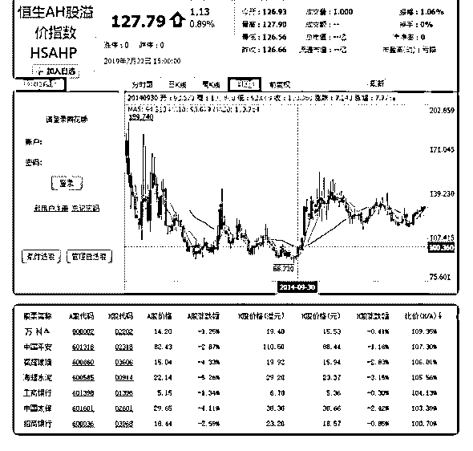

# 白菜闲聊投资 12：

流水白菜 : 白菜闲聊投资 12：5000 点的诺亚方舟，谈谈 AH 股 的逻辑

（一）前面的文章我提到过，15 年 5000 点的时候，在同时有 AH 股的股票中，选择比 H 股便宜的 A 股的股票，做一个组 合，那么，这个组合，虽然现在不到 3000 点，但这个组合， 目前盈利已经翻倍了。

这个办法，我 14-15 年的时候用了一次，17 年的时候又用了一 次。这个被我称为 AH 对照法。非常实用。 在股市里，我承认自己能力和专业的人士比，有很大差距， 但我可以用其他方式来弥补这一差距。 就像摇新，虽然没有技术含量，但没听说过有人说摇新丢 脸，反而羡慕的人很多。

（二） 这篇文章，是因为最近星球的朋友问 AH 股的问题，为什么我 战略投资 H 股。 理由很简单，同股同权（当然，A 股由于可以做门票摇新，红 利税便宜，交易费用低可以适当贵一点，但也就是适当一 点）。历史上，A 股并不总是比 H 股贵的，有两个时段，H 股 更贵。 这两个 A 股比 H 股更便宜的时候，是明显的机会，记住了！

（三） AH 价格的差别，本质上是，两边市场的不同步。A 股波动更 大，H 股总体估值更低。 但 AH 市场，背后的是同样的公司，是同样的市场，是同样的 人性。

所以，AH 长期来说，价格会差不多。 注意，是长期，也许是超长期。 但，这就够了。

（四）

H 股的两大价值，第一，给 A 股提供坐标。

第二，当你看好一家公司的时候，如果 H 股更便宜，如果相差

大，长线投资，买便宜的。

中国太保，15 年的时候，A 比 H 还便宜

中国平安，这么多年来，AH 折溢价不断波动

总之，有 AH 同时存在的这个市场，可以想出一些机会来。

（五）

15 年 5000 点，虽然股指很高

但我还是通过 AH 对照找到了一条诺亚方舟

我把当时写的文章附录在后面，供参考

2019-07-22(16 赞)

评论区：

宇辉 : 老师，以平安为例，您认为大约溢价多少买 a 股很划算

流水白菜 : 一般 A 比 H 便宜百分 5-10，买 A。A 比 H 贵百分 5-10，买 H。这个只是过去规律的运用。你可以把过去多年 AH 走势

拿来看，会发现这个策略非常不错。

关注公众号"懒人找资源"，星球资源一站式服务