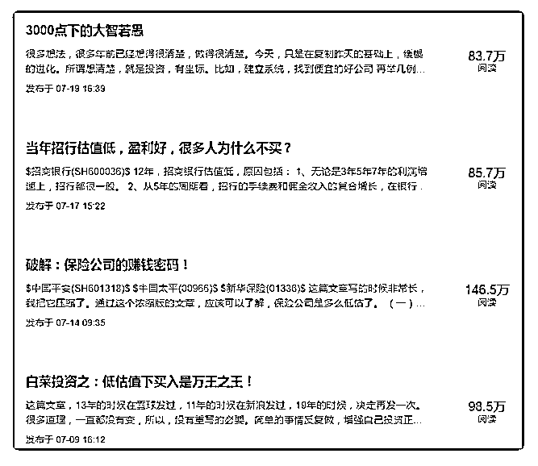

# 特别文章：低风险，

流水白菜 : 特别文章：低风险，高收益，高确定性的投资之 路！

很快，这个叫流水白菜的知识星球已经快一个月了。说很 快，是最近一个月主要的时间精力，都放在星球上，日复一 日，一下子时间就过去了。过去一个月，日均一篇比较精心 写的文章，日均分享一篇看到的比较好的内容或研报，日均 回答球友的几个问题。虽然更新的频率很高，但质量还行， 从星球上选了几篇传导雪球，4 篇的平均点击是 100 万。（截 图）

（一）低风险高收益的本质是：投资能力！ 投资，大家都说：低风险都收益，高风险高收益。但我关注

的是：如何运用自己的投资能力，让低风险下，也能获得理

想的收益。

银行的利息 2，如果你不多承担风险，那么，多过百分 2 的部 分，就是你的能力。买国债，买银行理财，获得了 4 的收益， 这是群众级别的投资能力。前几年我就知道，我敢买陆金所

6-7 回报的产品，这是我的能力。有些人买了其他 P2P，这是 不自量力。

（二） 10 几年前，知道用货币基金替代银行活期的，是投资能力。 前几年，用陆金所的产品，替代银行的理财，多出了的 2 的回 报，也是投资能力。股市里，回报会比理财更高，。过去一 个月，我写了六种以上低风险高回报的好办法。其实办法不

止这些。我以前也屡屡提及：

（二） 我呆过最愉快的一个群，是摇新群。这个群，从创业板前就 开始了，每次有新股，大家就摇啊摇。摇新有年 15 的回报， 没有风险，同时资金可以随时进出这个市场。所以，我认为 这是最好的投资了。0 风险，高回报，高流动性。

摇新摇久了，会什么风险都不愿意去冒 极端的例子，后来摇新需要市值，有个群友，开了三个账 户，每个账户，就配 8 万块深圳的市值摇新。而她，至少从摇 新上赚了 100 万。然而连这 24 万，都非常谨慎。。。

（三） 我呆过最愉快的一个论坛，是封基论坛。这个论坛，当时很 苦。版主叫黑夜太黑，有个网友叫盼天亮。但这里，是我见 过胆子最大的地方，很多人，砸锅卖铁入市。 基金有两种，一种是开放申购赎回的基金，开放式基金。另 外一种，是有一定封闭期的封闭式基金。当时，封闭式积极

5-6 折在场内交易。同样的东西，打 5-6 折，而且这些基金买的 是蓝筹，而且这些基金，有百分 30 的资金配置在债券和活期 上。当时股市 1000 点，要跌到 400 点，才会发生事实上的亏 损。所以，有人砸锅卖铁后，最后发财了

（四） 市场是错的，所以我们才有投资的机会 小错，就有小机会

大错，才有大机会 有人不信路上放着一堆钱 我相信，路上时不时有一堆钱在那里

我相信，市场上，总有低风险，高收益的机会。所以，我努 力寻找这种机会

这就是我的投资之路：寻找市场的错价

（五）提升确定性，就是提升了投资能力！ 股市里，最爱问的四句话是：买什么？现在买可以吗？什么

时候卖？买多少？

但四个问题，我都不能回答。政策上，不允许；星球上，不

允许。

我个人，没有能力。如果有这个能力，原先我说了，我会去

做私募基金。我有一个朋友圈上百人，里面有一半以上是私

募基金经理。但我知道我没有这个能力。

此外，股市的中短期无法预测，我这二十年股市投资下来， 尝试过成百上千次，但对错各半。

人性喜欢确定性，我能提供的，是另外一种确定性。

（六） 我写过一篇文章，像买房一样，买股票！文中我写到：

当一个人，把买股票当做买房子一样，那么，在股市中，就 往往不一样了。 第一，他买入会非常慎重，战略性的买入，因此，不会一涨 就没心没肺，一跌就疑神疑鬼。他的内心有个大局。第二， 他买入后，会不断进化。因为身家在那里，压力会让他投资 能力会进步得非常快。

第三，大多人不会去赌。 最后，最重要的，当一个人用买一 套房的钱，赚了一套房，他日子会跳跃式的改善。成年人在 不游戏的时候，要么不做事，要么做大事。

因为买股票的意义如此之大，因此，我们不需要那种虚假的 情绪管理，不需要那种运气的成功。

我们要把自己的投资确定性，真实的，把百分 80 提高的百分

98。

我的方式，无非两条路： 第一，不断淬炼自己的投资系统。思路越清晰，办法也越 多！（以后可以写 100 种低估买法。。。） 第二，搜集一切可以搜集的信息，增加投资的确定性。这 样，跌了，敢买；涨了，敢拿。

（七） 在星球上，我能做的事，就是通过分享我的思路，通过分析 我的阅读和思考，帮助大家提高投资的确定性。

过去这个月，我分享了保险股投资的将近 20 篇文章，如果有 时间看完，大概持股会多一些底气。至少会知道，中国的保 险还有很大的发展空间；中国，由于不可能是福利社会模 式，政府会大力发展商业险，总是有很多利好；中国的保 险，有出色的商业模式：成本很低（保障性保险的成本，大 概在 1-2 之间，理财险的成本，大概在 3.5-4.5），因此，目前 的保险，ROA 很高，ROE 很好……

（八） 星球的第一个月，非常顺利运行了。

星球的第一个月，我承诺的每周三篇文章，更多互动，一些 系列小文章都实现了。

第二个月的星球，我会继续写这些系列文章，会继续把主要 的互动，都放在星球上（雪球和微博基本没时间互动），会 每周继续写出更好的文章-----以后就每周三篇了，今天这篇， 算是这周的第一篇（周天到周六算一周）。

（九）

第二个月的星球，保险公司会陆续公布半年报，到时候，也 会做个解读。嗯，还有平安银行。

2019-07-21(22 赞)

评论区：

平安太保 : 星主，你现在几个号在打新

流水白菜 : 能多尽量多

行者 : 感谢白菜的付出

陈梓涵 : 我现在上星球的阅读时间，跟微信使用的时间几乎对半分了，哈哈！以前对保险有偏见、也无从下手去深入了

解，通过这一个月，犹如醍醐灌顶，很是舒心舒畅，每天学习一点点进步一点点！感恩遇见老师，很幸运！[太阳]

流水白菜 : 有收获就好

如意 : 加油！

小胖罗素 : 白菜哥，早认识你两年，不知道我现在还用不用上班了[呲牙]

关注公众号"懒人找资源"，星球资源一站式服务