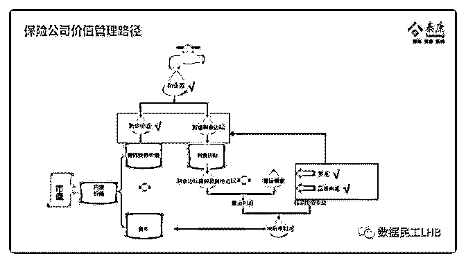

# 看到一张图片，感觉

颜景善 : 看到一张图片，感觉很好，分享下

2019-07-20(18 赞)

评论区：

陪陪 : 剩余边际的释放，是否有一定的规则？这里面的操纵空间不是太大了？？？

颜景善 : 从历史看每年释放剩余边际的百分之 10

陪陪 : 谢谢啊

颜景善 : 2018 年期初平安寿险业务剩余边际余额为 6163.79 亿，2018 年全年剩余边际摊销 622.87 亿，所以 2018 年剩余边际摊销

比例为 10.11%；2017 年初剩余边际余额为 4547.05 亿，2017 年全年剩余边际摊销 498.11 亿，2017 年剩余边际摊销比例为

10.95%。可以看出，平安寿险业务剩余边际摊销比例非常稳定，在 10-11%左右。

陪陪 : 6163/4575 有 34%增速，谢谢！

关注公众号"懒人找资源"，星球资源一站式服务