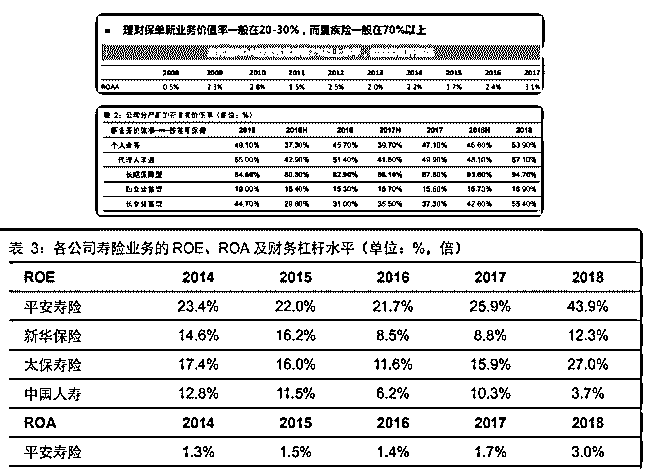
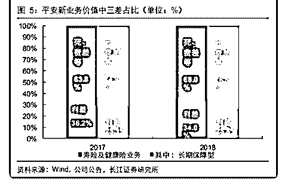

# 白菜聊保险系列（十

流水白菜 : 白菜聊保险系列（十）保险行业，现在的股价被大 幅低估了吗？会戴维斯双击吗？（下）

友邦 2017 年 ROA 达到 3.1，平安寿险 2018 年，ROA 达到 3。这 意味着什么？平安福的保本点是 1，而且中国平安几乎所有的 保单，每年利润率都在上升，这意味着什么？在检验这些数 据，回答这些问题之前，我们还是要从很远的地方说起。

（一） 上面前面两篇文章的铺垫，终于要提到结论了：目前的保险

股，低估值，加上未来可见的较高的 ROE，是让我们守株待

兔的原因。既然是守株待兔，当然，首先是要有大兔子会过

来。其次，这个等待时间，非常不确定。

你在 11-12 年买入招行，但招行真正的上涨是在 14 年之后，而 且，即便 15 年，招行也算不上爆发，真正的涨幅，是 17 年之 后。我最后一次买卖招行是 15 年，说实在没赚多少钱。招行 17-36 元，我完美路过。

当初，我买中国平安，这个守株待兔的时间也极长。你知道 他很便宜，但什么时候市场开始上涨，是市场决定的。便宜 了可以再便宜，但合理的估值永远在那里。 所以，大多成功 之路，充满荆棘。

（二） 在看这篇文章之前，我必须说，我这篇文章，只是不断的再 补充新看到的数据，不断用其他视角检验自己的投资逻辑。 毕竟，我的投资，和大多人不同，几年，就持有几只股票。

而且，都是重仓持有。看准了，拿住了，对我来说，确定性 比什么都重要，跟踪和思考是我投资的主线。。。 有人说， 你为什么基本只讨论保险股，因为只讨论保险股，才能保证 我比大多人赚得多。

没看过童成墩谈保险系列的网友，建议大家可以先去再看。 所有文章我的附在前面，并且还附录过一个简单解释的版本 辅助。我这篇文章，会在这个基础上谈。【童成墩保险科普 之二】保险保障模式的潜在 ROE 可以有多高？【童成墩保险 科普之三】复杂背后的一切价值，都应该指向利润可持续增 长【童成墩保险科普之四】讲完保障逻辑，还得看数据。 其实讨论股市，我们的逻辑都是一样的，看 ROE，看未来 ROE 的稳定性，通过数据来支撑。。。

（三） 2017 年，友邦的 ROA 达到 3.1，这还是在其包含了百分 20-30% 理财保单的情况下。 （见图） 2018 年，中国平安的 ROA 达到 3，这还是 2018 年，投资收益很不怎么样的情况下。（见图） 根据中信的研究，中国平安的平安福，保单的保本点在 1%。

（所以有人说平安的保单赚钱） 此外，根据长江证券的统 计，平安这几年的保单利润率是不断上升的。 （见图）

前面的一篇文章我们谈到，中国平安强大的保单设计能力， 强大的销售能力，强大的服务能力，以及在有消费力的都市 里销售的基础。 是做到这点的保障

（四） 那么，高 ROA 是怎么来的？ 简化一下 ROA 的公式： ROA = 收益---成本

优秀的保险公司的投资收益 5，减去成本 2，那么，就有 3。

（利差赚 1 个点，死差等 2 个点。）

一般的公司，成本 3-3.5，那么，ROA 就有 1.5-2。然后 10-15 倍

的杠杆。

结论就是，保险公司的 ROE，会是 15-45 之间。

（六） 高 ROA，往往意味着商业模式的优秀。（上面我们讨论了招

行的高 ROA）保障性保险，有高 ROA（保单利润率高）。

那么，未来这种高 ROA 是否能持续呢？看下表： 我们看到，死差等为主，利差为辅助。

注：营运经验差异及其他（即实际运营经验与期初假设间的

差异，包括死亡、发病、失效和退保）

（七） 从中国平安的保单利润率，我们看到了，和车险的同质化保 单不同，寿险的保单，差异化很大。市场剧烈竞争，平安保 单利润率却一路上行。ROA 越来越好。所以，保单设计是高 度掌控的，高 ROA 是可持续的！

友邦平安在前，其他保险公司，长期来说，也会效仿。 最 后，补充一点，优秀的保险公司，能比理论数值上赚得更 多。这在前面的文章讨论过了。中国平安赚的钱，是假设的 百分 130。新华太保，也有百分 105。

（八） 境外一些保险公司，由于长期低利率，只赚死差，没有利

差，甚至负利差。中国的保险公司，目前有死差和利差双重

收益。目前 3.2 的十年期国债，即便未来十年，慢慢下降到

2.5，也还有利差收益。因此，有非常好的 ROA。

此外，保险行业还有很大的发展空间，使得保险公司的杠杠 10-15 倍继续保持下去，这样，高 ROA 有了，高杠杠也有了。 加上非常安全的负债，（低风险）。加上，一些公司已经开 始资本大量剩余，大比例分红。未来保险的估值上升，已经 是必然的。

2019-07-19(24 赞)

评论区：

千山暮雪 : 老师周末愉快！[咖啡]

颜景善 : 老师，杠杆是怎么算的啊，我看着资产负债率是百分之 90 左右，也就是 9 倍杠杆啊

流水白菜 : 总资产净资产之比

关注公众号"懒人找资源"，星球资源一站式服务