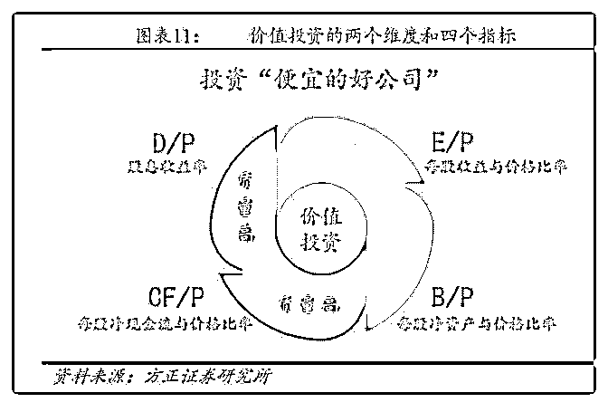

# 白菜闲聊保险（九）

流水白菜 : 白菜闲聊保险（九）从招行的戴维斯双击，看保险 的估值向上趋势（中）

上文提到，12 年的时候，招行所有的增长指标，都不突出， 但 ROE 指标，高于平均；ROA 指标，领先同行。ROA 指标 高，意味着商业模式利润空间大；同时高 ROA 主要源于低负 债成本，资产更优质。此外，领先的零售布局，意味着占据 未来竞争的高点。招行的估值升高，是人们看到，它未来的 ROE 会比同行出色很多。

（一）买股票的逻辑 一个人的钱，存银行，能获取百分 2 的利息；理财产品，百分 4；如果投资股票，能有年 6-8 的回报，（十年期国债+3，） 理性的他，就愿意买股票，而不是存银行买理财产品。（因 为目前的利率较低，所以目前的股市估值偏低）另外一个逻 辑是，风险越低，我们需要的回报就越低；风险越高，我们 希望的回报就越高。

（二）高 ROE 好公司，稳健高 ROE 的公司，往往会被市场哄抢，就是因为 它盈利稳健。过去十年， ROE 均大于 2 0 的股票，全 A 股只

有 9 只股票符合，分别为格力电器、承德露露、双汇发展、 华东医药、洋河股份、海康威视、恒瑞医药、贵州茅台和海 天味业， 1 0 年间股价基本都有 几 倍涨幅。 背后的原因是未 来的可持续的，R OE 才是牛股的特征。

好公司，会被抢到回报年 6-8 回报的价格。前一阵段永平说， 贵州茅台的目前价格持有，他的预期是年回报有百分 8。所以 会继续持有。

（三）未来的 ROE

但注意，我们往往知道的，是历史静态高 ROE。这里有两个

可能的大坑，第一，是这个高 ROE 可能是周期的，几年高，

几年低。比如券商股，某一年牛市，盈利暴增，然后不需要

熊市，正常的情况下，盈利回落，ROE 就回落。还有一类是

有问题的公司，比如康得新在 2 012 2015 年的 R OE 也有 2 0

%%，如 果仅根据这个指标选择就可能踩雷 2 018 年的 R OE

跌到 1 .6 。当然，有券商认为，用高估值买这样高 ROE 的公

司，要看现金流，要看分红。如果看这两项，康得新这个雷

就不会踩到。

招行为什么估值会比较高，因为他证明了，他比其他银行股 更安全的情况下，获得了如此高的 ROE，而且未来可以保 持。

（四）好公司，好价格？ 投资就是好公司，加上好价格。有些人更看中好公司，因此 愿意高 PB 买高 ROE 的公司，比如贵州茅台，爱尔眼科等；有 些人希望能兼顾，因此，选择 ROE 不低，估值也便宜的中国 平安和招商银行。牛股的 R OE 普遍较高，可持续性强，因 此，两种投资，都需要对未来公司的 ROE 有足够的把握。

投资的难点，在于预判未来。一直都是。 但投资更难的是，低估值买入好公司。

（五）保险：未来的 ROE 是多少？

2018 年，平安寿险的 ROA 高达 3 个点

2017 年，友邦保险的 ROA 高达 3 个点

所以，我的结论是：一般来说，保障性保险，考虑死差费差

后，资金成本就 2 以下。投资收益 5。ROA 也就是 3 了。加上其 他险种，ROA1.5-3，10-15 倍杠，ROE 就 15--40。好公司 ROE40，一般的公司 ROE15-20。这就是我投资保险股的核心 逻辑。

这个部分，下节再讨论。未来稳定的，较高的 ROE，这是我 们投资的基础和基本逻辑。需要比较严谨的证明。

2019-07-19(20 赞)

关注公众号"懒人找资源"，星球资源一站式服务