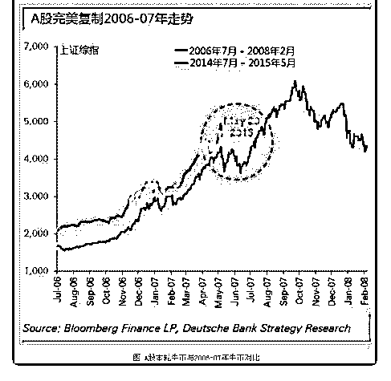

# 白菜闲聊投资 11：

流水白菜 : 白菜闲聊投资 11：历史不是简单的重复，但总是压 着相同的韵脚

（一） 先转一篇 2015 年的博文：

大跌是切换到蓝筹的路径

2015-05-28 17:34 阅读：43,122

——————————

股市的风格切换，有很多种路径。大跌，是常见的一种。包 括 07 年的 530。

本轮牛市，走势复制了 2006-2007 年的走法。政策催牛，天量 做底，股民先入场，基民再进来。之前回调百分 8 每次都成为 绝佳的买点。各种莫名其妙的五倍股十倍股腾涌。。。 因此，我认为本轮牛市还缺少一个蓝筹股大涨的阶段。这个 阶段，会贡献很多蓝筹股整轮牛市百分 70 的涨幅。错过了后 面的涨幅，很多蓝筹股在牛市中都平庸无比。

（二）

2014-2015 年的股市，居然完美复制了 2007 年的股市。（见文

后的图）再接下来的剧本，主要的剧情有两个。530 暴跌。小

股票向价值股切换。

（三） 但历史不是简单的重复。第一步，比 530 更猛的指数跌幅。第 二步，缓缓启动，一波三折的推动蓝筹股上涨。

（四） 但其实，无论市场怎么重复昨天。但其实道理只有一个：高 估的终将陨落，低估的总会崛起。15 年，持有价值股的，他 们真正赚钱，是 17 后开始的。但大多人，虽然持有过很多好 股票，但太看得起自己的时间成本，同时也太在意市场一个 月或者一年是怎么看

今天，看到有人在问中国平安从 17 年开始涨的原因。如果他 注意到，是招行，茅台，五粮液。。。等等一批蓝筹轮番上 涨

是一次集体的价值回归罢了

（五） 如果买的股票低估，就会回归 聪明人很多，但赚钱人很少 过去是这样，现在也是

2019-07-18(9 赞)

关注公众号"懒人找资源"，星球资源一站式服务