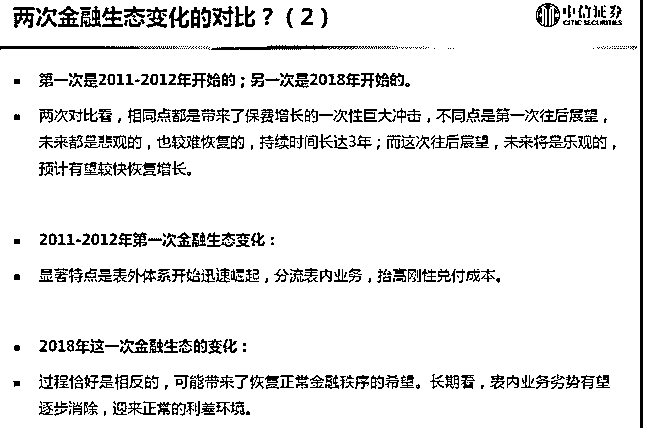

# 白菜闲聊保险（八）

流水白菜 : 白菜闲聊保险（八）保费增速，什么时候上去？

（一） 前两年保费爆炸增长，天时地利人和。代理人放开，一下销 售人员暴增。叠加保险投资收益高于理财收益。再加上偿二 代下，保险公司激活了健康险的大市场。

但这也透支了短期的保费增速。

（二） 居民收入快速增长，是保费快速增长的源泉。有调查显示， 家庭年收入 50 万的，购买保险意愿最强。还有调查显示，学 历越高的，购买保险的意愿越强。 中国经济快速增长，居民收入，居民素质快速上升。保险， 有长长的又湿又滑的雪道。 投资保险股，首先，看的就是至少 3-5 倍的增长空间。

（二） 有些国家地区，是高福利社会。所以商业险，可以不发达。 但中国，人口众多，社会难以全福利。所以，商业险大发展 是必然。 顶层设计下，政府给了很多政策。今年税收大减。同时不断 放开投资。能给的政策，都会给。所以，利好总在路上。

（三） 保险有两种，一种是理财险，一种是保障险。理财险，说白 了，给的比银行理财高，就好卖。当市场利率低的时候，银 行理财 3-4。如果保险第一二年给 5（后面还是给 3-4），理财 险就卖疯。理财险，其实就是通过精算，制造幻觉，保险公

司长期投资 5，给你 4。也就这样。所以，喜欢买银行理财 的，买买保险理财险，有是可以的。

16-17 年，理财险卖疯了。牛市时候，保险的投资收益高，分 红险给客户的回报就高。大牛市后，保费增长一般比较好。

（四） 健康险目前百分 30 的行业增速，且利润率高。所以，目前保 费上增长慢，但新业务价值，并没有倒退。只是暂时停滞而 已。

（五） 对于 EV 高于 1 的公司来说，新业务价值增速的讨论，比较有 价值。但 EV 低于 1，其实只要考虑公司健康发展就行，只要 考虑各项假设合理就行。因为 1EV，代表的是破产清算价 值。未来保单是 0，也可以卖 1EV。

也许过几年有一天，我们会发现，H 股低于 1 的保险股，虽然 持有很长时间不涨。但这机会，确实是大机会啊！

2019-07-18(10 赞)

评论区：

千山暮雪 : 白菜老师：“但这机会，是大机会啊！”这个判断是站在 2019 年半年时间已过去的这个时间点上所做的结论吗？

流水白菜 : 我觉得现在就是大机会。因为几家 H 股保险股，不仅大幅低于 1EV，也在历史估值的下轨。此外，A 股总体估值

还有点小便宜

千山暮雪 : 谢谢老师！感谢！

李命清 : 请问 EV 是什么？如何计算？

一蓑烟雨任平生 : 白菜老师，打扰您一下，我想问一下保险公司的表外业务和表内业务分别指的是什么啊，有点儿抽象

流水白菜 : 这个是银行的吧

一蓑烟雨任平生 : 嗯？不是保险的吗，第三个图片上出现的表内业务和表外业务，我也不太清楚啊[发呆]

流水白菜 : 这是指银行体系的。可以不用管它

关注公众号"懒人找资源"，星球资源一站式服务