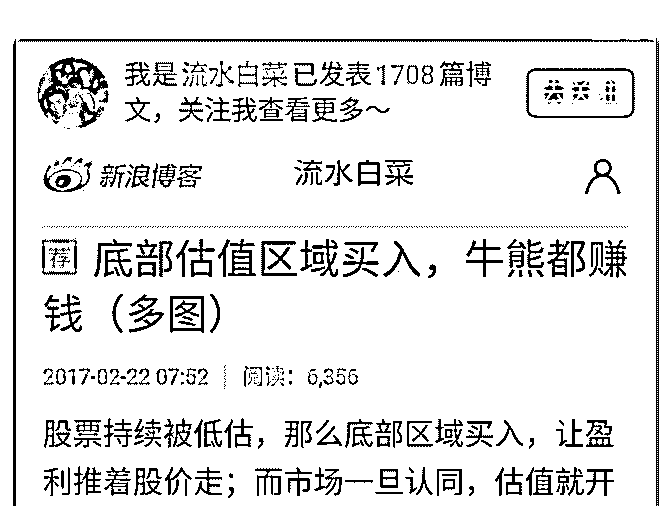
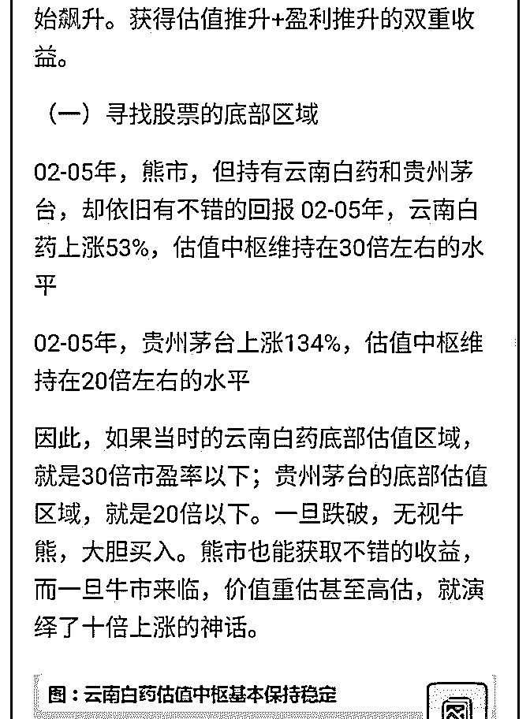
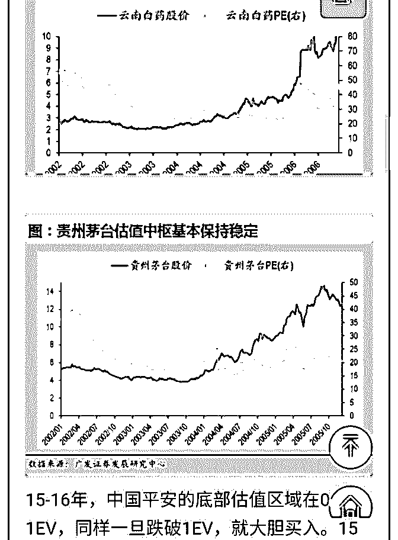
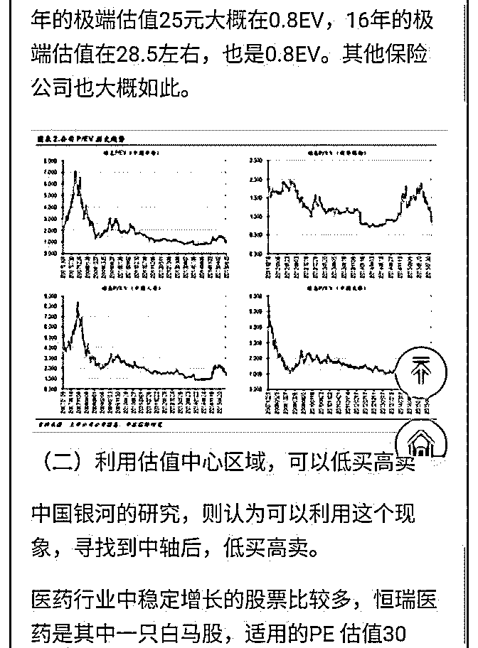
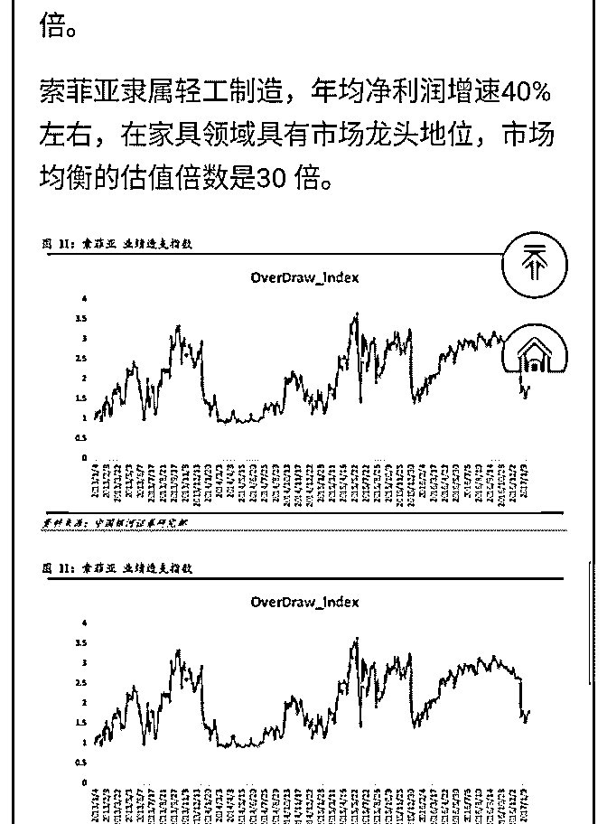
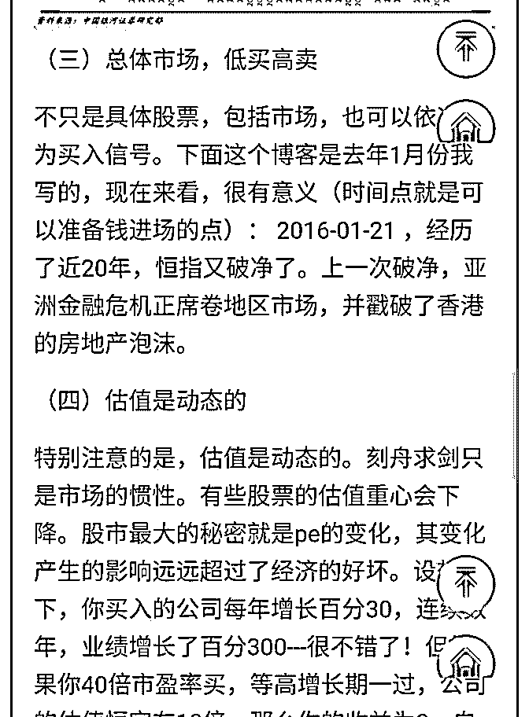
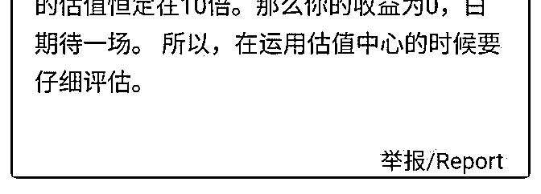

# 低估值是万王之王之

流水白菜 : 低估值是万王之王之：底部区域买入

这是 2017 年 2 月写的文章，写的可算非常及时。正是蓝筹，可 以大买热买的好时机。为了买点便宜货，我也算是绞尽脑 汁，想尽各种偷懒的办法了。（前面提到过的 AH 对照法，外 资买入股跟随法等等，都是偷懒但有效的办法）

因为知道低估，所以才有信念

（一） 一只手刚从冰水中伸出，放进常温的水中 人的正常反应是认为：这是温水 一只手从热水中伸出，放进常温的水中 人的正常反应是认为：这是冷水 人们的感知和认知被这种对比反差所欺骗 是因为没有温度计 相信温度计，而不相信不断变化的水温

投资中，不相信市场价格的准确性 相信价值温度计的刻度，就是信念

（二） 股市的本质是剧烈波动，

快速的变换，迅速的转场，快速剪辑一样。 试图捕捉和计算的，最后反而会迷惑， 智慧线缠绕心，打上千千结！ 或者股市像魔术一样让人迷惑， 用眼甚至用心也会被戏耍得七晕八眩。

（三） 看破重重幻觉的方式，就是不跟着股市的节奏走， 就是根据其公司的内在逻辑去推算长期的回报。 有些股票可以持有到涨幅几倍 有些股票即使连续腰斩也不去碰

一法破万象，有了法，相信法，就是信念 但我们知道一只股票是底部区域的时候，是信念，而不是市

场的情绪，带领我们回到估值之上。

2019-07-17(13 赞)

评论区：

尤德刚 : 感谢白菜老师，关键是明确温度计的刻度并确信它

尤德刚 : 请教白菜老师，股票高估有哪些重要量化考量指标。

流水白菜 : 具体行业具体公司具体分析。所以任何一只公司的买入，一般都需要非常多的时间精力去研究

尤德刚 : 谢谢老师

千山暮雪 : 谢谢老师！

关注公众号"懒人找资源"，星球资源一站式服务