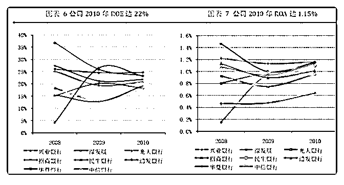

# 白菜闲聊保险（七）

流水白菜 : 白菜闲聊保险（七）谈保险的未来，从招行的戴维 斯双击谈起（上）

上次的一篇文章提到：招行连续增长百分 40 近 10 年，而 12 年 股价跌到 06 年的水平。12 年，招行低估值，恰恰又是买入机 会。这个恰恰是买入的机会，是怎么判断的？核心的因素是 什么？

（一） 2012 年，是招行最低迷的时候，估值从远高于其他银行，到 估值靡然众人。原因很多，主要包括： 1/无论是 3 年 5 年 7 年的利润增速上，招行都很一般。

2/从 5 年的周期看，招行的手续费和佣金收入的复合增长，在 银行中排在第 10 名。 3）融资饥渴。4）混业经营受阻。5）行长面临换届

但有四点需要指出：

1/招行 2010 年公司加权平均净资产收益率（ROE）达

21.75%，高出行业平均值 1 个百分点，；2）总资产收益率

(ROA)为 1.15%，是行业最好的。

3）招行第一次转型的优势为其现在的发展奠定了良好的基

础，尤其是其活期存款占比高，风控好，财富管理上的优

势，都是当时奠定的。

4）零售持续投入，虽然当期各项指标一般，甚至拖后腿。但

布局领先。

（二） 面对这样的招行，你会买吗？从后视镜的角度来看，当时正 是买入的好机会，这之前，招行估值高于其他银行股，这之

后，招行的估值也慢慢的升上去。14-19 年，5 年，招行复利 回报百分 34，股价涨 333%。标准的戴维斯双击。

低估值，买入成长股，说的就是这样啊。 但低估值的时候，你敢买吗？

（三） 回到 12 年，招行平庸的原因是，其实招行并不平庸！银行怎

么都赚钱，整体高 ROE，招行当时 ROE 非常高了，非常卓

越。同时，相对与 ROE，招行的 ROA 更为出色。关于 ROA，

这个留到下次再聊。到时候谈保险公司的 ROA。

此外，当时招行布局零售，为未来持续保持高 ROA 奠定了基 础。零售，是银行的未来之路。

结论：未来的 ROE（ROA），是企业估值的核心。静态的

ROE，下图：

2019-07-17(13 赞)

关注公众号"懒人找资源"，星球资源一站式服务