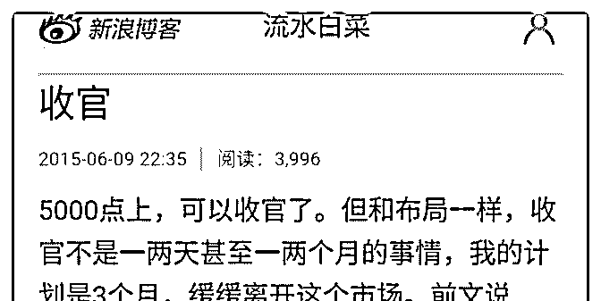
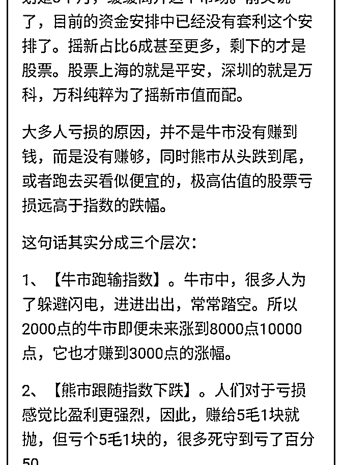
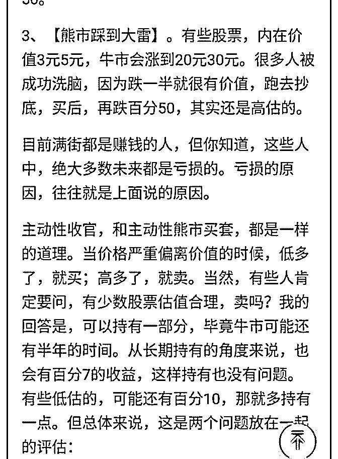
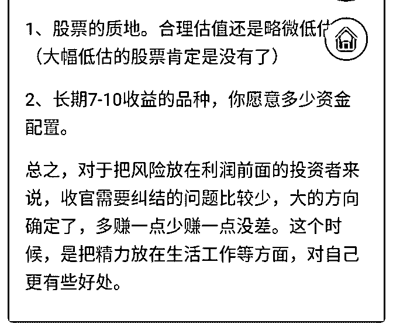

# 白菜闲聊投资 10

流水白菜 : 白菜闲聊投资 10 ：心中有“锚”，就有定见！

（一） 很多想法，其实在很多年前已经想得很清楚，做得很清楚。 但投资，有些时候只是看上去很简单：

（二） 彼得林奇说的：只要做足功课，个人投资者可以轻松击败机 构投资者。我同意，因为知乎上有人说：只要智商不低，好 好工作，认真努力，前提是别入错行业，然后把握好机会， 并非人中龙凤才能做到年薪百万。我也同意。

（三） 大多人的投资，没有地图。什么是地图呢，这个就是：

（投资的 2，4，6，8，10，15，20）：

1.散户的平均年收益是每年百分 2。

2.银行的理财，每年百分 4。

3.主动型基金，管理费贵，每年百分 6。

4.指数基金投资，长期每年百分 8-10。

5.有把握年百分 10，那么，自己投资。

6.每年百分 15，时间长了，就财富自由。

7、长期百分 20，恭喜你，中国巴菲特。

（四） 这个也是：

每次上电梯，从 5 楼到 10 楼的电梯（5 折买入），我们都以 为，电梯坐上去，就直接上去了。但后来我们明白，一下就 上十楼的，叫运气好。过三年五年上十楼十二楼的，那才是 价值投资的常态。人性贪婪。任何一种投资方法，都希望他

简单到三分钟理解；希望他今天买买两周以后就大赚。

（五） 在股市里，有很多规律构成了我们的“锚点”，我们心里知道 股市的世界是这样的，笨笨的去做，投资股市前，我们先要 向好无论股市天气如何变化，我们都准备了雨天时候的伞， 烈日之下的遮阳工具，寒风中的厚棉袄，雾霾时候的口罩。 或者春花秋月良城美景时候的心情。

（六） 我现在就坚持一点，3000 点，从未来看，就是早早入场，就 是大智若愚。下面一篇，是我 15 年股市 5000 点写的：收官。 逻辑一样。我现在写的，思考的，和当时的水平一样，我只 是再玩一次股市的牛熊游戏罢了。可复制的，可重复的，才 是投资的原则。

2019-07-16(21 赞)

评论区：

背包前行客 : 哎，我那时还是满仓硬抗下来的。[大哭]

流水白菜 : 所有的经历，都是财富

没故事的人 : 已满仓，下一轮收官一定要提醒我们[玫瑰]

流水白菜 : [胜利]互相提醒

金牛双子星 : 所有过往，皆为序章

宇辉 : 当时知识不够，我早三个月清仓，赚了一倍，也比大部分人强 老师您清仓后，有休息一段时间再投入吗？

流水白菜 : 我买入卖出主要看估值。估值低就买

关注公众号"懒人找资源"，星球资源一站式服务