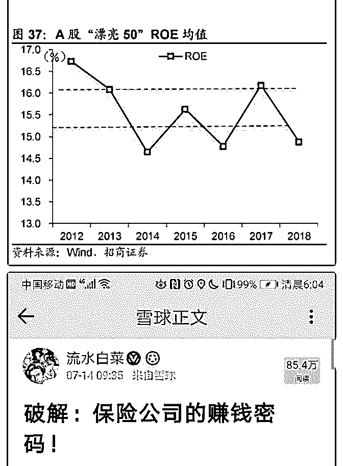
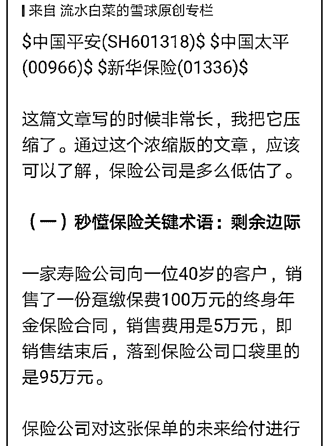
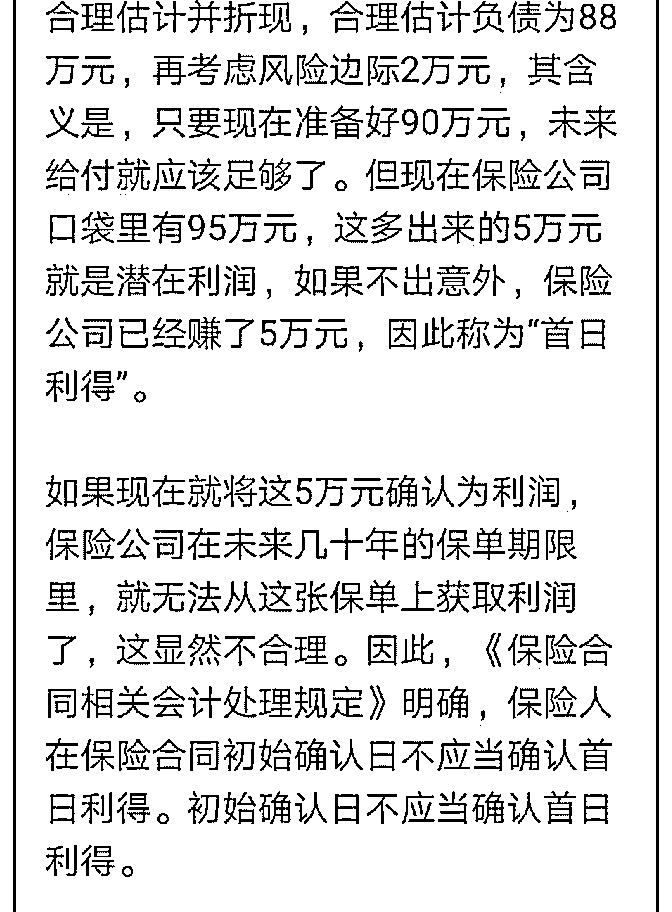
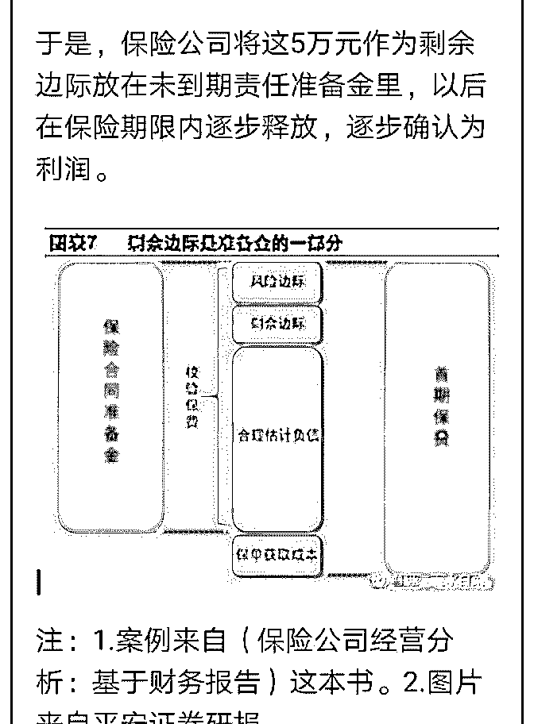
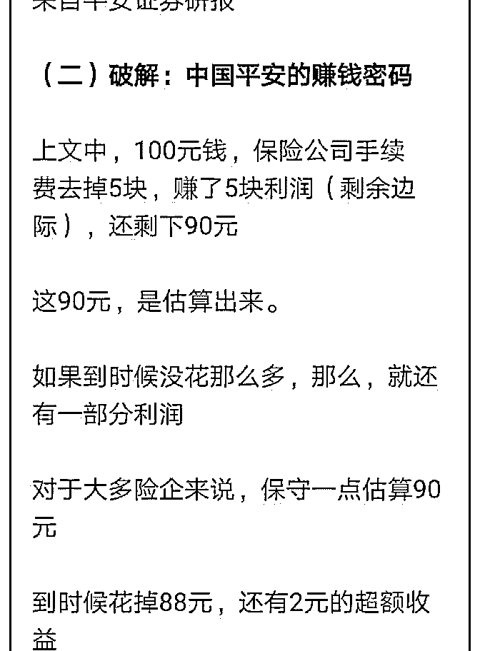
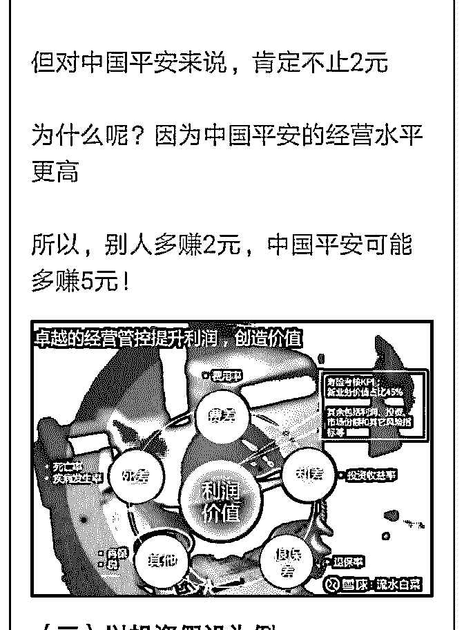
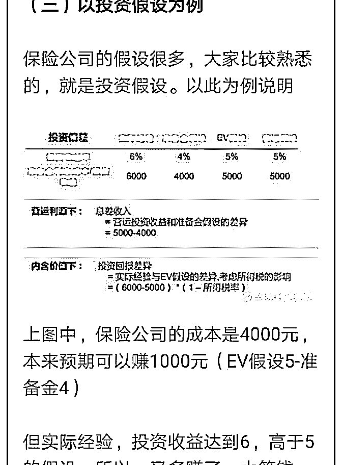
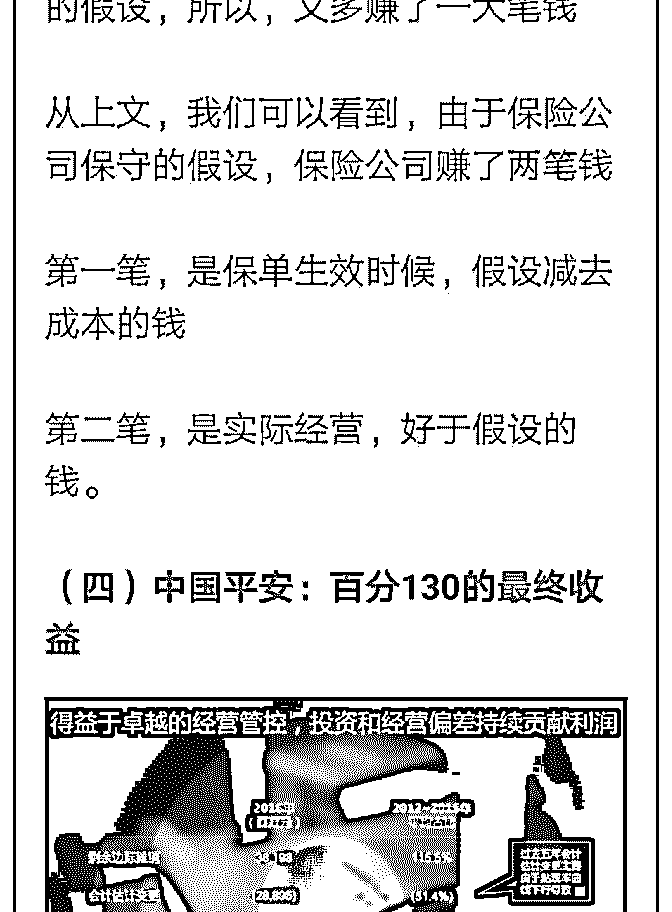
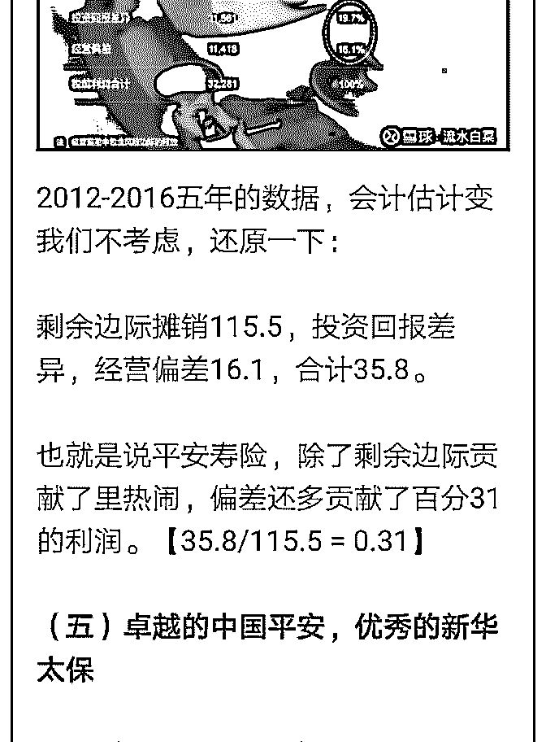
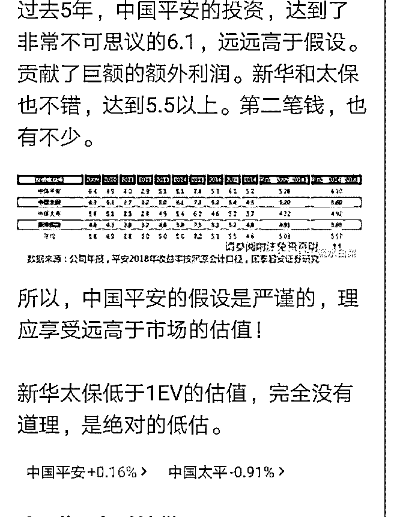

# 白菜聊保险系列 5：

流水白菜 : 白菜聊保险系列 5：是的，市场错了！

保单的价值，是基于假设（最优假设）的。最后能赚多少 钱，要看实际经营成果。市场普遍担心，保险公司太的假设 太乐观。实际经营可能达不到预期。

通过前两周发的保险基本知识系列的分析，我们发现，市场 错了。中国平安的假设，不仅不是太乐观，而是极度保守 了，甚至可以说，藏起来一部分丰厚的利润。中国平安，连 续多年的经营结果显示：最终实现了百分 130 的假设利润。新 华和太保，太平也比较保守有超额利润。因此，中国平安的 估值应该会大幅领先行业。而 H 股保险股低于 1EV 是明显大幅 低估。我在雪球和新浪博客都写了一个通俗简约版本，也放 在这里。

漂亮 50，目前的 ROE 在 15-16。19 年，保险全行业 ROE 会 15- 20。未来几年，平均也有 15 以上。市场还是会认 ROE 的，尤 其 ROE 向上的行业和公司。

2019-07-15(13 赞)

关注公众号"懒人找资源"，星球资源一站式服务