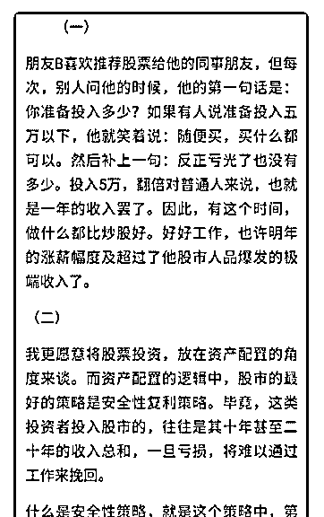
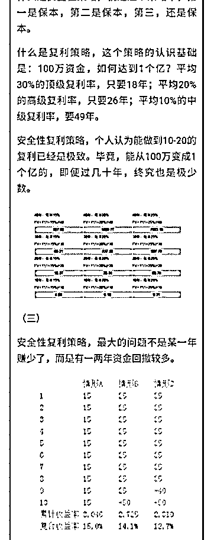
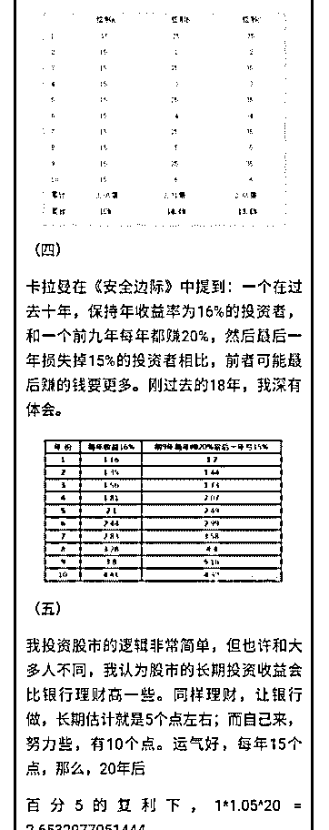
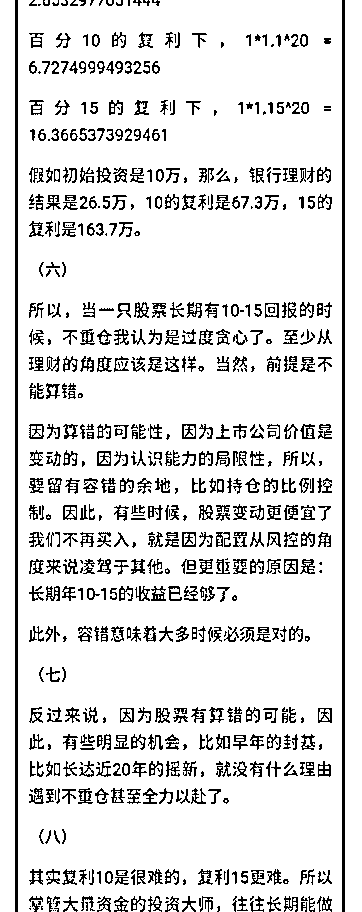
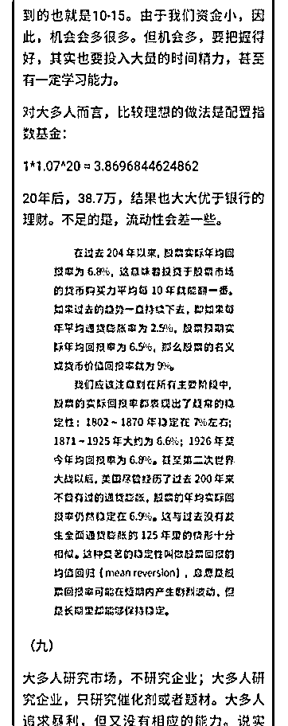
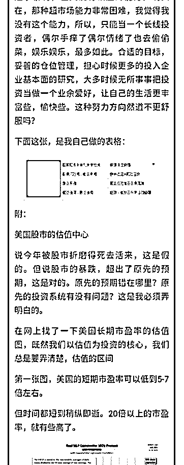
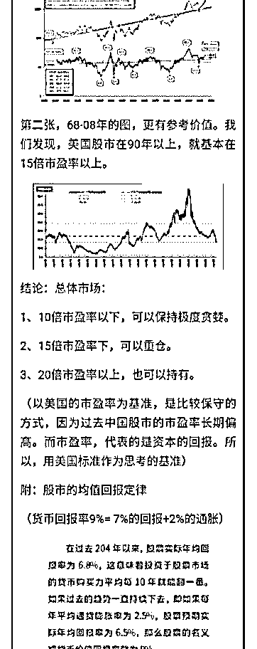
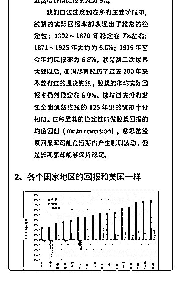

# 白菜闲聊投资 8：安

流水白菜 : 白菜闲聊投资 8：安全性复利原则

这个系列写得有些快。原先的计划，在星球一周写一篇。但 讨论的时候，总觉得有些问题，必须先拿来讨论，这样，日 后就可以问答效率会更高一些。

（一） 先做一些简单的复利计算，算完，我们就大体知道，什么样 的策略，会是更好的策略

100 万资金，如何达到 1 个亿？平均 30%的超级复利率，只要

18 年；平均 20%的巴菲特式的复利率，只要 26 年（所以他是

巨富）；平均 10%的中级复利率，要 49 年。（好像活得久，

就实现了）安全性复利策略，个人认为能做到 10-20 的复利已

经是极致。毕竟，能从 100 万变成 1 个亿的，即便过几十年，

终究也是极少数。

（二） 卡拉曼在《安全边际》中提到：一个在过去十年，保持年收 益率为 16%的投资者，和一个前九年每年都赚 20%，然后最后 一年损失掉 15%的投资者相比，前者可能最后赚的钱要更 多。

所以，当有人说自己赚钱很快的时候，我们要考察他是怎样 做到很快的。有些投资方式，赚钱很快，但波动很大。长期 未必更厉害。还有一些，赌博的味道太重，可能还没赚，就 会出现大幅亏损，不谈也罢。有些基金经理拿别人的钱赌， 赢了登顶风光，输了也就过一两年重头再来。这更要小心。

（三） 当然，有些时候，赚钱快是运气。

相应的，你算对了，运气不来，也没办法。11 年我买入中国 平安，14-15 年翻了一倍。我算对了，但市场反射弧就这么 慢。5 年平均复利 15，其实也很好。但估计大多人已经怀疑很 多遍人生了。 昨天中了一只新股。我几个账户摇，近半年才中一只。一般 人，也许早就放弃了。但我知道，运气无非是概率的积累。

（四） 上面三段文字是引导阅读文字。下面是我的文章 2019-07-11(7 赞)

关注公众号"懒人找资源"，星球资源一站式服务