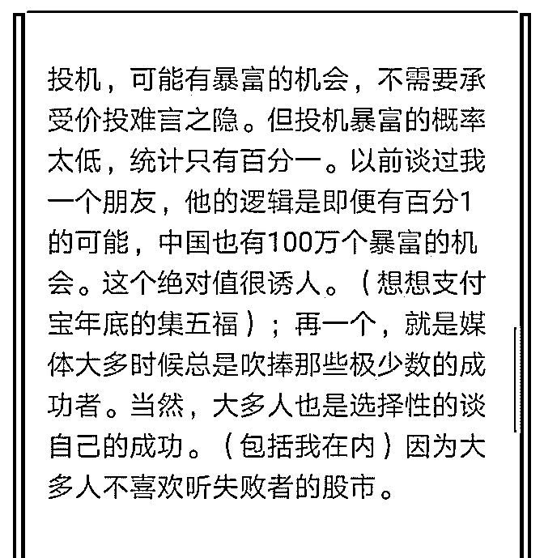
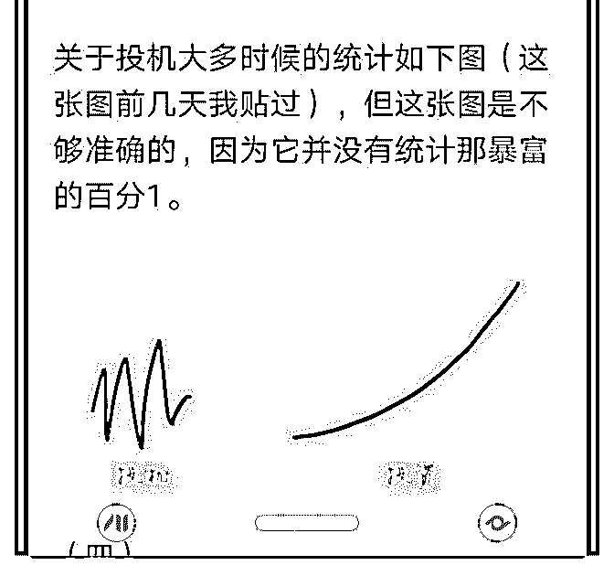

# 白菜闲聊投资 5：如

流水白菜 : 白菜闲聊投资 5：如果赌，确保一定赢

这个世界上最愉快的赌博，莫过于摇新股。没摸到奖，什么 都不会失去。而一开奖，1 万不嫌少，3 万不算多。

低估的时候买入股票也是如此。不小心碰到牛市，就牛市 了。碰不到，就继续等待运气来临。下面这篇文章，前两年 写的，但放在今天，依旧有用。摇新摇久了，知道，终究比 的是资金量和账户，而非什么运气。投资久了，比的就是眼 光和心性。不仅要看得准，而且要在股市的剧烈波动中拿得 住。

（一） 刚开始投资股市的时候，我就发现一个很不可思议的事情，

大多公司，绝大多数年份，经营并没有太大的变化，但每年

的最高价和最低价，往往相差很多，有时相差一倍以上。对

于股市的波动性，也就有了基本的认识。

（二） 后来经历了牛熊。知道牛市有一个有趣的现象，叫着死了都

不卖；而熊市也有一个说法，叫着十八层地狱下面还有十八

层。所以，知道牛市最基本的操作就是不操作，叫着躺着睡

觉醒来瞎叫；所以，也知道一旦熊市来了，有多快就跑多

快，跑完了就不再回头看。这两个操作的好处是，牛市吃

饱，熊市逃跑。

（三）

中国的股市总是大起大落，像一部好莱坞大片。记得 07 年写 过一篇文章：

对于朝生暮死的虫子而言，一天就是一生；对于 500 年为 春，500 年为秋的古怪的树而言，一年只是一瞬。庄子的《逍 遥游》，非常辩证的告诉我们，时间是个相对的概念，长短 因生物而异。如果以股市翻一倍作为一个长期，那么，美国 也许要 5 年，但中国，就是 5 个月。

中国的大牛市，5 个月就是一个长期的概念，100 个交易日， 你可以见证一个股票从冷落、挖掘、吸筹、拉升、盘整、巨 幅波动……生生死死的过程，故事情节一波三折，跌宕起 伏，煞是可观。但正如好莱坞的片子一样，看多了，大抵一 开始就知道：喜剧片男女主角不会死，大坏蛋们屡次要干掉 好人，但最终被干掉的是他们，虽然，大坏蛋往往不会一次 死干净。中国股市的大多股票，也是如此。

（四） 但是，我们有什么理由相信，市场总是如此呢？所以虽然知

道得很早，我却渐渐的不相信牛市熊市。我一切的买入和卖

出，都不是根据市场的情绪，也不是根据市场的判断，我依

据的，只是股票贵了还是便宜了这个简单的逻辑。便宜了，

买；贵了，卖。

（五） 但牛市或者熊市的现象，还是可以给人启示的。这个启示就

是，股票也许会沉眠许久，可能是几个月，甚至可能是几

年。但苏醒后，就会回归价值。也许，几年的沉眠几个月的

上涨就回归到均值上。因此，一旦股票上涨，那么，在回到

价值之前，就安安心心的耐心等待就好了。

（六） 摩根大通有一个统计，如果一名投资者在 1993 年到 2013 年保

持满仓投资标普 500 指数的状态，那么原本可以拿到 9.2%的年

化回报率；但是，如果这名投资者仅仅只是错过了这一时间

段里 10 个最好的交易日，那么其年化回报率就会下降至

5.4%。

所以，不仅仅是不能错过几个月，甚至，有些时候，有些天 错过了，投资收益也会差很多。

但那几天，几个月，都有暴跌的可能。暴跌了怎么办？那也 只能里焦外嫩，因为闪电的时候在场，这是必然的结果。但 暴雨过去，总是会有晴天。如果知道价格会回到价值，那 么，开走的车开过去还是会再开回来。

（七） 有些人上涨的时候，股票拿不住，那是因为没有“锚”。不知

道价值在哪里。

有些人上涨的时候，股票没拿住，那是因为想做来回多赚几 次，那是贪小便宜。

还有的人上涨的时候，股票没拿住，那是因为叶公好龙，不 知道龙长什么样子。不知道股票一旦上涨，有一种可能，就 是狂飙突进，一去不回头。

（八）

如果认为自己持有的股票便宜，持有的仓位合理。那么，就 口头上大惊小怪，内心里波澜不惊。相信历史只是再一次的 重复罢了。重复多的，那就是规律。我们遵循的无非是简单 的规律罢了。低买，然后合理的价格或者高一些的价格卖。 如此而已，简简单单

2019-07-09(18 赞)

评论区：

石海天 : "不喜欢听失败者的股市"，为啥元卫南那么火

流水白菜 : 寻求心里平衡吧。有些人亏了，看看原味男，就觉得还好自己亏得不多。这是八卦的视角，不是投资的

关注公众号"懒人找资源"，星球资源一站式服务