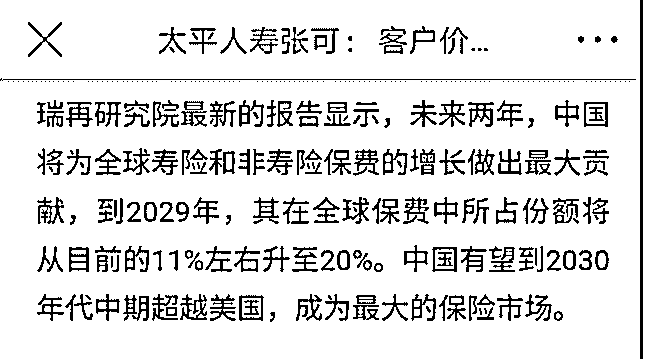

# 白菜闲聊保险系列 4

流水白菜 : 白菜闲聊保险系列 4：中国平安的九大问题，现在 都解决了吗？

刚开始投资一家公司，我们不仅会看其值得买的地方，也要 问它值得担心的地方。下面这篇文章，是我刚开始买入中国 平安问的，问题一共九个，我当时市场普遍的疑惑。现在看 看，这些问题都解决了吗？ 投资不简单，还原当日，买的时候其实并不轻松，问题很多

（现在看好像低估加成长，买入就是），但投资又简单前， 大多数的问题虽然都是问题，是枝节问题，都要“剃除”。

1、资金饥渴

2011 年，平安因为融资问题被暴跌了三次。前两次是传言， 第三次是可转债融资。虽然全年平安业绩超出同业，但跌幅 是三大险企最高的。平安上市后已完成融资两次，都是 H 股的 融资，两次融资近 400 亿，资金主要用途是控股深发展。平安 控股深发展耗费的资金量近 600 亿，作为原先总资产才 800 亿 的平安，几乎这是一个不可能完成的任务。但平安做到了。 借助了两次融资。

平安为什么一定要融资，因为平安要从一家保险公司转化成 一家综合金融公司，而控股银行是关键的一环。综合金融公 司意味着平安的目标在数年之后，在几乎全部的金融领域都 有平安系的公司，同时这些公司必须都必须非常强大。所有 的金融公司，都意味着在成长期需要不断投入。平安的老总 说过，别人是 1 家保险公司，而平安有 9 家子公司（现在不止 了），是 9 个公司，因此，融资量大。

在这次可转债融资后（如果获批），那么，未来数年在 A 股的 融资概率不高，一是平安最大投资银行已经完成，二是可转 债募集的资金是用来补充资本金，三是股市不可能永远熊 市。但过三五年，也许平安的再融资还会再有。

（点评：中国平安已经不再融资，而且大笔分红回购。发展 中的问题，发展了，就不是问题。但平安花了九牛二虎之 力，想做起来的平安银行，还没从黑马到卓越。值得期待）

2、带债上市 在 90 年代末，保险公司事实上都已经破产。当时，保险公司

在高息环境下开了很多高息的保单，成本达到 6 以上，因此，

事实上所有的保险公司在这个世纪初已经破产。人寿上市前

和中国的那些银行一样，把那些让它破产的保单给剥离了。

但平安太保没有。平安的高额保单在 09 年因为会计准则的改

变爆发出来，当时马明哲大呼，要亏 800 亿，而 09 年平安的净

资产也只有这么多。马明哲是夸大了，事实上，09 年，平安

付了 96 个亿，并且把剩下的 166 亿逐年释放。平安这几年来的

赚钱能力，不仅让富通的 200 亿损失不影响公司的脚步，同时

还掩盖了 90 年代末足以让它破产的巨额损失，此外，平安还

在一两年前补交了上市前欠的 10 个亿的税收。或许，正由于

166 亿的存在，在熊市下，平安的估值会低于其他保险公司；

而牛市的时候，人们反过来会说，平安的盈利能力实在强，

它在弥补亏空的同时，盈利还超过了其他的保险公司。

（点评：高利率保单问题，已经消除。过去这些年平安持续 买入工商银行，有部分原因就是为了消除高利率保单的影 响。没想到，过去 5 年，工商银行年复利回报百分 18。不仅仅

远远超出当初 6 的高利率保单，而且，赚翻了）

3、不务“正业”

平安卖得最好的其实都是基金。什么投连险啊，分红险啊， 万能险啊，其实都是少部分保险，大部分投资。而传统意义 上的保险卖得很少。这几年平安保费增加多，其实都是卖这 几种保险。02-03 年投连险风波，就是股市下跌，非常多人退 保闹出来的。当年的投连险一部分责任在买的人贪心，另外 一个原因是销售误导。

保险公司大卖理财型保险的根源在于保监会限定了保单的资 金成本，确保保险公司可以盈利。

点评：（原先的保障性保险，规则是卖得多，前几年亏得 多，甚至有些要七年，才能达到财务上平衡。再加上需求不 足的原因所以大家不爱卖。平安最早保险姓保，因为规则改 了，卖得多，前期利润释放得多。）

4、风格激进甚至冒进 平安证券承销胜景山河被骂得半死，虽然券商都是蛇蝎一

窟，承保的新股连蒙带骗，但平安证券难咎其职，还承销得

特别多。08 年平安车险大打价格战，综合成本率甚至上升到

110，不亏也难；至于股市投资，06-07 简直是疯狂无比，在

短短时间里进入股市的资金就翻倍。在所有的保险公司，无

疑平安是最激进的，甚至有时候冒进，比如投资富通，把所

有鸡蛋放进一个篮子，虽然是黑天鹅，但蛋全碎了不得不说

这种投资手法充满了投机主义。关于投资富通，前文已经谈

了很多，就不再细谈了。

（点评：这两年，平安的投资非常稳健，而且收益更高，已 经明显高出其它险企一个层次。是平安理当更高估值的一个 原因。平安是一家会自我进化的公司，短板变长板，这才是 平安难以复制的基因）

5、发展模式难以为续？ 如果中国市场保险业放开，平安的竞争力堪忧。2011 年友邦

在中国地区新业务价值比 2010 年上升 50%，新业务价值利润

率 47.2%。而同期中国平安的新业务价值增速分别为 8.5%，新

业务价值利润分别为 41.9%。在新业务价值上落后非常明显。

可见，平安保费增速放缓，不是本身增长面临瓶颈，而是发 展模式难以为继。

（过去几年，平安业务爆发增长，同时利润率大幅提高。保 险发展有周期性。18-19 又处于高速发展后的一个调整期。中 国的保险发展空间还有 3-5 倍，决定了大发展---调整-----大发 展的模式还继续有效。因此，我们要坚定信心）

6、销售误导难以自拔？ 平安的退保率因为个险渠道的退保率较低，但销售中的误导

并不少。历史上，平安的退保率并不低，前一阵子，平安人

寿在北京、厦门等多个地区的营销员向社会公众发送误导和

违法违规内容的产品宣传短信，引发的集中误导问题，也看

出平安寿险在销售上始终存在销售误导的问题。由于平安保

单的价值高，因此，一旦退保率上升，其对内含价值的影响

会高于其他保险公司。

（点评：上市险企，平安的退保率非常低。退保的根源是银 保渠道销售误导非常厉害。平安主要做个险，所以问题就消 失了）

7、无法控制的人力成本飙升?

平安主要是个险渠道，人力成本的飙升对于平安的负面影响 最大；同时，平安的薪酬增长又是最快的。通胀经济带来保 险行业人工成本明显增加，中国平安在 2011 年共为员工支付 了近 180 亿元的总薪酬，年增幅高达 54%，四家公司的平均人 工成本已经从 2010 年的 9.2 万元上升至 2011 年的 10.9 万元，总 人工成本支出较 2010 年有超过三分之一的上涨幅度。

（点评：这个问题现在还在，行业竞争剧烈。同时，还是全 社会人力成本的上升。后者是主要原因，这可以理解）

8、如何平衡公司的发展和股东的利益?

融资不仅在熊市里造成股价的下跌，同时，低价融资也损害 了中小股东的利益。对于长期投资者而言，不怕股价下跌， 就怕股价下跌后的融资，稀释了股权，损害了股权的价值。 此外，集团在资金紧张的情况下，去并购估值不低的上海家 化，并不符合股东的利益。如果说深发展的并购具有战略意 义，上海家化的投资更多是一种财务上的投资。因此，对于 平安而言，如何平衡公司的发展和股东的利益始终是个问 题。

(点评；目前这点做得很好了。而且公司平衡了高管，核心员 工，投资者三者的利益。连成利益共同体）

9、子公司文化如何融合？

平安证券投行过去两年连续占据新股承销的冠军，但去年年 底团队集体跳槽，今年平安证券的投行优势已经消失，实在 令人叹息。此外，研究所大规模裁员，以及原深发展员工或 主动或被动离职都引起不小的风波。

震荡背后反映的是不同行业属性之间巨大的文化差异。同样 是金融行业，零售业务和机构业务是不同的盈利模式，代理 人网络与物理网络在渠道管理上也差异巨大，公司文化和客 户认知都是历史的产物，是有价值的，短期内不可能因人而 变。唯有在文化融合和尊重历史规律之间找到平衡点，才能 实现真正意义上的长治久安。

此外，平安发展中还存在着一些隐忧：在银行的景气周期开 始下行的同时，深发展资产质量不佳；合并口径下，不良余 额环比增长 35%，不良率上升 15bp 至 0.68%；平安银行一季度 净利润同比仅增长 7%；平安还隐含了九十年代几十亿的高利 率保单的负债，因此保单的假设高于其他保险公司。

（点评：过去几年，这些问题已经消除。最新的举动是，平 衡了陆金所，平安信托，平安银行三者的利益。平衡不准 确，应该说是根据战略重点，逐个突破。中国平安在这个层 面上的架构，高屋建瓴，而且需要强大的执行力来破局。大 象奔跑，是因为集团总能举重若轻）

2019-07-09(16 赞)

关注公众号"懒人找资源"，星球资源一站式服务