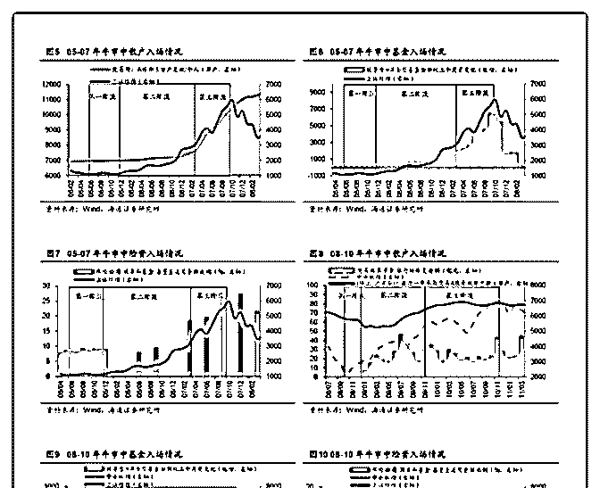
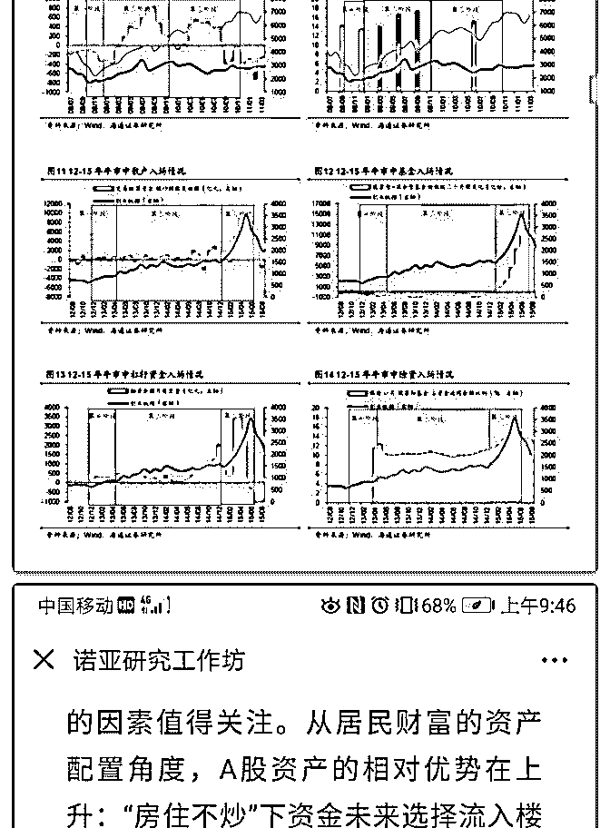
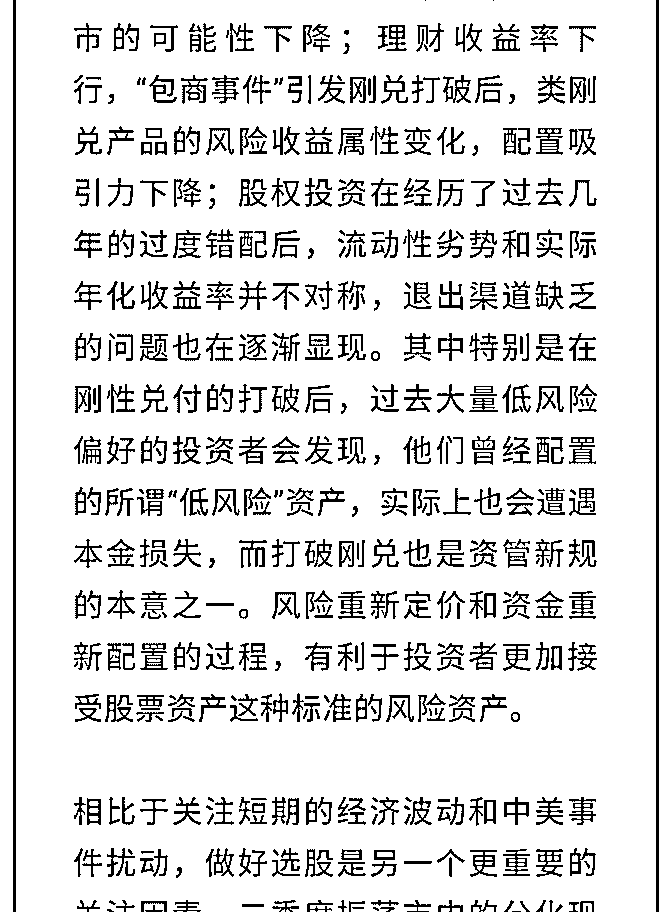
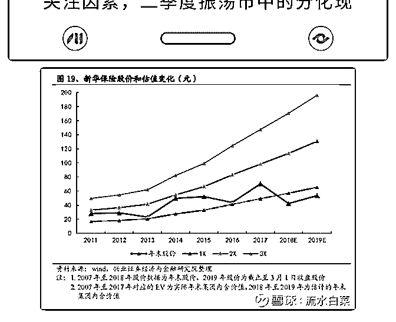

# 股市获得高收益的方

流水白菜 : 股市获得高收益的方法 3：四条捷径 人人都想赚快钱，但赚快钱，只有一个原则：不赌。如果有 第二个原则：如果一定要赌，那么一定不能输。

赚快钱的方法，其实就是赚估值差。因为企业的盈利增长， 对于大多人来说，大多太慢了。所以，只能赚估值。

1.牛市。一个翻倍的牛市，意味着大多公司的估值乘 2。一小 部分乘以 3，乘以 5。牛市需要的是运气，运气我们可遇不可 求。运气的背后是情绪。我们在人们悲观时候入场，在他们 狂热中隐退。

2.寻找黑马。有些行业，公司，基本面如果反转，于是估值自 然大增。投资平安银行，我就是黑马逻辑，从平安银行估值 最低的时候买，相信中国平安有能力，把它变为一线银行。

（因为最便宜的时候买，其实只要预期，有人会认为平安银 行是黑马，给他一个银行中位的估值。这样无论是还是不 是，其实这个估值差就赚到了。当然，我赌是，所以继续拿

——说赌，因为我认为概率高，也是概率）

3.寻找错价。就是一家公司本来应该值 10 倍市盈率，但市场只 给了 5 倍市盈率。这样，回到 10 倍的时候，就有翻倍的收益。 这种投资，就是价值投资的逻辑，正常运行的企业，无需优 秀，也能赚到估值差。

4.赚时代的钱。上个世纪七十年代，美国股市 10 倍市盈率，现 在 20 倍市盈率。原因是无风险收益变了。当时，美国十年期 国债 7.5，所以股市加 3 个点，回报 10 个点，所以市盈率 10 倍以 下。现在国债 2 个点，股市加 3 个点 20 倍市盈率合理。未来，

中国的利率下降一些（注意，是缓慢的下降一些），股市的 合理估值就上升一些。

四种方案，其实要求我们，把有限的时间精力，放在研究公 司上。牛市的梦我们不拒绝，毕竟牛市来了，我们知道怎样 低买高卖。时代的趋势我们也看到，顺势而为。

附：不同估值，价格天差地别

2019-07-05(21 赞)

评论区：

流水白菜 : 以上四种捷径，就是 1 幸运。（如果牛市来了要把握住，不要叶公好龙。我现在为什么满仓。），2 黑马。（平

安银行会成为黑马吗）3 错价（H 股的保险股价值回归）4.利率（社会的无风险利率下降，刚性兑付的打破，实质提升了股

市的价值）。

vi 秋歌 v : 第三张图，有中国太保的吗？目前只做 A 股，除了平安，还有更好的保险标的吗

流水白菜 : 第三张图，就是一个示意。1 倍内含价值是 50 元。0.5 倍就是 25 元，2 倍就是 100 元。25 元和 100 元看起来就是天差地

别的价格了。股市最具剧烈的变化，不是基本面，是估值

关注公众号"懒人找资源"，星球资源一站式服务