# 白菜投资系列知识 3

流水白菜 : 白菜投资系列知识 3：认识市场，认识自我

这篇文章非常基础，但很多入市很久的人并没有深入了解 过。我当时写这篇文章用了不到一个小时，（因为很多以前 写过，思考过，实践过），写完后，很多人很喜欢。放在这 里，给没看过的让朋友看看。看过的朋友，也可以看。因为 人性，其实不利于投资。投资，需要我们不断的重复强化， 市场，自我这个增强回路。

2019-07-05(15 赞)

评论区：

流水白菜 : 首先，在认知上，形成自我增强的回路。1 认知的基础上，形成 2 核心算法，3 算对了，就赚钱。赚钱完，又苛求 1

认知上的精准。2 认知再提升算法。3 算法再赚钱。。。。。其次，复利，是一种钱的增强回路。钱生钱。

陈梓涵 : 接下来有可能又是黄金 10 年[色]

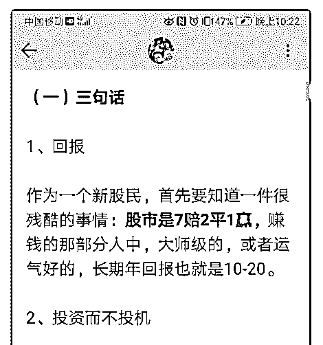

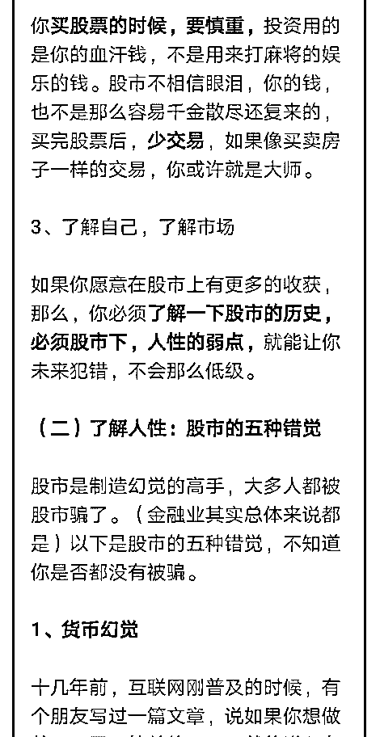

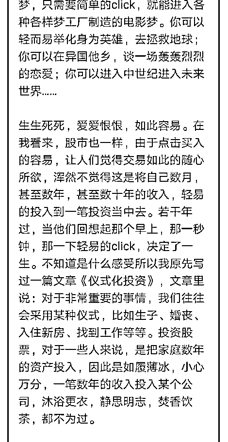

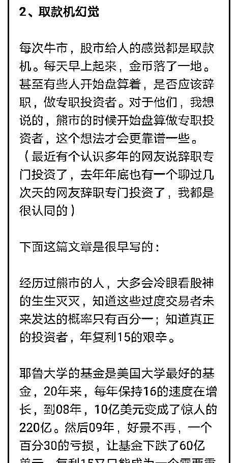

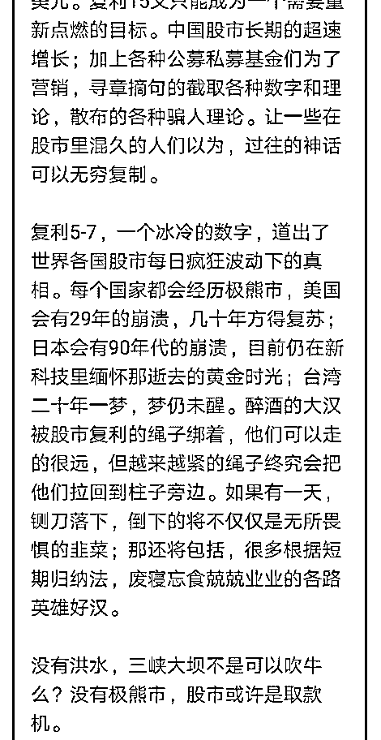

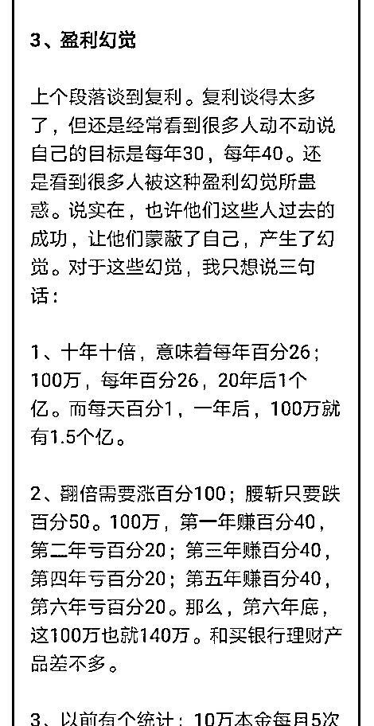

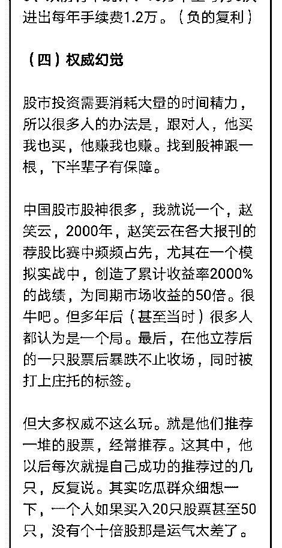

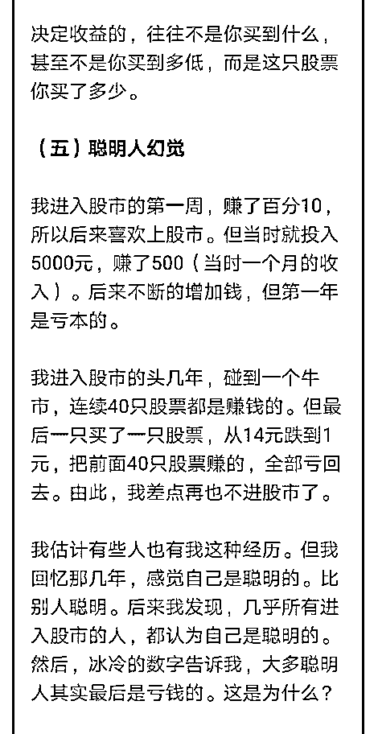

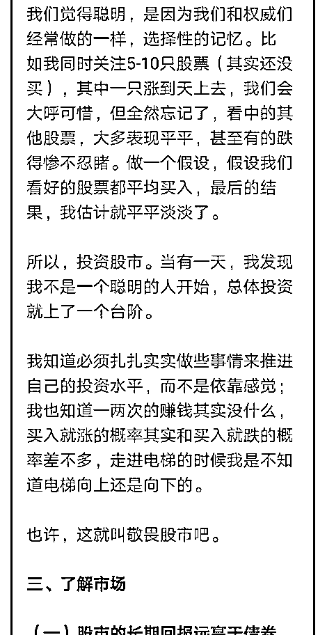

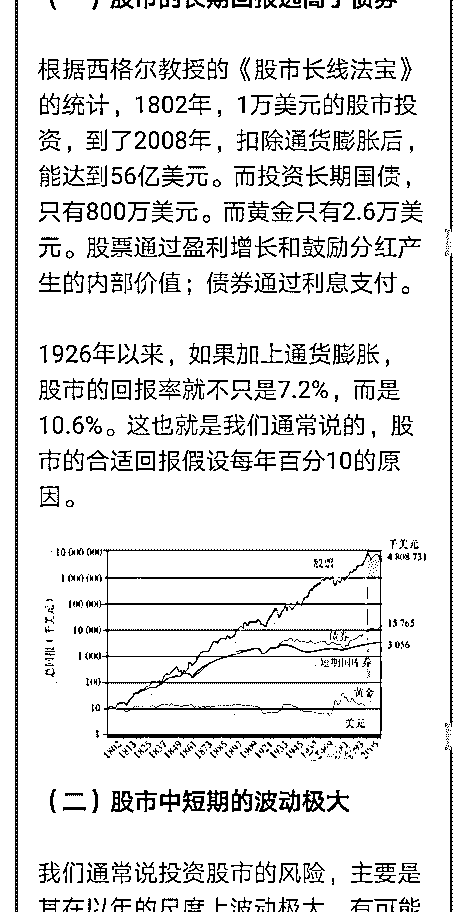

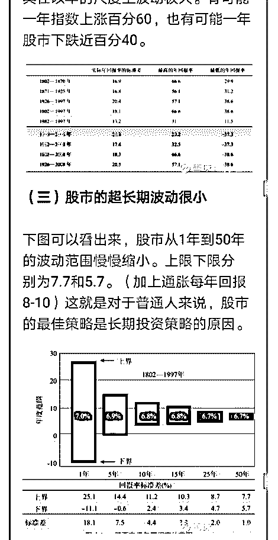

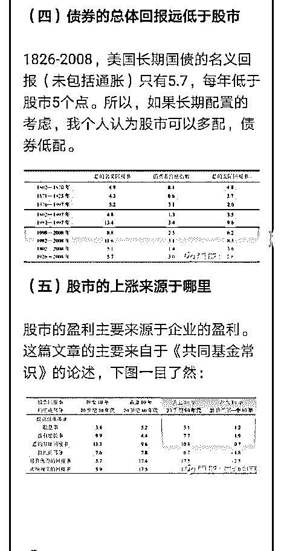

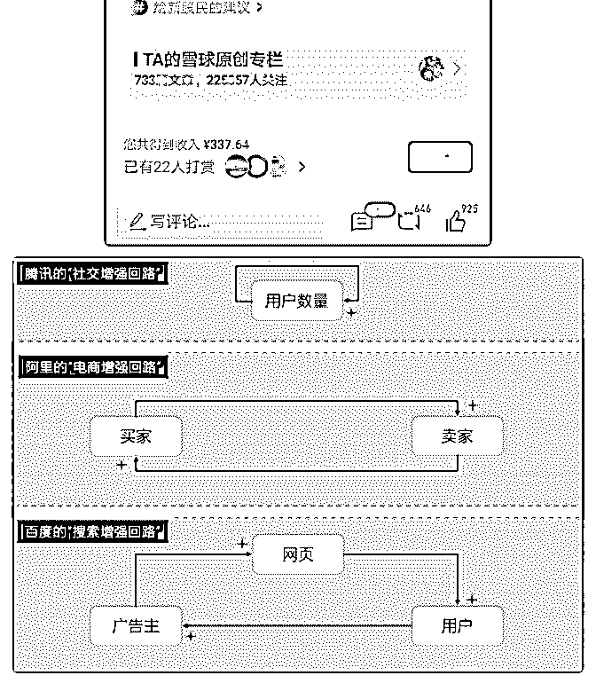

关注公众号"懒人找资源"，星球资源一站式服务