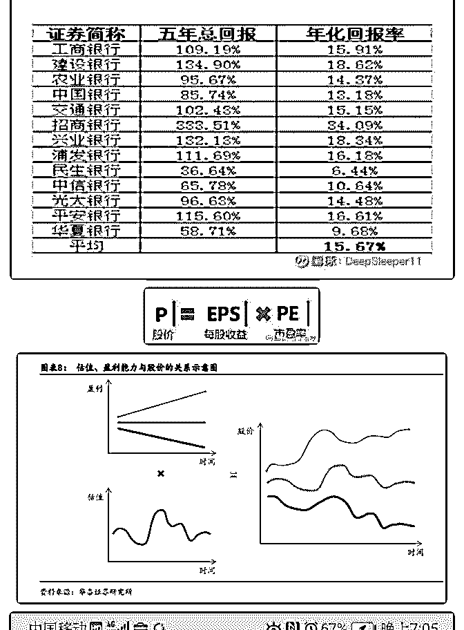
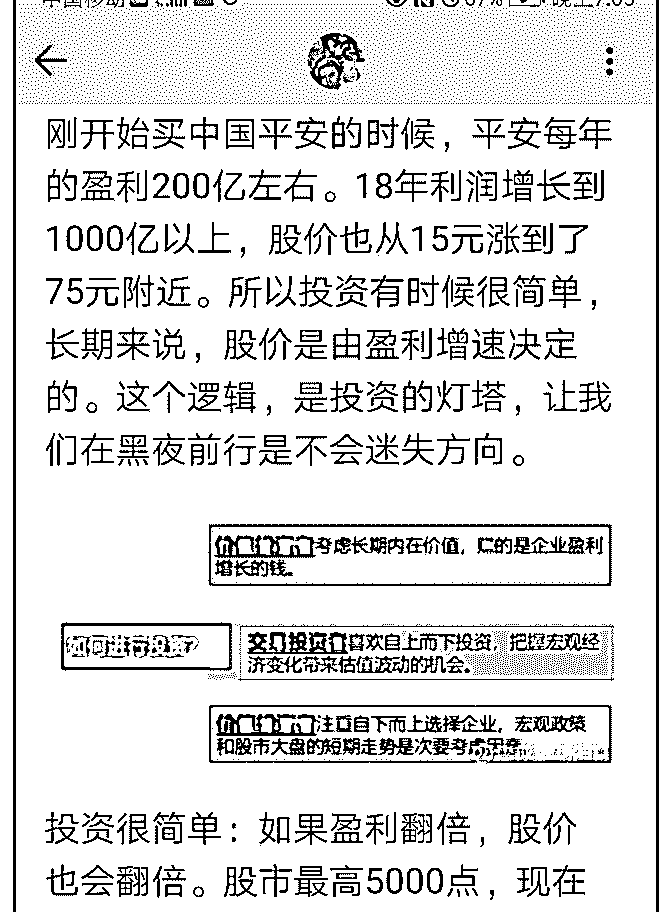

# 股市获得高收益的方

流水白菜 : 股市获得高收益的方法 2：正常收益是怎样的？

过去 5 年，我们经常听到银行股的持有者抱怨，说银行股涨得 不好。但事实呢？

（一） 根据网友 DeepSleeper11 的统计，银行股过去 5 年，年均回报超 过百分 15，超过典型的成长股，1 制药平均年化回报 12%；2 信息技术服务股，平均年化回报仅 9.04%。（后面附他做的 图）

（二） 过去 5 年，银行股估值不变，从 0.9PB 跌到 0.87PB。股价的上 涨，完全源于盈利的增长。（看第二张图，第三张图）

（三） 股市赚钱的公式非常简单，前些天说过 1.估值增加

2.盈利增长

银行股过去 5 年，利润完全来源于盈利增长。所以股价翻了一 倍。很多人觉得低估，如果 0.9PB，涨到 1.2-1.5PB 那就好了。 但市场不理他们。（谁对谁错，暂无定论）

（三） 我们买入股票，有两种方法可以赚 1 倍的钱。第一种，5 年 内，盈利增 1 倍。第二种，估值增 1 倍。而如果估值和盈利提 升，那么就是戴维斯双击，1 元变 4 元了。

（四） 如果我们很便宜买的股票，只要公司正常运行，那么，估值 再长期下跌，就很难。而如果估值不变，那么就是过去 5 年的 银行股。5 年 1 倍。而如果估值和盈利一起增加，就是过去几 年的中国平安，盆满钵满。

（五） 很多人问中国太平和新华 H 股。我的逻辑是，持有 5 年，假设 5 年后仍然 0.5EV（清算价值的一半），那么，凭借内在价值年 增 15，股价可以翻倍。如果市场认为过去错了，给个 1 倍的 EV 就好，那就双击了。甚至市场不认错，凭借保险股牛市更 牛的特性，到 1EV，这个估值提升的钱也赚得到

当然，如果我看错基本面，上面推理就失效

（六） 这篇文章，核心是要能明白，我们股市赚的钱来自哪里。然 后根据这个思路，去寻找自己能看懂的公司获取利润。

最后，市场虽然终究会验证这个简单的数学公式。但过程， 全是情绪。

最后附我写过的一篇文章的片段

2019-07-03(17 赞)

评论区：

璇璇和光同尘 : 老师好，这个银行的平均回报包括了股息吗？

关注公众号"懒人找资源"，星球资源一站式服务