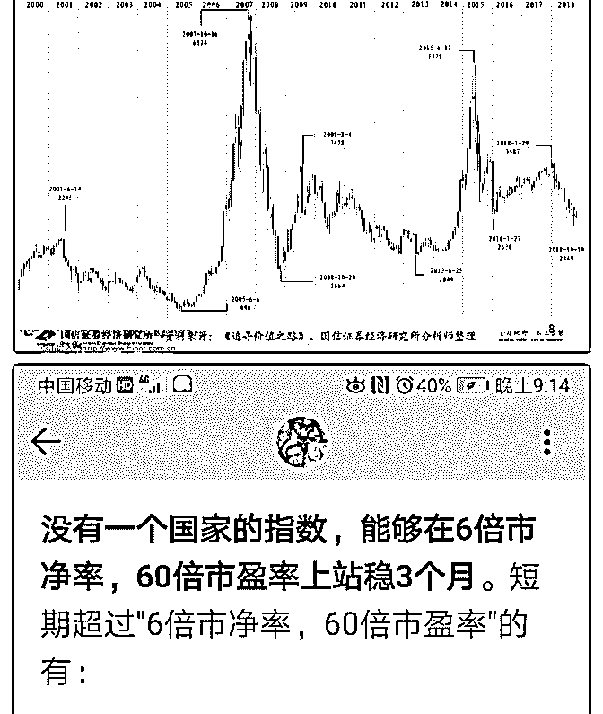
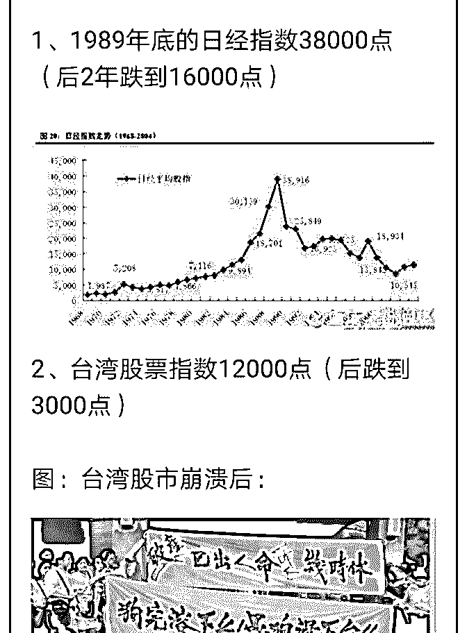
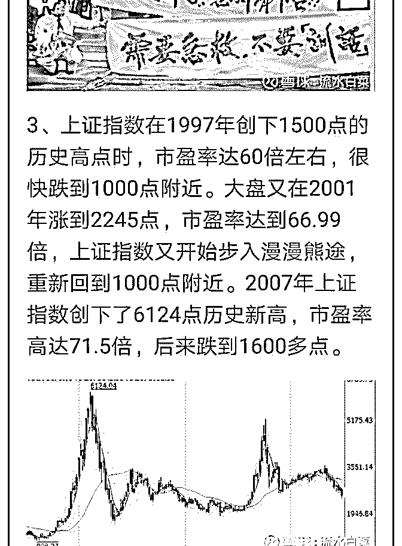
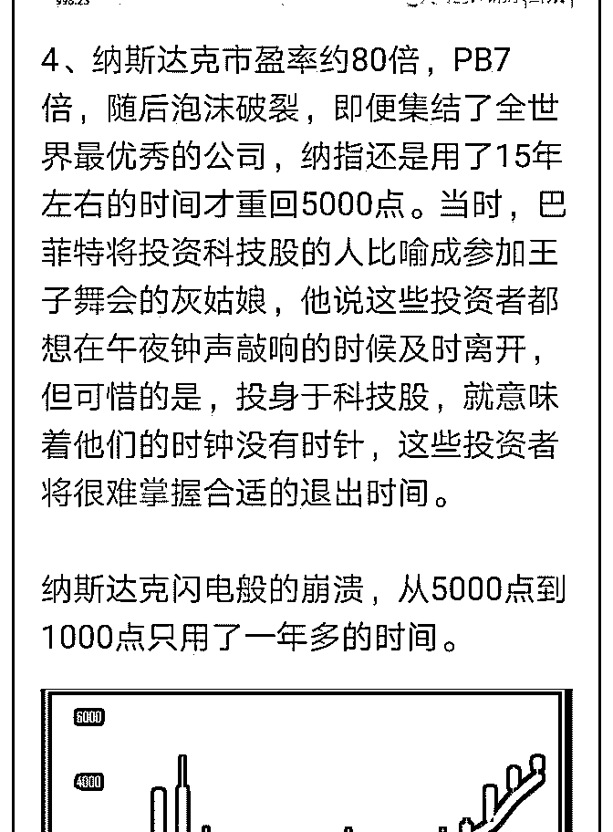
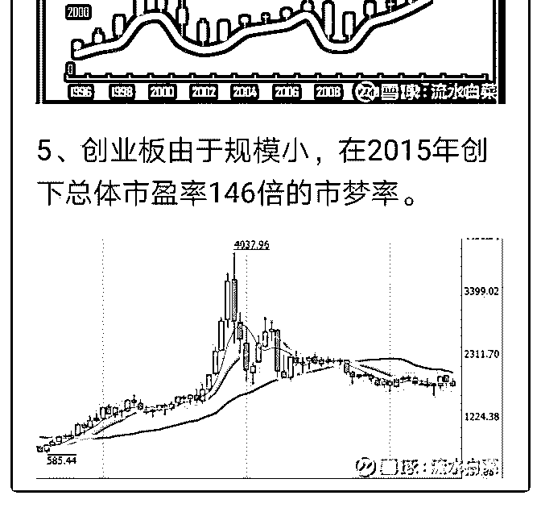

# 投资知识系列 2：牛

流水白菜 : 投资知识系列 2：牛市不言顶，熊市看估值

我写过一篇文章，叫 60 倍市盈率魔咒。说的是，股市没有能 力在 60 倍市盈率上站太久，就会崩溃（我把这文章附在后 面）。但反过来说，如果合理估值是 15-20 倍市盈率，60 倍是 怎么涨上去的。或者说，给了我们怎样的一个经验。

1.牛市不言顶。 牛市最好的参与方式是，牛市前满仓。牛市最好的方式是， 知道股市估值高，不买但慢慢卖。07 年 15 年，在 5000 点，我 依旧有股票卖。牛市不言顶，买我没胆量。但慢慢卖，乐趣 无穷。

2.熊市看估值。60 倍市盈率，跌下来，你直接在 20 倍以下等就 好了。股市腰斩后，还有 30 倍市盈率。07 年 6000 点下来，08 年跌到 3000 点。你敢买吗？

3.一次牛市，你比较完整参与，就可以三五年日子很好过。而 在熊市跌回合理估值区后，即便伤害，大多是时间上比较无 聊要等。

4.涨的时候，我们也可以是趋势派（持有待涨）。跌的时候， 我们就是价值派，挑三拣四。

在牛市中成熟，在熊市中成长

2019-07-02(18 赞)

评论区：

芳 : 老师，关于如何计算估值，和市盈率的书，推介下～～～

流水白菜 : 这个非常简单，上网搜一下就有。有空我直接找来放在这里

芳 : 三口油，谢谢！

江城子 : 白菜老师，我理解您现在满仓持有保险和平安银行，是不是今年也要等大盘上 5000 点再慢慢卖。但今年是结构性牛

市，才 3000 多点，茅台、平安等大蓝筹已不断创出新高。如果满仓持有茅台和平安，是现在就慢慢卖，还是等大盘上

4000、5000 点以上再慢慢卖好。

流水白菜 : 这个帖子只思考指数，具体的公司要具体分析。我讨论的是在股市上总体的配置

江城子 : 哦，看了您的这篇帖子很受启发。看到今天平安公司在 91 块钱还在大额回购，说明平安对公司发展充满信心，预

计中报应该会很靓丽[微笑]

璇璇和光同尘 : 白菜老师，你看的 PE 和 PB 是指上证指数或某单个的指数还是全 A 股的指数呢？

流水白菜 : 其实没有那么严格。一般来说，最有价值的是沪深 300。

关注公众号"懒人找资源"，星球资源一站式服务