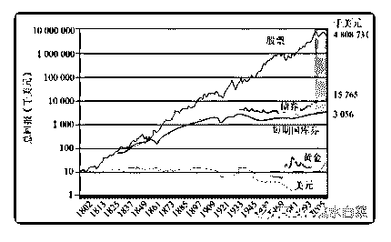

# 投资知识系列 1：股

流水白菜 : 投资知识系列 1：股市最重要的一张图

进入一个陌生的地方，有两种方法，能快速熟悉它。第一 种，是找个高点，俯视。第二种，就是找张地图。

股市最重要的一张图，就是股市的历史。通过股市百年历史 图，我们可以得到三个结论。

1\. 股市是投资之王。在资产配置上，股权配置占的比例越 高，回报就越高。 2.市场剧烈波动，但指数永远向上，在股市，不乱来，获取指 数平均收益，就有年百分 8-10。 3.均值回归。低估的，终将回归。大熊市买，大牛市卖，做到 这点的，就是王者。别人恐惧的时候，你看到估值，想到这 张图；别人贪婪的时候，你理解估值，用这张图作为大的策 略指南。几轮牛熊之后，已成高手。

从今天开始，收藏一些关键地图在。未来，就不会迷路，也 不会迷惘

2019-07-02(19 赞)

关注公众号"懒人找资源"，星球资源一站式服务