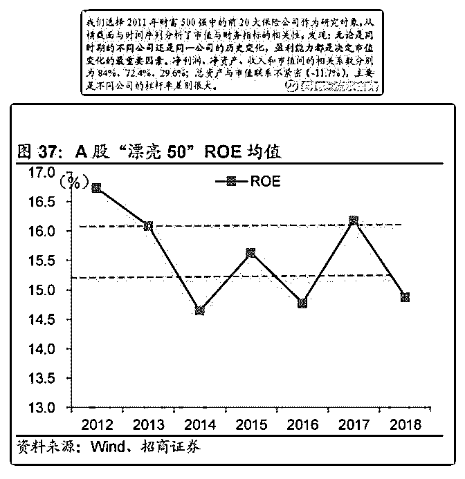

# 闲聊保险系列 3 中国

流水白菜 : 闲聊保险系列 3 中国平安一飞冲天，其它保险股会紧跟其后吗？（下）

这个话题，很重要。有多重要呢？这是一个战略性的投资机 会。

（一） 说战略，它必须满足两个条件：1.值得重仓。2.是三五年的视 角。

（二） 对中国平安，我遗憾过几次，如果平安产险单独上市，当年 可能它就是十倍股，因为几年内，平安产险利润增长了十 倍。平安寿险呢？过去这些年盈利也涨了十倍。 遗憾的点还很多。陆金所刚成立我就跟踪，但现在是呢？估 值 2000 亿了，还没上市。

（三） 我们不谈平安，在这个贴。我们谈其他保险公司。人保 A 刚上 市，是次新股，也不谈。嗯，具体的公司我们都不具体谈。 我只说，H 股的保险公司，有一个历史性的战略机会。估值历 史最低区间，而业绩爆发，可能就在今年。

（四） 如果平安寿险，ROE 能做到 40 左右。那么，其他保险公司， 大概也有 15-20。寿险行业，ROE15-20 是平庸。但这个 ROE15-20，拿出去是可以碾压九成公司的。（18 年，中国的 漂亮 50，ROE 平均也才 15）同时，寿险行业不需要融资。分 红随业绩快速增加，是常态。

（五） 在上午的文章，我讨论过，其他保险公司的估值低，原因 是，这几年净资产和每股盈利增长不如意（有兴趣可以自己 查）。核心原因是。15-17 准备金计提，18 年碰到大熊市。

而 19 年，形势逆转！准备金会略微有所释放，19 年上半年， 沪深 300 大涨近百分 30。这意味着，19 年净资产大增，每股盈 利大增，没有问题。如果叠加减税，叠加保障性保险比例增 加，那么，19 年，保险业会远超预期。

（六） 但仅仅增长个利润，不值得战略二字。

今年保险行业的减税，券商都在算，能多赚多少钱。但我看 到的是：国家顶层设计上，对商业险的支持力度。

我一直喋喋不休的讨论指数，是因为指数低估，对评估保险 公司的价值，太重要了。

假如 3500 点是合理估值，那么，对于一家 1000 净资产的公 司，（假设，总资产 1 万亿，投资股市 1000 亿），这意味着它 的净资产，至少少算了百分 10。。。一次性补百分 10 的净资 产，再加上原先正常的收益，那么，市场会从这是一个学渣 的评估（ROE10 以下），变为这是一个优等生（正常年份 ROE15，牛市下 ROE20）。估值会大幅提升。

（七） 价值投资的本义，是买低估。是四毛买 1 元，从 0.5EV 买入

（3-4 折），1-1.2EV 卖出。叠加上持有期间 EV 的增长。 这很价值。

2019-07-01(23 赞)

评论区：

红叶 : 老师您好，新华保险 H 是否满足条件？

流水白菜 : 人保主要是产险，国寿目前还没彻底转型完成，平安 H 股另当别论。

谢坤 : 请问白菜老师，15-17 年保险公司大幅计提准备金的原因是什么？未来几年还有这个可能吗？

流水白菜 : 十年期国债下行，所以补。原先从看过 4 下行到 3，意味着保险的长期投资收益会下行。所以先计提。

谢坤 : 另外，我记得您说过这些保险公司的合理估值可以到 1.5PEV，在各种形势逆转、利润大幅释放、净资产和 ROE 大

增、减税、国家支持等利好条件下，新华、太平、太保的的 H 股的合理估值应该能到 1.5PEV 吧？在叠加牛市指数大涨，投

资者情绪乐观的情况下，这些保险公司的 H 股应该能往 2PEV 靠近吧？那还需要在 1.2PEV 左右就开始卖出吗？

流水白菜 : 十年期国债走势，不可预测。所以保险股可以做十年啊。股市债市大波动，造成股价不断过山车，同时内在价

值每年 15 的速度在增长。

流水白菜 : 到时候看，模糊而不迷糊的正确就可以

谢坤 : 好的，谢谢老师的解答[微笑]

关注公众号"懒人找资源"，星球资源一站式服务