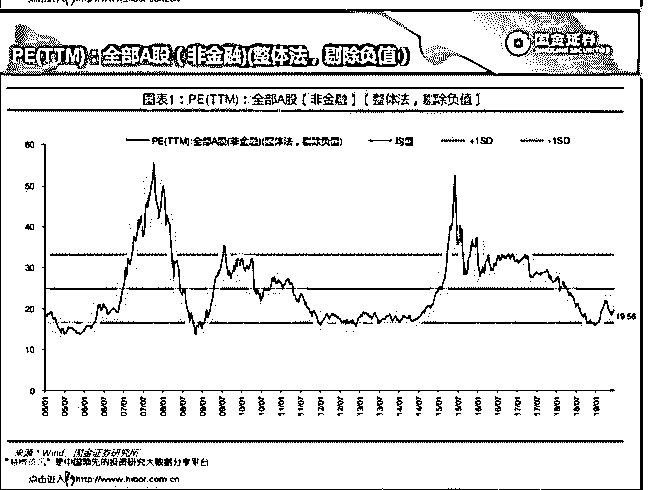

# 投资是长跑，宁静以

流水白菜 : 投资是长跑，宁静以致远

（一） 半年下来，有人收益翻倍；有人大增百分 50。剩下的人心里 不平衡然后想，要不要卖掉自己手上的股票，买那些大家都 看好的？ 要不要学人加点杠杆，或者更激进的杠杆，这样，收益就上 去了

（二） 投资是和 CPI 比，是和银行理财比，是和 M2 比，是和股市平 均增幅比，是和自己的目标比，唯一不需要的，是和少数今 年赚得特别多的人比，你又不准备做基金经理，需要的不是 业绩好到让世人鼓掌，让别人以为你是一个传奇，你需要的 是，是改善自己的生活，让自己退休无忧，当然，如果运气 够好，早日财务自由

（三） 看别人冲，你也冲，那是短跑 跑长跑，每个人都有自己的节奏 我们的投资，不要看被人的收益

我们的投资，看看别人研究公司，有什么特备的洞见，这才 是交流的意义。

（四） 此外，股市里，一年赚百分 50 很容易。但 5 年翻倍很难。甚 至，在股市里，能做到不亏钱都很难。所以，所有投资的 课，投资的书，一般都建议买指数基金。因为，超越指数的 人极少。

人性，在剧烈的波动的股市中，是浮躁的。 而投资，需要的是宁静

宁静，方能致远

谈牛市，谈高收益，内心宁静 才是本事

2019-07-01(18 赞)

评论区：

背包前行客 : 中国平安近 3 年的收益约百分之 200，[微笑]

流水白菜 : 内在价值快速增长，叠加估值快速回升。戴维斯双击的典范

关注公众号"懒人找资源"，星球资源一站式服务