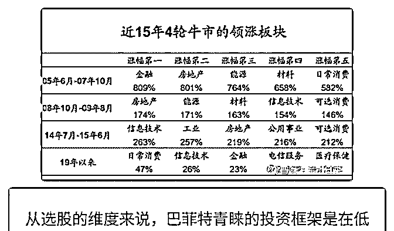
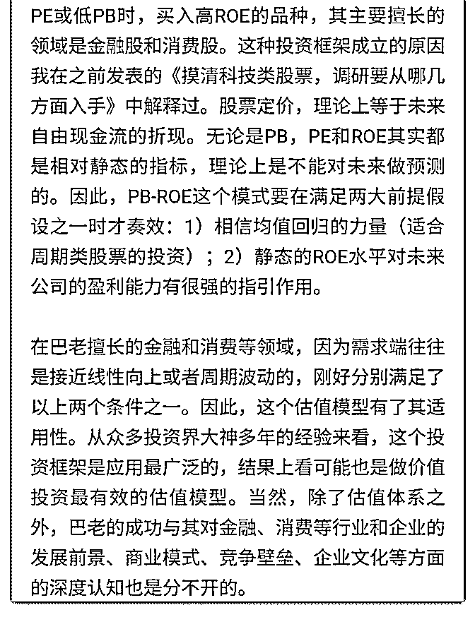
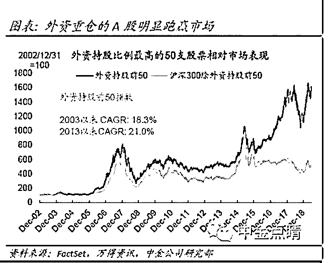

# 牛股集中营有句老话

流水白菜 : 牛股集中营 有句老话：到有鱼的地方钓鱼，那么。鱼在哪里？ 1、彼得林奇的 PEG 方法：

这个办法是昨天介绍的，非常简单实用。但最有价值的地 方，是提示我们，研究公司，核心是要思考一个行业，一个 公司的未来。（巴菲特更多的是教我们安全边际，怎样去防 守，）

2、AH 对照法 这点有网友问，我的回答是：出现 A 比 H 更便宜的公司，可以

关注。可能好公司出现低价格的时机。但我想更详细的说明

15 年，到 5000 点附近，我就持有三只股票，万科，中国平安 还有招行。主要是中国平安。当时万科只有现价的一半，招 行也只有现价的一半。平安呢，也是。巧合吗？惊不惊喜， 意不意外？

17 年，除了重仓中国平安外，我说了一个 AH 折价三剑客，

（当时 A 都更便宜）海螺水泥，潍才动力，福耀玻璃。海螺当

时不到 20 元（我买的最多，印象深）。潍才动力和福耀玻璃

当时短期涨了百分 30，被我换平安银行去了所以没有再关

注。

3、好行业，牛股云集

每个时代，都有一些行业特别能赚钱，股价表现特别好。比 如上半年，牛股集中营中，白酒，食品消费牛股就多。

总结一下：投资，在牛股集中营里找牛股，是跨越低的栏 杆。

4.巴菲特的低 PB，高 ROE 选股 这个模型，可以大致理解价值投资是怎么一回事了。周而复 始，均值回归。大跌有低 PB，和好公司（高 ROE）一起成 长。金融和消费牛股多。。。

下面的图，提到了适应范围。

5，跟外资重仓股吃肉喝酒 由于沪深 300 指数编制的缺陷，因此，超越沪深 300 似乎很容 易。过去几年，外资重仓股，大幅跑赢沪深 300

2019-06-30(16 赞)

评论区：

宁静致远 : 当下什么地方鱼多呢？除了保险。

流水白菜 : 消费股，保险也是消费的一部分。科创版如果有指数基金，可以买。

流水白菜 : 这个帖子，四种方法，分别是成长股，价值股，套利，行业选择四种不同的视角。

关注公众号"懒人找资源"，星球资源一站式服务