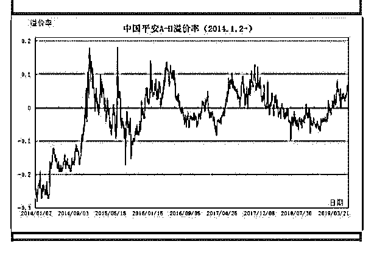

# 保险闲聊系列 1 想了

流水白菜 : 保险闲聊系列 1

想了很久，觉得闲聊的方式，会比较容易写，也容易读。未 来一段时间，就尝试这样写。

（一）

16 年底，我做过一个中国平安 3 年翻倍的策略，写在博客上。

（也在雪球上分享过）大概的逻辑是。

1.平安的内在价值年增 20 左右。

2.摇新每年 5-10 个点回报。

3.AH 互换每年 5-10 个点。

4.上面的逻辑是 2 年翻倍，打个折，3 年翻倍。结果，这个策略

超预期，平安内在价值超预期，摇新超预期，AH 超预期，同

时，平安的估值从极度低估上升到非常便宜，价值回归还提

供一部分收益。所以，当年持有的平安，收益比翻倍还多一

点。

（二） 在上面这个策略中，是三个因子的组合。第一个是价值（低 估值买入策略），第二个是成长。第三个是套利（摇新加 AH 套利）。

（三） 低估值策略，举个栗子。就是不用太考虑公司的其他因素， 只要公司平庸一如既往就可以了。比如中国太平，现在是 0.5EV，回到清盘价值 1EV，就可以有翻倍的收益。17 年其实 翻倍的不只是中国平安，还包括中国太平。

（四） 高质量公司，我举个细节。比如有三家公司，他们的保单都 值 100 亿，但 100 亿这个价值，是假设（估算）出来的。最 后，A 公司兑现了 130 亿的利润。B 公司兑现了 105 亿，C 公司 只兑现了 90 亿。A 公司，就是中国平安，它不只是发展很快， 而且保单假设非常保守。

再换一个栗子。两家公司，一家公司保单成本是 3，投资收益 是 5.5，杠杆率是 15。ROE 是 30 以上。这公司就是中国平安。 而另外一家公司，成本是 4，投资收益不到 5，杠杠是 10，这 家公司是国寿。

平安的高质量，导致业绩总是超预期。

（五）

AH 互换策略，以前写的。

一）套利的思路 巴菲特早期擅长套利，有些人认为巴菲特的手法太难，不可

学，但他的思路，却是长期投资完美的思路。套利，是一种

思路！一个人，假设投资的回报是年 15，如果通过套利，能

每年增加百分 10 的回报，那么，这种技能怎么重视，都不为

过。

二）重视套利的利润 通过摇新和 AH 互换来增强收益，是一种套利，无风险，高收

益。摇新人人懂，但有钱，做得好的，一般都是开多个账

户。。。。AH 互换，懂的人其实不多，实现的人更少。太多

时候，我们严重低估了换股带来的收益。

三）机会来了，抓住机会

中国平安的套利提过很多年，过去 5 年，平安至少出现过 7-8 次百分 10 套利的机会。

【1】如果想长期持有中国平安，那么，持有 A 股还是 H 股， 是一样的。同股同权

【2】如果中国平安 A 股比 H 股贵百分 10，就可以把平安 A 卖 出买入 H。等 A 比 H 股便宜的时候，再卖出 H 买入 A。一个来 回，股票就增加百分 10。

【3】两地市场的投资者，情绪高峰低谷不太一致。 所以有这 个机会。

【4】A 换 H，比较简单。但 H 换 A，比较麻烦，卖出 H 股要两 天后资金才会到账。

【5】目前制度，平安 A 比 H 值钱，A 可以摇新，H 不行分红 H 扣税也多。怎么换，随意。如果你觉得 5 个点也不错，价差 5 个点的时候就可以换。5 个点的差价波动出现概率会更高。

【6】只要股份不换丢，每年多赚百分 10 的股份，或者多赚百 分 5-15 的股份，都是不错的

网友抱朴守拙之十年十倍做的表格（中国平安 AH 对照表）

2019-06-29(17 赞)

评论区：

江城子 : 写得真好，前面两条很容易做到，第一条要拿得住，要有死猪不怕开水烫的韧劲；第二条要能坚持，重在每天参

与打新，享受无风险中奖财富；第三条 AH 套利我感到麻烦一点。是不是还要到香港开户，同时担心把握不好，两边失利。

流水白菜 : 看得明白，才拿得住

陈梓涵 : 老师，那新华保险 A 和 H 大概在多少点的差价波动可以考虑互换？

流水白菜 : 新华 H 如果价格达到新华 A 的百分 90，可以换成 A。但目前看，基本没有换的可能。差太远

陈梓涵 : 好的明白 谢谢老师

关注公众号"懒人找资源"，星球资源一站式服务