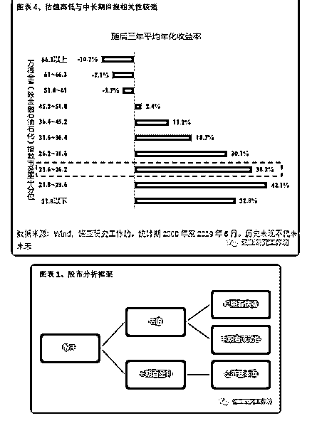
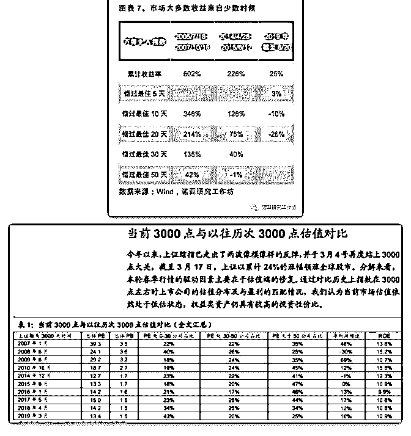

# 一些实用网址，有兴

流水白菜 : 一些实用网址，有兴趣可以看看：

中国太保研报 新华保险研报 中国平安研报 中国太平资讯

常用的国内基金和股票数据查询平台： 天天基金网：

可以查看基金业绩，规模，持仓，基金经理基本信息。 理杏仁： 可以查看各种股票、行业、指数的各种指标，包括历史市盈 率、市净率、市销率、股息率等。

上海证券交易所：

深圳证券交易所： 中证指数公司官网：

MSCI 官网，全球最大最权威的指数制定公司之一： 国际主流 etf 基金查询平台：

[十年期国债](http://guba.eastmoney.com/list%2C601601%2C2%2Cf.html)[中国太保](http://guba.eastmoney.com/list%2C601601%2C2%2Cf.html)[(601601)](http://guba.eastmoney.com/list%2C601601%2C2%2Cf.html)[研报](http://guba.eastmoney.com/list%2C601601%2C2%2Cf.html)[_](http://guba.eastmoney.com/list%2C601601%2C2%2Cf.html)[中国太保盈利分析](http://guba.eastmoney.com/list%2C601601%2C2%2Cf.html)[—](http://guba.eastmoney.com/list%2C601601%2C2%2Cf.html)[东方](http://guba.eastmoney.com/list%2C601601%2C2%2Cf.html)  [财富网股吧新华保险](http://guba.eastmoney.com/list%2C601336%2C2%2Cf.html)[(601336)](http://guba.eastmoney.com/list%2C601336%2C2%2Cf.html)[研报](http://guba.eastmoney.com/list%2C601336%2C2%2Cf.html)[_](http://guba.eastmoney.com/list%2C601336%2C2%2Cf.html)[新华保险盈利分析](http://guba.eastmoney.com/list%2C601336%2C2%2Cf.html)[—](http://guba.eastmoney.com/list%2C601336%2C2%2Cf.html)[东方](http://guba.eastmoney.com/list%2C601336%2C2%2Cf.html)  [财富网股吧 中国平安](http://data.eastmoney.com/report/601318.html)[(601318)](http://data.eastmoney.com/report/601318.html) [研报一览](http://data.eastmoney.com/report/601318.html) [_](http://data.eastmoney.com/report/601318.html) [数据中心](http://data.eastmoney.com/report/601318.html) [_](http://data.eastmoney.com/report/601318.html) [东方财](http://data.eastmoney.com/report/601318.html)  [富网 中国太平](http://guba.eastmoney.com/list%2Chk00966.html)[(hk00966)](http://guba.eastmoney.com/list%2Chk00966.html)[股吧](http://guba.eastmoney.com/list%2Chk00966.html)[_](http://guba.eastmoney.com/list%2Chk00966.html)[中国太平怎么样](http://guba.eastmoney.com/list%2Chk00966.html)[_](http://guba.eastmoney.com/list%2Chk00966.html)[分析讨论社区](http://guba.eastmoney.com/list%2Chk00966.html)

[—](http://www.csindex.com.cn/)[东方财富网 上海证券交易所](http://www.csindex.com.cn/) [`www.szse.cn`](http://www.csindex.com.cn/) [首页](http://www.csindex.com.cn/) [-](http://www.csindex.com.cn/) [中证](http://www.csindex.com.cn/)

[指数有限公司](https://www.msci.com/)[MSCI–Poweringbetterinvestmentdecisions -](https://www.msci.com/)  [MSCI https://www.etf.com](https://cn.investing.com/rates-bonds/china-10-year-bond-yield) [中国十年期国债收益率](https://cn.investing.com/rates-bonds/china-10-year-bond-yield)[_](https://cn.investing.com/rates-bonds/china-10-year-bond-yield)[最新债券利](https://cn.investing.com/rates-bonds/china-10-year-bond-yield)  [率](https://cn.investing.com/rates-bonds/china-10-year-bond-yield)[,](https://cn.investing.com/rates-bonds/china-10-year-bond-yield)[价格行情](https://cn.investing.com/rates-bonds/china-10-year-bond-yield)[,](https://cn.investing.com/rates-bonds/china-10-year-bond-yield)[走势图](https://cn.investing.com/rates-bonds/china-10-year-bond-yield)[_](https://cn.investing.com/rates-bonds/china-10-year-bond-yield)[英为财情](https://cn.investing.com/rates-bonds/china-10-year-bond-yield)

2019-06-24(10 赞)

评论区：

石海天 : 为啥十年期国债才 3.26,我们这 4 大行，3 年期大额存单(10 万起)都有 3.7。

流水白菜 : 大额存单一般利率比较高，买存款

石海天 : 不应该国债比存款高吗？

关注公众号"懒人找资源"，星球资源一站式服务

# 3000 点是个投资

流水白菜 : 3000 点是个投资大问题，非常高级！

3000 点，根据我昨天的奥卡姆剃刀原则，我就谈一点：根据 历史的指数估值，目前的估值，未来三年的年化收益率会非 常高（图在文后）

（一）十字路口，选择！ 05 年，1000 点的时候，这个大是大非的节点，我没做错。08 年初，从股市离场，开心了十年。15 年，股市 5000 点，再度 撤离股市。这些关键时点，值得提的，十年也就三四个。

选择，比努力更重要。十字路口，想明白了，做清楚了，就 可以用奥卡姆剃刀，剃掉各种杂念，未来海阔天空，未来如 鸟飞天，未来如鱼有水，未来如山野村夫冬日傲娇的晒太阳 不知天会荒地会老

（二）年 15 的回报目标 过去一年，我一直死扣 3000 点，我认为这是一个关键节点。 对了，未来 5 年，我的年 15 股市回报的目标，就可以实现。暂 时错了，未来年 15 的目标，还是可以实现，但道路更曲折一 些。也许，更低点买，回报更高。但我的目标，是年 15。所 以，我还是以一种最笨拙的姿势，去守株待兔

（三）股市分析框架 股市有人看短期，有人看中期，有人，看长期。长期，看盈

利。

（四）捕捉大概率

当然，如果今年不涨再跌一点，明年回报率会更高，但我不 赌这个概率。为什么不赌，因为，如果错过，那么，不小心 错过了最好的时候，未来的收益就低了 换句话说，目前的最优策略，3000 点，是以静制动。捕捉未 来 3 年的大概率

（五）3000 点的奥卡姆剃刀 昨天说了，奥卡姆剃刀，就是要剃除所有枝节，仅留下核心

相关的因素

3000 点，有些人谈股市的情绪，但我不谈，3000 点，有些人 谈流动性 3000 点，但我不谈。3000 点，我只谈历史经验，并 且给历史经验打个折，得出未来年 15 的收益

3000 点，如果还要谈，那么，就是保护住自己精心挑选的股 票，不被震下车去。

附：3000 点的历史

2019-06-24(16 赞)

评论区：

流水白菜 : 刚才的文章不见了。不知道什么原因，我改了下。

石海天 : 已上车，等待，快到目的地再醒来，准备下车

朱涛 : 透彻

流水白菜 : 补充说明： 第一，我的投资锚点（参考点）不是昨天，不是上个月，不是今年低点，不是 5 年低点。是合理估值

点，这个合理估值点，在 3500-4000 之间。 第二，合理估值点，目前每年上升 150 点左右。（指数每年百分 5 增长） 第三，每

个人的情况不同，策略不同。但寻找一合适的框架这个是个思路。（框架效应——我们投资的框架，锚点，不能老用自己

今天这周这个月赚钱还是亏了，不能用市场近期的点位来设定。）长线看的，就是估值。而且指数是会快速上移的

宁静致远 : 刚从雪球转来，打个招呼。感谢您在雪球上这么多年的分享，受益匪浅！

流水白菜 : 一起前行！

关注公众号"懒人找资源"，星球资源一站式服务