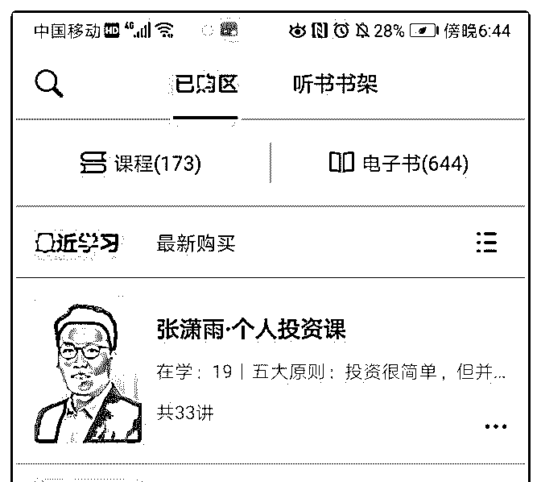
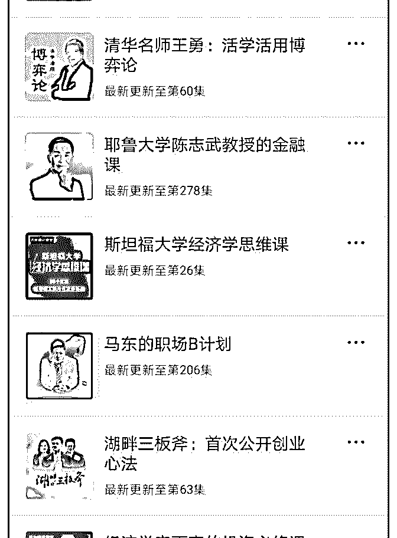
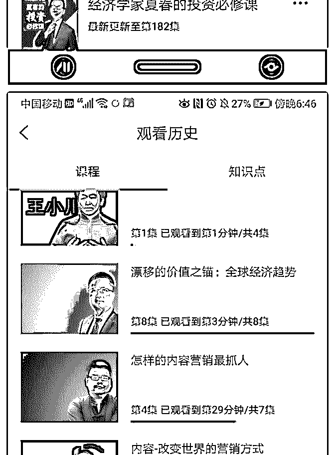
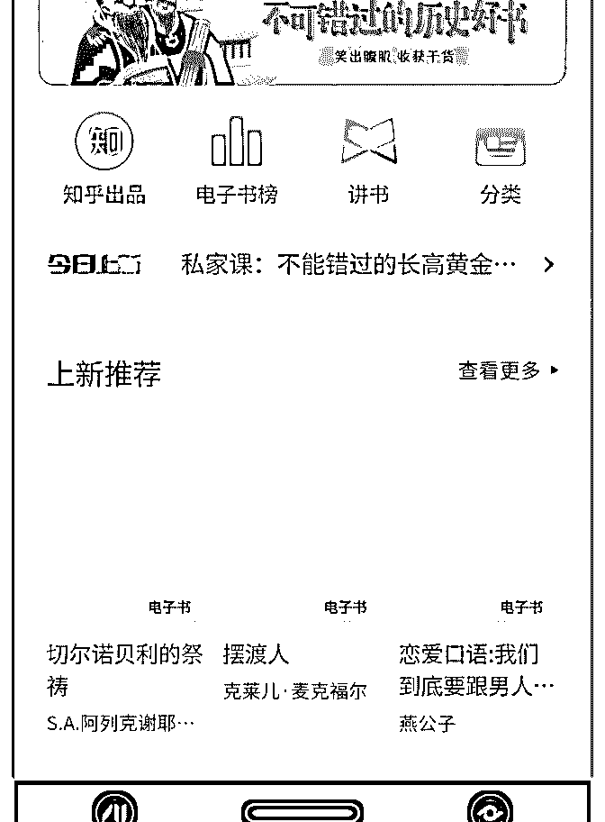

# 我买了很多的课程，

流水白菜 : 我买了很多的课程，有些课程我听完有收获，（很 多我买了还没时间听）。未来，我会把这些课程中，我认为 有价值的内容在这里分享。

2019-06-23(19 赞)

评论区： 三木 : 谢谢

流水白菜 : 我来做过滤器。[微笑]

三木 : 君子！

金牛双子星 : 谢谢啦！

Henry : 推荐薛兆丰经济学

流水白菜 : 嗯。薛兆丰老师的得到课程非常不错。他上线的时候我就买了

关注公众号"懒人找资源"，星球资源一站式服务