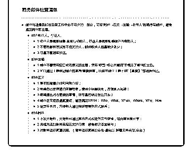

# 2\. 邮件沟通是我们在日

邮件沟通是我们在日常工作中必不可少的一部分，可按“附件→正文→主题→ 收件人”的顺序写邮件，避免遗漏附件和主题。

1 邮件收件人、抄送人

1.收件人是需要回复/直接行动的人，抄送人是需要知悉邮件内容的人；

2.不要将邮件发送给不相关的人，邮件收件人数量能少则少；

3.尽量不要越级抄送。

2 邮件主题

1.邮件不要使用空白或无意义的主题，使用“标签+核心关键词”来概括了邮件

的主旨。

2.可以通过主题标记邮件的紧急/重要程度，比如在邮件主题上用“【重要】”等 词语标记。

3 邮件正文

1.基本的背景介绍和自我介绍；

2.明确自己要传递的关键信息，使用小标题说明，方便别人阅读；

3.明确提出对方要做的事情，并尽量把结论放在开头；

4.邮件正文是否遗漏要点，能否满足 5W1H： Who、What、When、Where、

Why、How

5.设定签名档，方便他人通过电话等其他方式联系；

4 邮件附件

1.不发大附件，大附件可通过其他方式或提供文件链接，如百度网盘分享；

2.养成先添加附件再写正文的习惯，避免忘记添加附件；

3.对附件进行简要说明。（附件进行简单的命名-避免以“新建文件夹”的命名）

评论：

