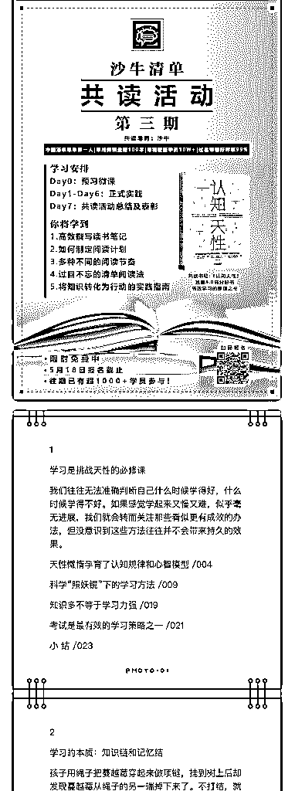
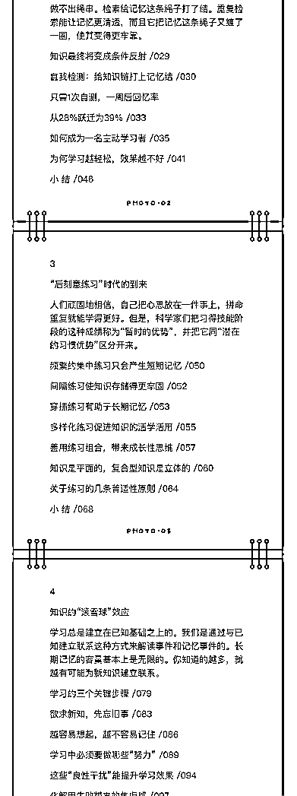
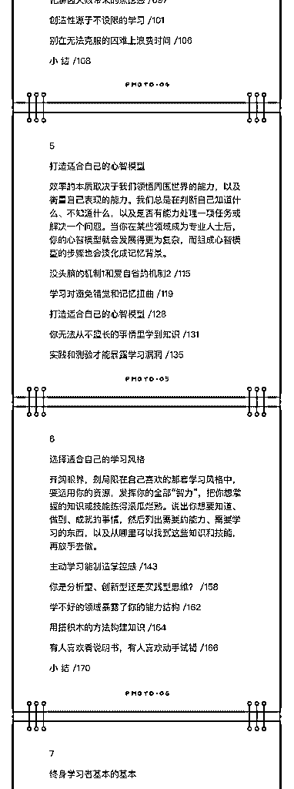
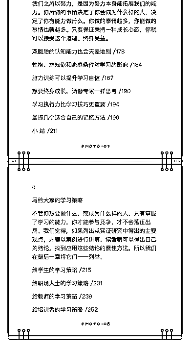
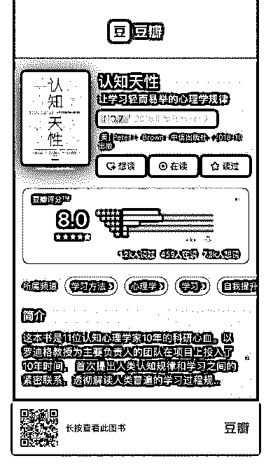

# 3\. 【共读活动第 3 期】

【共读活动第 3 期】报名中

「读什么书」 1.本期共读的，是大家投票率最高的《认知天性》，8.0 豆瓣高分好书，讲述 11 位认知心理学家 10 年脑神经科研成果--最有利于大脑的简单学习法则。 2.小番茄把书籍目录附在后面，可以看一看，感兴趣不

「怎么读」 沙牛老师亲自带班，7 天共读，除了书本身的知识，你还可以学习： 1.过目不忘的清单阅读法

2.如何制定阅读计划

3.高效撰写读书笔记

4.多种不同的阅读节奏

5.将知识转化为行动的实践指南

「如何免费参加」 1.扫描海报二维码，进群报名，即可限时免费参加！5 月 18 日截止～ 2.更多活动信息，点击文章：[`t.cn/EKMyhYh`](http://t.cn/EKMyhYh)

评论：

小番茄㊣ : 用知识星球 app 看的，保存下第一张海报，用微信扫码报名哈！ 小番茄㊣ : 用微信公众号看的，直接长按识别二维码就行[害羞]

