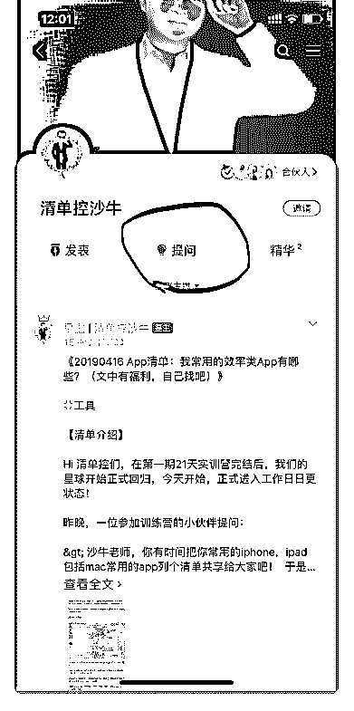

# 13\. 《星球公告：有问题

《星球公告：有问题？来这里向沙牛提问吧！》

喂喂喂，你们这些家里有矿的小朋友，买了星球，就得及时来看呀！充分压榨 我的剩余价值吧！

另外，告诉你一个隐藏的福利： 如果你正好有问题，而且正好感觉这个问题我擅长，不妨点击星球里的“提

问”按钮，向我发起提问吧！我会在最多两个工作日里，认真解答你的问题。

你可以向我提出这些问题：

1\. 关于清单思维。比如：如何把清单思维运用到日常生活中？

2\. 关于工具。比如：经常需要发送几段固定的文本给客户，有什么更快速的方

式吗？

3\. 关于书籍。比如：有什么时间管理的书籍推荐吗？

4\. 关于个人成长的技能。比如：我的笔记总是一团糟、我总是读了书就忘，有

什么解决的方法吗？

1.  ……

    唔，看样子，我还需要对自己做一个正式的自我介绍—— 我的昵称叫做沙牛，这是小时候外婆给起的外号，被我一直使用到了现在，所

    以，大家可以叫我沙牛老师。我是一位三十出头的中年大叔，如果大家觉得我

    不够大叔的资格，也可以叫我为沙牛师傅。

    我呢，曾经是互联网公司的运营总监，在 2016 年底辞职，到现在为止，过了两 年自由职业者的生活。

    在这两年里，我创办了以番茄工作法为核心的效率技能分享平台 PomoNote， 并通过分享番茄工作法、笔记术、阅读方法等课程，让数万人收益。

    同时，我在唯库发起了高效笔记术的系列课程，课程现有学员近 5000 人，除此 之外呢，在这两年时间里，我还开发了关于阅读方法、阅读分享、高效学习等 系列课程，这些课程都有数千名学员。

    无论是我之前的职业生涯，还是现在成为自由职业者之后的生活，我都在很大 程度上受益于清单，所以，我萌生了一个想法：我希望聚焦在一个更小的领 域，也就是清单，把清单这项让我受益匪浅的工具和思维，分享给更多的人。

    然后，我把我的公众号改名成为了“清单控沙牛”，便开始了任重道远的清单思 维普及之路。

    好了，尽管向我提问吧！提问现在免费中：） 评论：

    

    