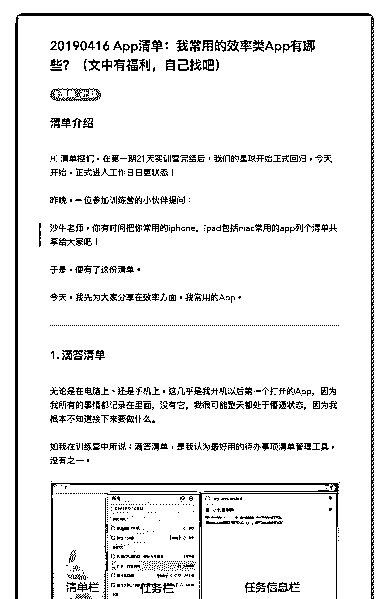
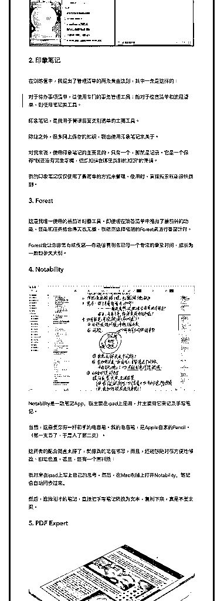
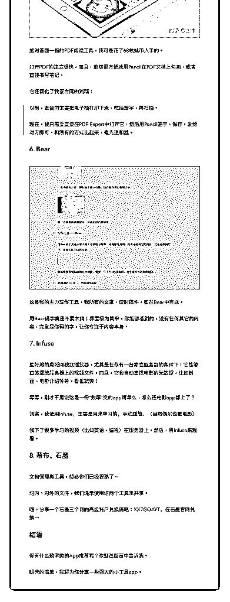

# 14\. 《20190416

《20190416 App 清单：我常用的效率类 App 有哪些？（文中有福利，自己找 吧）》

【清单介绍】

Hi 清单控们，在第一期 21 天实训营完结后，我们的星球开始正式回归，今天 开始，正式进入工作日日更状态！

昨晚，一位参加训练营的小伙伴提问：

> 沙牛老师，你有时间把你常用的 iphone，ipad 包括 mac 常用的 app 列个清单共 享给大家吧！

于是，便有了这份清单。 今天，我先为大家分享在效率方面，我常用的 App。

---

【1\. 滴答清单】 无论是在电脑上、还是手机上，这几乎是我开机以后第一个打开的 App，因为

我所有的事情都记录在里面，没有它，我很可能整天都处于懵逼状态，因为我

根本不知道接下来要做什么。

如我在训练营中所说：滴答清单，是我认为最好用的待办事项清单管理工具， 没有之一。

[图片]

【 2\. 印象笔记】 在训练营中，我提出了管理清单的两条黄金法则，其中一条是这样的：

> 对于待办事项清单，请使用专门的事务管理工具；而对于检查清单和流程清 单，则使用笔记类工具。

印象笔记，是我用于管理后面类别清单的主要工具。 除此之外，很多网上保存的知识，我也使用印象笔记来管理。 对我来说，使用印象笔记的主要目的，只有一个，那就是记录。它是一个保

存“我还没有完全掌握，但却知道在哪里找到的知识”的渠道。

我的印象笔记仅仅使用了最简单的方式来管理，使用时，直接搜索就能很快找 到。

【3\. Forest】 这是我唯一使用的番茄计时器工具。即使现在滴答清单中推出了番茄钟的功

能，还能和任务结合得天衣无缝，我依然选择极简的 Forest 来进行番茄计时。

Forest 会让你非常有成就感——你能够看到自已每一个专注的番茄时间，成长 为一颗颗参天大树。

【4\. Notability】 [图片]

Notability 是一款笔记 App，我主要在 ipad 上使用，并主要用它来记录手写笔 记。

当然，这需要你有一杆称手的电容笔。我的电容笔，是 Apple 自家的 Pencil。

（第一支丢了，于是入了第二支）。

这两者的配合简直太棒了，就像真的笔在书写，而且，还能够随时很方便地修 改、挪动位置。甚至，还有一个黑科技：

我时常在 ipad 上写上自己的思考，然后，在 Mac 电脑上打开 Notability，笔记会 自动同步过来。

然后，选择刚才的笔记，直接把手写笔记转换为文本，复制下来，真是不要太 爽。

【5\. PDF Expert】 [图片]

绝对首屈一指的 PDF 阅读工具，我可是花了 68 软妹币入手的。

打开 PDF 的速度极快，而且，能够很方便地用 Pencil 在 PDF 文档上勾画，或者 直接书写笔记。

它还简化了我签合同的流程：

> 以前，签合同需要把电子档打印下来，然后签字，再扫描。

>

> 现在，我只需要直接在 PDF Expert 中打开它，然后用 Pencil 签字，保存，发给

对方即可。和原有的方式比起来，毫无违和感。

【6\. Bear】 [图片]

这是我的主力写作工具，我所有的文章、课时稿件，都在 Bear 中完成。

用 Bear 码字真是不要太爽！界面极为简单，你能够看到的，没有任何其它的内 容，完全是你码的字，让你专注于内容本身。

【7\. Infuse】 最好用的局域网视频播放器，尤其是在你有一台家庭服务器的条件下！它能够

直接播放服务器上的视频文件，而且，它会自动查找电影的元数据，比如封

面、电影介绍等等，看着就爽！

等等，刚才不是说这是一份“效率”类的 app 清单么，怎么连电影 app 都上了？ 其实，我使用 Infuse，主要是用来学习的，手动尴尬。（当然偶尔也看电影） 我下了很多学习的视频（比如英语、编程）在服务器上，然后，用 Infuse 来观

看。

【8\. 幕布、石墨】 文档管理类工具，想必你们已经很熟了～ 对内、对外的文件，我们通常使用这两个工具来共享。

唔，分享一个石墨三个月的高级账户兑换码吧：XX7GQAYT，在石墨官网兑 换～

【结语】

你有什么效率类的 App 推荐呢？欢迎在留言中告诉我。 明天的清单，我将为你分享一些强大的小工具 app。

评论：

清单控沙牛 : Hi 清单控们，在第一期 21 天实训营完结后，我们的星球开始正 式回归，今天开始，正式进入工作日日更状态！ 今天的清单中，送了一个石墨三个月高级账户福利，自己找找吧：）

清单控沙牛 : 今日讨论： 你有什么效率类的 App 推荐呢？欢迎在留言中告诉我。 明天的清单，我将为你分享一些强大的小工具 app。

ʚ狮子ɞ elsie* : iOS 自带日历、提醒事项、备忘录，都不错。 清单控沙牛 : 这些我个人都用得很少，倒是 Siri 用得最多～ 六一王 : 时光序是免费的清单 APP，感觉比嘀嗒清单更好用

