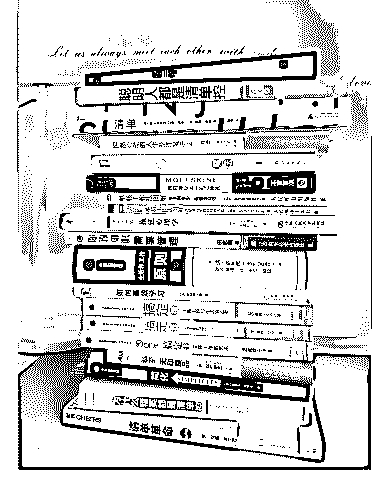

# 16\. 经过几个月时间的

经过几个月时间的酝酿，终于推出了我们的第一个训练营——21 天清单思维 实训营。

这段时间，我把大量以清单为主题，或者沾一点边的书籍都阅读，或者重读 了一遍，上部分书目~

这些书里，你看过或者最喜欢的一本呢？ 在评论中，挑选一位小伙伴，可以任选其中一本赠送，包邮。

评论：

诺诺爱苹果 : 看过《怦然心动的人生整理魔法》，但是我想要那本《拖延心理 学》 因为听你讲了好几遍这本书，总感觉找不到状态，还是想自己看一遍

千叶 : 看过怦然心动的人生整理魔法，和断舍离一起看的，学了一些整理的方 法，精简了物品。聪明人都是清单控和清单革命只看了一小部分，现在都回忆 不起来了[捂脸]

Crystal : 看过《你的知识需要管理》，也是因为老师推荐买了实体书，真的很 有用。觊觎老师的《清单革命》很久了[奸笑]

czfyoyo : 看过 3 本，《简化》看了觉得有点乏味，《如何高效学习》对学习的 原理有了更加形象的认识，看完《拖延心理学》就是各种中枪的感觉，对拖延 心理形成原因的多种多样感到吃惊。后两本都挺喜欢的准备二刷，不知道老师 在这些书中更喜欢哪一本呢？

颂小雅 : 看过《如何高效学习》和《原则》，喜欢《原则》这本书上的工作原 则部分，也很佩服达利欧的自律和坚持，把公开透明做到极致。最近拖延症犯 了，对《拖延心理学》很感兴趣。

