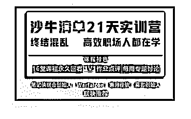
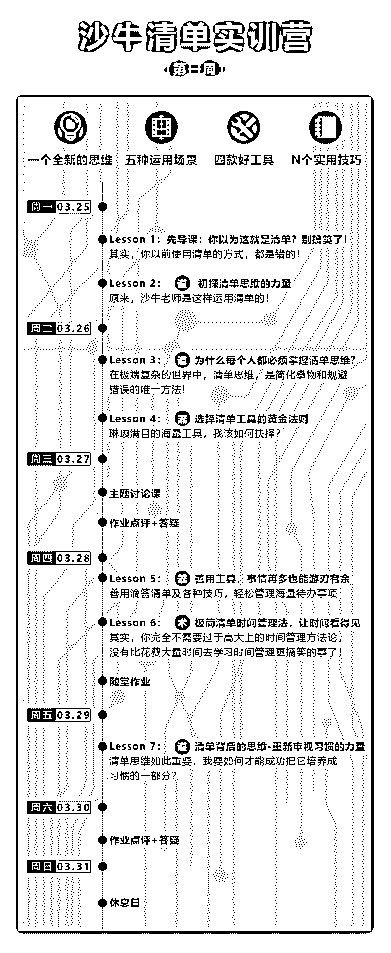
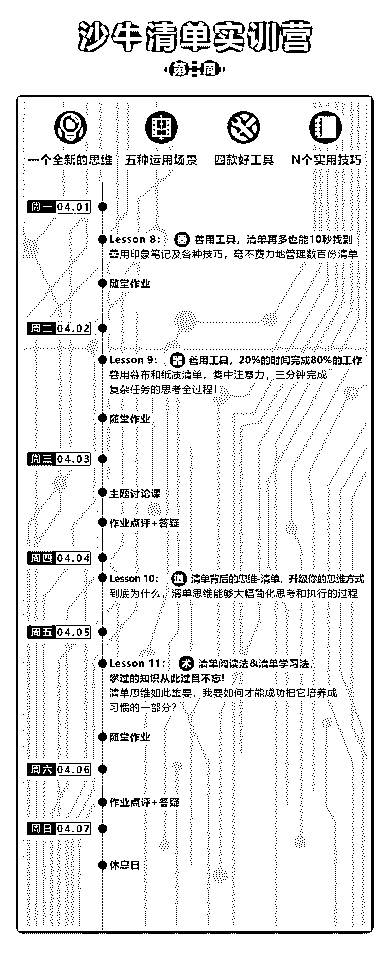
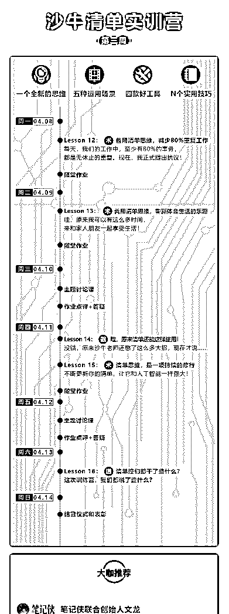
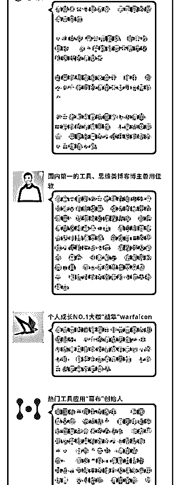
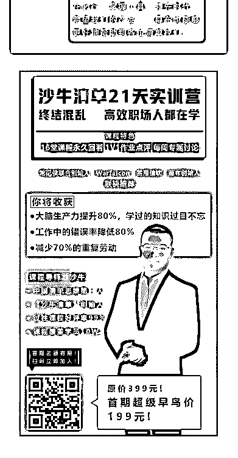

# 17\. 《这一次，我们从道

《这一次，我们从道、术、器三个层面，深度了解清单！》

Hi 亲爱的清单控们，我是沙牛。今天，我要发布一条重要的公告—— 经过半年之久的策划和试运营之后，我们精心策划的“沙牛清单 21 天实训营”现

已正式上线！现已正式开启报名，第一期实训营名额非常有限。

无废话，直接上一个介绍——

【一. 了解“沙牛清单”21 天实训营】 21 天实训营和七天清单思维体验营的本质区别，在于—— 体验营注重的，仅仅是清单思维的培养。

而 21 天实训营，除了为你更加深入地剖析清单思维的力量，还将手把手地告诉 你如何将清单思维运用在不同的多个场景之中，而且，会告诉你如何善用工 具，来更高效便捷地使用、管理清单。

经过无数次的修改和测试，我们终于把 21 天实训营的课表呈现出来（见前三张 图）。

〖1.1 训练营课程内容〗 在这份课表中，可以看出，在这 21 天里，我将告诉你这些内容：

1\. 思维（道）层面：从思维、习惯等方面，重新认识清单的力量。

2\. 运用（术）层面：我将通过几个具体的课时，来告诉你如何把清单运用在时 间管理、学习、工作和生活上，做到不忘掉任何事情、学过的知识过目不忘、 大幅降低错误率，同时，生活还能井井有条。

3\. 工具（器）层面：我会深入拆解多款相关工具的使用，通过这些工具，你能 够轻松管理数百份清单，而且，需要查找一份清单时，能够在 10 秒内快速定 位。

〖1.2 训练营服务〗 整个训练营，为期 21 天，囊括了 16 个毫无尿点的课时。除此之外，为了让你能

够更好地理解和运用清单，我们还加入了这些环节：

1\. 大部分运用和工具层面的课时，均有作业，我们会逐一点评，嗯，逐一点 评！

2\. 每周两次集中点评优秀作业或典型作业的时间，最大程度发现清单的优秀使 用方法。

3\. 每周一次研讨会形式的主题讨论，大幅拓展清单的认知极限。

4\. 所有学员都会分为一个个的小班，以加强同学们之前的监督和互动。

5\. 其它还有很多，不一一细说。

【二. 如何参与？】

1\. 首期 21 天实训训练营的开营时间是 2019 年 3 月 25 日，即日起开始报名，报名 将于 2019 年 3 月 23 日截止。

2\. 这次训练营并不免费，首期早鸟价仅需 199，相当请人吃一顿饭的费用。这 个价格仅限这一期，每一期会有一定程度的涨幅。我相信，训练营中随便一两 个课时的价值，就足以超过票价。

如果你想通过清单思维，来获得更正确、更高效、更轻松做事的能力，不妨来 加入这次训练营吧！

戳此链接报名： 或者，识别最后一图中的二维码也能加入。

【三. 有问题？】 请点击这个链接详细了解： 或者，添加我们的微信：

沙牛：imsandox 小番茄：pnhelper[`t.cn/Exi3cFL`](http://t.cn/Exi3cFL) [`t.cn/Ex6U77k`](http://t.cn/Ex6U77k)

评论：

