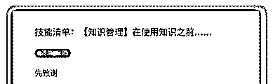
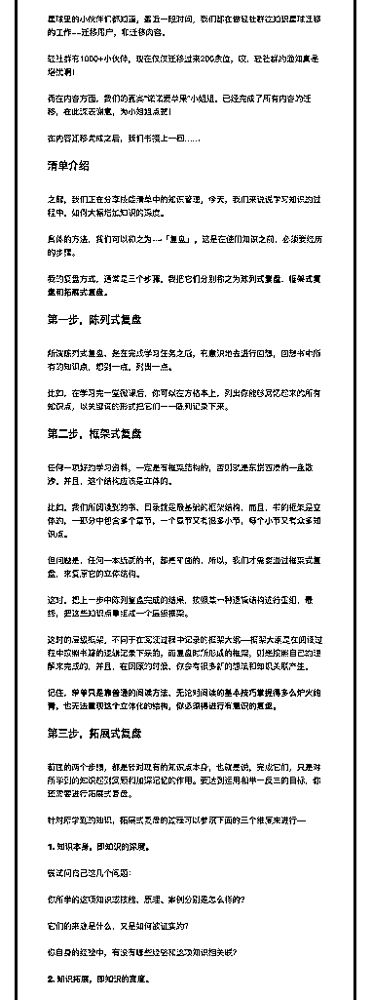
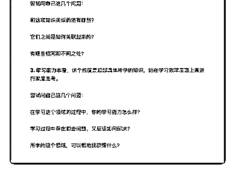

# 18\. 《技能清单：【知识

《技能清单：【知识管理】在使用知识之前……》

【先致谢】 星球里的小伙伴们都知道，最近一段时间，我们都在做轻社群往知识星球迁移

的工作——迁移用户，和迁移肉容。

轻社群有 1000+小伙伴，现在仅仅迁移过来 200 余位，哎，轻社群的通知真是 堪忧啊！

而在内容方面，我们的嘉宾“诺诺爱苹果”小姐姐，已经完成了所有内容的迁

移，在此深表谢意，为小姐姐点赞！

在内容迁移完成之后，我们书接上一回……

【清单介绍】

之前，我们正在分享技能清单中的知识管理，今天，我们来说说学习知识的过 程中，如何大幅增加知识的深度。

具体的方法，我们可以称之为——「复盘」，这是在使用知识之前，必须要经 历的步骤。

我的复盘方式，通常是三个步骤，我把它们分别称之为陈列式复盘、框架式复 盘和拓展式复盘。

【第一步，陈列式复盘】 所谓陈列式复盘，是在完成学习任务之后，有意识地去进行回想，回想书中所

有的知识点，想到一点，列出一点。

比如，在学习完一堂微课后，你可以在方格本上，列出你能够回忆起来的所有 知识点，以关键词的形式把它们一一陈列记录下来。

【第二步，框架式复盘】 任何一项好的学习资料，一定是有框架结构的，否则就是东拼西凑的一盘散

沙。并且，这个结构应该是立体的。

比如，我们所阅读到的书，目录就是最基础的框架结构，而且，书的框架是立 体的，一部分中包含多个章节，一个章节又有很多小节，每个小节又有众多知 识点。

但问题是，任何一本纸质的书，都是平面的，所以，我们才需要通过框架式复 盘，来复原它的立体结构。

这时，把上一步中陈列复盘完成的结果，按照某一种逻辑结构进行重组，最 终，把这些知识点重组成一个层级框架。

这时的层级框架，不同于在阅读过程中记录的框架大纲——框架大纲是在阅读 过程中按照书籍的逻辑记录下来的，而复盘时所形成的框架，则是按照自己的 理解来完成的，并且，在回顾的时候，你会有很多新的想法和知识关联产生。

记住，单单只是靠普通的阅读方法，无论对阅读的基本技巧掌握得多么炉火纯 青，也无法重现这个立体化的结构，你必须得进行有意识的复盘。

【第三步，拓展式复盘】 前面的两个步骤，都是针对现有的知识点本身，也就是说，完成它们，只是对

所学到的知识起到回顾和加深记忆的作用。要达到运用和举一反三的目标，你

还需要进行拓展式复盘。

针对所学到的知识，拓展式复盘的过程可以参照下面的三个维度来进行——

〖1\. 知识本身，即知识的深度。〗 尝试问自己这几个问题：

你所学的这项知识或技能，原理、案例分别是怎么样的？

它们的来源是什么，又是如何被证实的？ 你自身的经验中，有没有哪些经验和这项知识相关联？

〖2\. 知识拓展，即知识的宽度。〗 尝试问自己这几个问题： 和这项知识类似的还有哪些？

它们之间是如何关联起来的？ 有哪些相同和不同之处？

〖3\. 学习能力本身〗 这个维度是超越具体所学的知识，站在学习效率层面上来进行深度思考。 尝试问自己这几个问题：

在学习这个领域的过程中，你的学习能力怎么样？ 学习过程中存在哪些问题，又应该如何解决？ 所学的这个领域，可以帮助我获得什么？

---

以上

评论：

清单控沙牛 : 留一个问题给大家：在你看来，复盘，和我们读书时代经常听到 的“复习”，有什么区别呢？

诺诺爱苹果 : 复盘需要带着脑子 用脑子思考和拓展 复习不需要带脑子，讲什么记住什么

czfyoyo : 复习主要是为了防止遗忘加深印象，形式上比较简单机械。复盘是在 复习的基础上，联结自身已有知识建立框架和扩展思维，需要有更大的灵活性 和主动性。

颂小雅 : 复习只是机械记忆大脑中的“点”，而复盘是把对自己有用的“点”，连 成“线”，就像玩游戏拼图一样。

