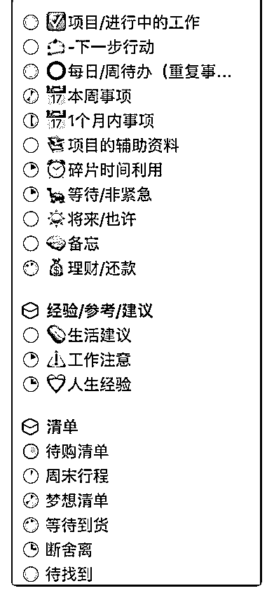

# 19\. 分享一下我的 thi

分享一下我的 things 菜单左侧

评论：

清单控沙牛 : 很棒呀！我也买了 Things，但没怎么用 子夜 : 这个是项目分类还是标签的分类

思嘉蕾 : 方型的叫区域，圆形的是项目。 一个区域下面可以建很多项目，项目下面也可以分类、加标签、加检查清单。

清单控沙牛 : 冲着这段回复，告诉你一个我的方法：我的清单名字里把检查清 单、流程清单等等都规定一个前缀。流程清单是 FL_、检查清单是 CL_.

思嘉蕾 : 嗯嗯，多谢沙牛老师的建议，我去修改优化一下。

