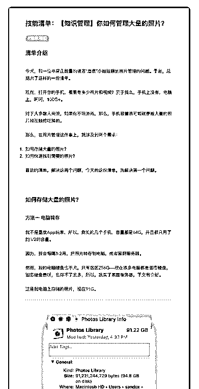
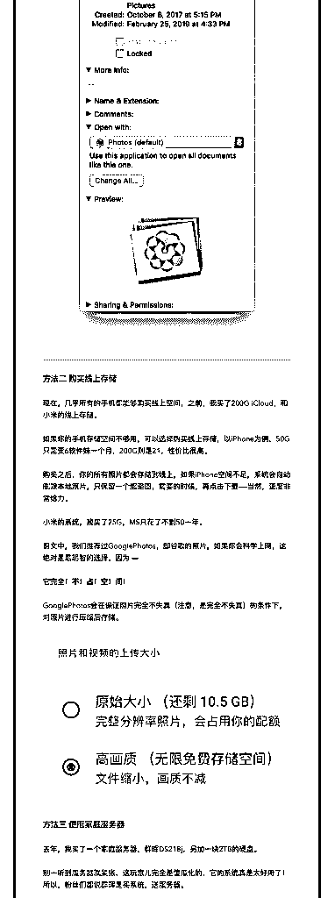

# 26.

《

《20190226 你如何管理大量的照片？》

【清单介绍】

今天，和一位非常正能量的读者“眉痕”小姐姐聊到照片管理的问题。于是，总 结出了这样的一份清单。

现在，打开你的手机，看看有多少照片和视频？至于我么，手机上没有，电脑 上，呵呵，100G+。

对于大多数人来说，如果你不玩游戏，那么，手机容量很可能就是被大量的照 片和视频给吃掉的。

那么，在照片管理这件事上，就涉及到两个需求：

1\. 如何存储大量的照片？

2\. 如何快速找到需要的照片？

最近的清单，解决这两个问题，今天的这份清单，先解决第一个问题。

---

【如何存储大量的照片？】

〖方法一 电脑转存〗 我不是重度 App 玩家，所以，我买的几个手机，容量都是 64G，并且都只用了

约 1/2 的容量。

因为，我会每隔 1-2 周，把照片转存到电脑，或者家庭服务器。 然而，我的电脑硬盘也不大，只有区区 256G——现在很多电脑都是固态硬

盘，固态硬盘贵呀，也存不了太多，所以，我买了家庭服务器，下文有介绍。

这是我电脑上存储的照片，现在 91G。

[图片]

〖方法二 购买线上存储〗

现在，几乎所有的手机都能够购买线上空间，之前，我买了 200G iCloud，和 小米的线上存储。

如果你的手机存储空间不够用，可以选择购买线上存储，以 iPhone 为例，50G 只需要 6 软件妹一个月，200G 则是 21，性价比很高。

购买之后，你的所有照片都会存储到线上，如果 iPhone 空间不足，系统会自动 删除本地照片，只保留一个缩略图，需要的时候，再点击下载——当然，速度 非常给力。

小米的系统，我买了 25G，MS 只花了不到 50 一年。 前文中，我们推荐过 GooglePhotos，即谷歌的照片，这绝对是最明智的选择，

因为——

**它完全！不！占！空！间！** GooglePhotos 会在保证照片完全不失真（注意，是完全不失真）的条件下，对

照片进行压缩后存储。

[图片]

〖方法三 使用家庭服务器〗 去年，我买了一个家庭服务器，群晖 DS218j，另加一块 2TB 的硬盘。

别一听到服务器就紧张，这玩意儿完全是傻瓜化的，它的系统真是太好用了！ 所以，粉丝们都说群晖是买系统，送服务器。

这个服务器里面有个功能，叫做 Moments，开启之后，在手机上下载一个同名 App，之后，在家的时候就把它打开，它会自动把所有照片和视频上传到服务 器。

上传之后，我就会把手机上的照片完全删掉。 然后，我可以拿出手机、平板、电脑，甚至家里的电视，来浏览这些照片—— [图片]

（嘟嘟小朋友友情出镜）

〖警示：别放移动硬盘！〗

很多小伙伴会把大量的照片放在移动硬盘，其实，以我的经验来说，这方法不 靠谱！

因为，我用坏了两块移动硬盘，but，我是很爱惜电子产品的人！ 所以，我总结出一个血泪教训：硬盘这玩意儿，装电脑上，用上三五年都不容

易出问题，但一旦让它变成移动的，就呵呵了。

【结语】 文中的方法，你现在正在使用哪一种呢？

评论：

