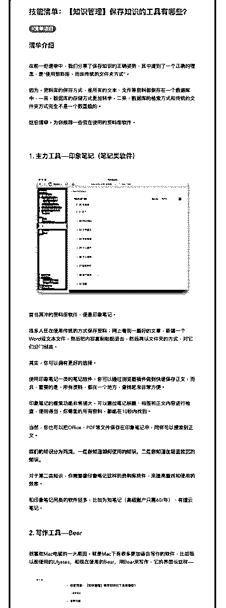
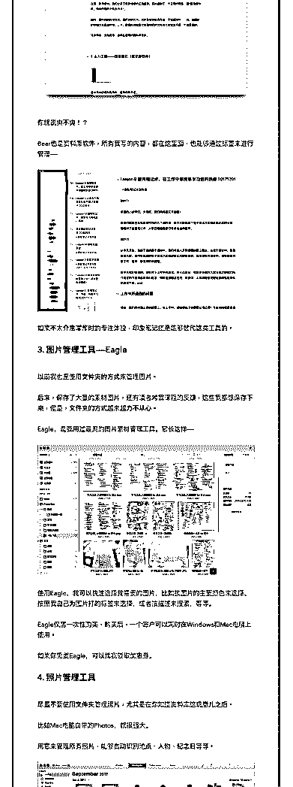
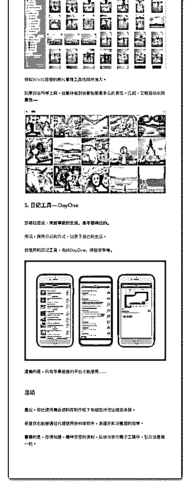

# 27.

《20190225 保存知识的工具有哪些？》

【清单介绍】

在前一份清单中，我们分享了保存知识的正确姿势，其中提到了一个正确的理 念，是“使用资料库，而非传统的文件夹方式”。

因为，资料库的保存方式，是所有的文本、文件等资料都保存在一个数据库 中，一来，数据库的存储方式更加科学，二来，数据库的检索方式和传统的文 件夹方式完全不是一个数量级的。

这份清单，为你推荐一些我在使用的资料库软件。

---

【1\. 主力工具——印象笔记（笔记类软件）】 [图片] 首当其冲的资料库软件，便是印象笔记。

很多人还在使用传统的方式保存资料：网上看到一篇好的文章，新建一个 Word 或文本文件，然后把内容复制粘贴进去，然后再以文件夹的方式，对它 们分门别类。

其实，你可以拥有更好的选择。 使用印象笔记一类的笔记软件，你可以通过浏览器插件做到快速保存正文，而

且，重要的是，所有资料，都在一个地方，查找起来非常方便。

印象笔记的搜索功能非常强大，可以通过笔记标题、标签和正文内容进行检 查，使用得当，你需要的所有资料，都能在 10 秒内找到。

当然，你也可以把 Office、PDF 等文件保存在印象笔记中，同样可以搜索到正 文。

**我们的知识分为两类，一是你知道如何使用的知识，二是你知道在哪里找到 的知识。**

对于第二类知识，你需要像印象笔记这样的资料库软件，来提高查找和使用的 效率。

和印象笔记同类的软件挺多，比如为知笔记（高级账户只需 60/年）、有道云 笔记。

【2\. 写作工具——Bear】 我喜欢 Mac 电脑的一大原因，就是 Mac 下有很多更加适合写作的软件，比如我

以前使用的 Ulysses，和现在使用的 Bear，用 Bear 来写作，它的界面长这样——

[图片]

你就说爽不爽！？

Bear 也是资料库软件，所有我写的内容，都在这里面，也能够通过标签来进行 管理——

[图片]

如果不太介意写作时的专注体验，印象笔记还是能够替代这类工具的。

【3\. 图片管理工具——Eagle】 以前我也是使用文件夹的方式来管理图片。

后来，保存了大量的素材图片，还有读者对我课程的反馈，这些我都想保存下

来，但是，文件夹的方式越来越力不从心。

Eagle，是我用过最爽的图片素材管理工具。它长这样—— [图片]

使用 Eagle，我可以快速选择我需要的图片，比如按图片的主要颜色来选择、 按照我自己为图片打的标签来选择，或者按描述来搜索，等等。

Eagle 仅需一次性购买，购买后，一个账户可以同时在 Windows 和 Mac 电脑上使 用。

如果你需要 Eagle，可以找我领取优惠券。

【4\. 照片管理工具】 尽量不要使用文件夹管理照片，尤其是在你知道资料库这玩意儿之后。 比如 Mac 电脑自带的 Photos，就很强大。

用它来管理所有照片，能够自动识别地点、人物、纪念日等等。

[图片]

貌似 Win10 自带的照片管理工具也同样强大。 如果你能体验到谷歌相册是多么的变态。比如，它能自动识别景物—— [图片]

【5\. 日记工具——DayOne】 苏格拉底说：**未经审视的生活，是不值得过的。** 所以，我用日记的方式，记录下自己的生活。

我使用的日记工具，名叫 DayOne，体验非常棒。 [图片] 遗憾的是，只有苹果爸爸的平台才能使用……

【总结】 最后，你还使用哪些资料库软件呢？欢迎在评论区域告诉我。 希望你也能够通过合理使用资料库软件，来提升知识管理的效率。

重要的是，你得知道，哪种类型的资料，应该存放在哪个工具中，它应该是唯 一的。

评论：

