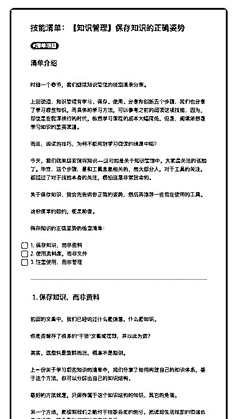
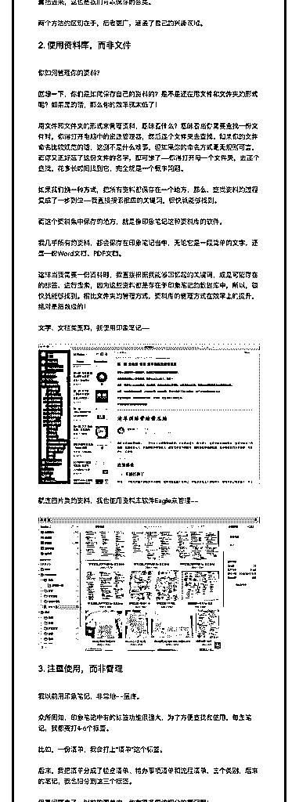
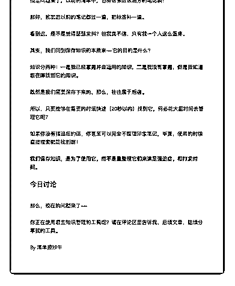

# 28.

《

《20190214 保存知识的正确姿势》

【清单介绍】 时隔一个春节，我们继续知识管理的技能清单分享。

上回说道，知识管理有学习、保存、使用、分享和创新五个步骤，我们也分享 了学习哪些知识，而具体的学习方法，可以参考之前的阅读这项技能，因为， 即使是在微课横行的时代，纵然学习课程的成本大幅降低，但是，阅读依然是 学习知识的重要渠道。

而且，阅读的技巧，为何不能用到学习微课的场景中呢？ 今天，我们就来聊聊保存知识——这可能是关于知识管理中，大家最关注的话

题了。毕竟，这个步骤，是和工具息息相关的，而大部分人，对于工具的关

注，都超过了对于技能本身的关注，哪怕这是非常致命的。

关于保存知识，我会先告诉你正确的姿势，然后再推荐一些我在使用的工具。 这份清单的目的，便是前者。

保存知识的正确姿势的检查清单：

- [ ] 1\. 保存知识，而非资料

- [ ] 2\. 使用资料库，而非文件

- [ ] 3\. 注重使用，而非管理

---

【1\. 保存知识，而非资料】 前面的文章中，我们已经说过什么是信息，什么是知识。 你是否保存了很多的“干货”文章或视频，并以此为傲？

其实，**这些只是资料而已，根本不是知识。**

上一份关于学习哪些知识的清单中，我们分享了如何构建自己的知识体系，基 于这个方法，你可以分解出自己的知识结构。

最好的方法就是，只保存属于这个知识结构的知识，其它的免谈。 另一个方法，是按照我们之前对于技能各类的划分，把诸如生活技能的领域也

囊括进来，这也是我们可以保存的各类。

两个方法的区别在于，后者更广，涵盖了自己的兴趣领域。

【2\. 使用资料库，而非文件】 你如何管理你的资料？

回想一下，你们是如何保存自己的资料的？是不是还在用文件和文件夹的形式 呢？如果是的话，那么你的效率就太低了！

用文件和文件夹的形式来管理资料，意味着什么？意味着当你需要查找一份文 件时，你得打开电脑中的资源管理器，然后逐个文件夹去查找。如果你的文件 命名比较规范的话，这倒不是什么难事，但如果你的命名方式毫无规则可言， 而你又正好忘了这份文件的名字，那可惨了——你得打开每一个文件夹，去逐 个查找，花多长时间找到它，完全就是一个概率问题。

如果我们换一种方式，把所有资料都保存在一个地方，那么，查找资料的过程 变成了一步到位——我直接搜索相应的关键词，很快就能够找到。

而这个资料集中保存的地方，就是像印象笔记这种资料库的软件。 我几乎所有的资料，都会保存在印象笔记当中，无论它是一段简单的文字，还

是一份 Word 文档、PDF 文档。

这样当我需要一份资料时，我直接根据我能够回忆起的关键词，或是可能存在 的标签，进行搜索，因为这些资料都是存在于印象笔记的数据库中，所以，很 快就能够找到。相比文件夹的管理方式，资料库的管理方式在效率上的提升， 绝对是指数级的！

文字、文档类资料，我使用印象笔记—— [图片]

就连图片类的资料，我也使用资料库软件 Eagle 来管理—— [图片]

【3\. 注重使用，而非管理】 我以前用印象笔记，非常地——蛋疼。

众所周知，印象笔记中有的标签功能很强大，为了方便查找和使用，每条笔 记，我都要打 4-6 个标签。

比如，一份清单，我会打上“清单”这个标签。 后来，我把清单分成了检查清单、待办事项清单和流程清单，三个类别，后来

的笔记，我也细分到这三个标签。

但是问题来了，以前的清单中，也有很多应该细分的笔记啊！ 那好，我就把以前的笔记都过一遍，把标签补一遍。 看到这，是不是觉得瑟瑟发抖？但我真不信，只有我一个人这么蛋疼。 其实，我们回到保存知识的本质来——它的目的是什么？ 知识分两种：**一是我已经掌握并会运用的知识，二是我没有掌握，但是我知

道能在哪找到它的知识。**

既然是我们需要保存下来的，那么，往往属于后者。

所以，只要能够在需要的时候快速（20 秒以内）找到它，何必花大量时间去管 理它呢？

如果你没有强迫症的话，你甚至可以完全不整理印象笔记，毕竟，使用的时候 直接搜索就能找到呀！

**我们保存知识，是为了使用它，而不是靠整理它们来满足强迫症，和打发时 间。**

【今日讨论】 那么，现在的问题来了——

你正在使用哪些知识管理的工具呢？请在评论区里告诉我，后续文章，陆续分 享我的工具。

评论：

