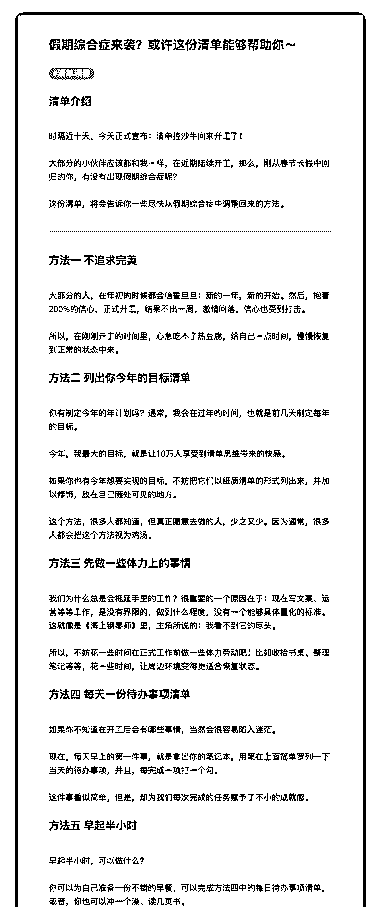
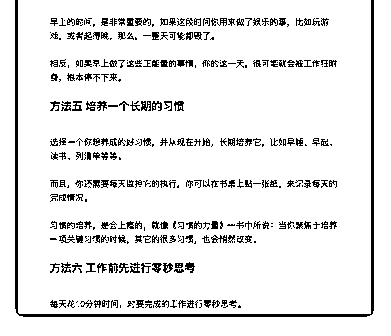

# 29.

《

《20190212 假期综合症来袭？或许这份清单能够帮助你～》

【清单介绍】 时隔近十天，今天正式宣布：清单控沙牛回来开工了！

大部分的小伙伴应该都和我一样，在近期陆续开工，那么，刚从春节长假中回 归的你，有没有出现假期综合症呢？

这份清单，将会告诉你一些尽快从假期综合症中调整回来的方法。

---

【方法一 不追求完美】

大部分的人，在年初的时候都会信誓旦旦：新的一年，新的开始。然后，抱着

200%的信心，正式开工，结果不出一周，激情回落，信心也受到打击。

所以，在刚刚开工的时间里，心急吃不了热豆腐，给自己一点时间，慢慢恢复 到正常的状态中来。

【方法二 列出你今年的目标清单】

你有制定今年的年计划吗？通常，我会在过年的时间，也就是前几天制定每年 的目标。

今年，我最大的目标，就是让 10 万人享受到清单思维带来的快感。 如果你也有今年想要实现的目标，不妨把它们以纸质清单的形式列出来，并加

以修饰，放在自己随处可见的地方。

这个方法，很多人都知道，但真正愿意去做的人，少之又少。因为通常，很多 人都会把这个方法视为鸡汤。

【方法三 先做一些体力上的事情】 我们为什么总是会拖延手里的工作？很重要的一个原因在于：现在写文案、运

营等等工作，是没有界限的，做到什么程度，没有一个能够具体量化的标准。

这就像是《海上钢琴师》里，主角所说的：我看不到它的尽头。

所以，不妨花一些时间在正式工作前做一些体力劳动吧！比如收拾书桌、整理 笔记等等，花一些时间，让周边环境变得更适合恢复状态。

【方法四 每天一份待办事项清单】 如果你不知道在开工后会有哪些事情，当然会很容易陷入迷茫。 现在，每天早上的第一件事，就是拿出你的笔记本，用笔在上面简单罗列一下

当天的待办事项，并且，每完成一项打一个勾。

这件事看似简单，但是，却为我们每次完成的任务赋予了不小的成就感。

【方法五 早起半小时】 早起半小时，可以做什么？

你可以为自己准备一份不错的早餐，可以完成方法四中的每日待办事项清单， 或者，你也可以冲一个澡、读几页书。

早上的时间，是非常重要的，如果这段时间你用来做了娱乐的事，比如玩游 戏，或者起得晚，那么，一整天可能都毁了。

相反，如果早上做了这些正能量的事情，你的这一天，很可能就会被工作狂附 身，根本停不下来。

【方法五 培养一个长期的习惯】 选择一个你想养成的好习惯，并从现在开始，长期培养它，比如早睡、早起、

读书、列清单等等。

而且，你还需要每天监控它的执行，你可以在书桌上贴一张纸，来记录每天的 完成情况。

习惯的培养，是会上瘾的，就像《习惯的力量》一书中所说：当你聚焦于培养 一项关键习惯的时候，其它的很多习惯，也会悄然改变。

【方法六 工作前先进行零秒思考】 每天花 10 分钟时间，对要完成的工作进行零秒思考。

具体的方法，可以参考我们之前的清单：[`t.zsxq.com/fmMZj`](https://t.zsxq.com/fmMZjey)ey

评论：

