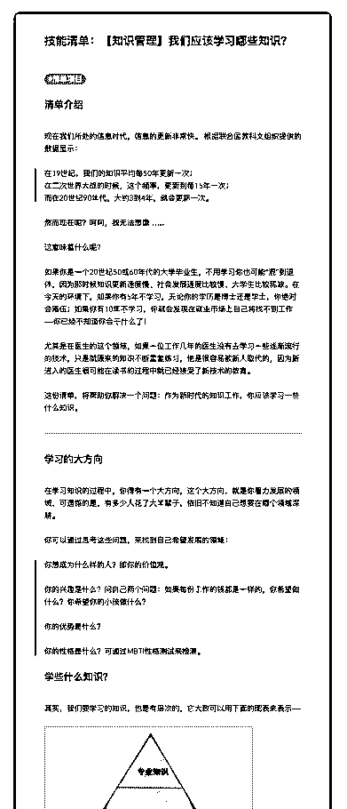
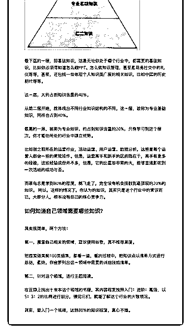

# 30.

《20190131 我们应该学习哪些知识？》

【清单介绍】

现在我们所处的信息时代，信息的更新非常快。 根据联合国教科文组织提供 的数据显示：

> 在 19 世纪，我们的知识平均每 50 年更新一次；

> 在二次世界大战的时候，这个频率，更新到每 15 年一次；

> 而在 20 世纪 90 年代，大约 3 到 4 年，就会更新一次。

然而现在呢？呵呵，我无法想像…… 这意味着什么呢？

如果你是一个 20 世纪 50 或 60 年代的大学毕业生，不用学习你也可能“混”到退 休，因为那时候知识更新速度慢、社会发展速度比较慢、大学生比较稀缺。在 今天的环境下，如果你有 5 年不学习，无论你的学历是博士还是学士，你绝对 会落伍；如果你有 10 年不学习，你就会发现在就业市场上自己将找不到工作

——你已经不知道你会干什么了！

尤其是在医生的这个领域，如果一位工作几年的医生没有去学习一些逐渐流行 的技术，只是就原来的知识不断重复练习，他是很容易被新人取代的，因为新 进入的医生很可能在读书的过程中就已经接受了新技术的教育。

这份清单，将帮助你解决一个问题：作为新时代的知识工作，你应该学习一些 什么知识。

---

【学习的大方向】

在学习知识的过程中，你得有一个大方向，这个大方向，就是你着力发展的领 域，可遗憾的是，有多少人花了大半辈子，依旧不知道自己想要在哪个领域深 耕。

你可以通过思考这些问题，来找到自己希望发展的领域：

> 你想成为什么样的人？即你的价值观。

>

> 你的兴趣是什么？问自己两个问题：如果每份工作的钱都是一样的，你希望

做什么？你希望你的小孩做什么？

>

> 你的优势是什么？

>

> 你的性格是什么？可通过 MBTI 性格测试来检测。

【学些什么知识？】

其实，我们要学习的知识，也是有层次的，它大致可以用下面的图表来表示

——

[图片]

最下面的一层，即基础知识，这是无论你处于哪个行业中，都需要的基础知 识，比如你必须得知道怎么做 PPT、怎么做知识管理，甚至是商务社交中的礼 仪等等，甚至，还包括一些体现个人知识面广度的相关知识，比如中国的历史 朝代等等。

这一层，大约占到知识含量的 40%。 从第二层开始，就体现出不同行业知识结构的不同，这一层，被称为专业基础

知识，同样也占到 40%。

最高的一层，被称为专业知识，约占到知识含量的 20%，只有学习到这个层 次，你才能在所处的行业中建立优势。

比如我之前所在的运营行业，活动运营、用户运营、数据分析，这些是每个运 营人都会一些的常规操作。但是，运营高手和新手的区别就在于，高手有更多 的经验，这些经验成份并不多，但是，它的比重却非常的大，能够直接影响到 一次活动的成功与否。

而菜鸟总是学到 80%的程度，就飞走了，完全没有机会接触到最顶层的 20%的 知识。 所以，这样的情况下，你认为的知识，其实只是这个行业中的常识而 已，大部分人，根本没有自己的核心竞争力。

【如何知道自己领域需要哪些知识？】 其实很简单，两个方法： 第一，搜索自己相关的领域，建议使用谷歌，真不推荐某度。

把搜索结果前 100 页结果，都看一遍，看的过程中，把知识点以清单方式进行 总结，最终，你会罗列出这一领域中需要的详细技能清单。

第二，针对这个领域，进行主题阅读。 在豆瓣上找出十来本这个领域的书籍，其内容程度按照入门：进阶：高级，以

5：3：2 的比例进行划分，读完它们，就能了解这个行业的大致情况。

其实，要入门一个领域，达到 80%的知识程度，真心不难。 评论：

