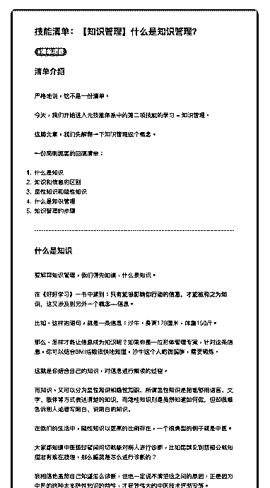

# 31.

《20190129 什么是知识管理？》

【清单介绍】 严格地说，这不是一份清单。

今天，我们开始进入元技能体系中的第二项技能的学习——知识管理。 这篇文章，我们先解释一下知识管理这个概念。 一份简明扼要的回顾清单：

1\. 什么是知识

2\. 知识和信息的区别

3\. 显性知识和隐性知识

4\. 什么是知识管理

5\. 知识管理的步骤

---

【什么是知识】 要解释知识管理，我们得先知道，什么是知识。

在《好好学习》一书中提到：**只有能够影响你行动的信息，才能被称之为知 识**，这又涉及到另外一个概念——信息。

比如，这样的语句，就是一条信息：沙牛，身高 178 厘米，体重 150 斤。 那么，怎样才能让信息成为知识呢？如果你是一位形体管理专家，针对这条信

息，你可以结合 BMI 指数很快地知道，沙牛这个人略微偏胖，需要锻炼。

这就是你结合自己的知识，对信息进行解读的过程。

而知识，又可以分为**显性知识**和**隐性知识**，所谓显性知识是指能够用 语言、文字、肢体等方式表达清楚的知识，而隐性知识则是虽然知道如何做， 但却很难告诉别人或者写明白、说明白的知识。

在我们的生活中，隐性知识以更高的比例存在，一个很典型的例子就是中医。 大家都知道中医通过望闻问切就能对病人进行诊断，比如扁鹊见到蔡桓公就知

道君有疾在腠理，那么扁鹊是怎么进行诊断的？

我相信他虽然自己知道怎么诊断，但他一定说不清楚这之间的原因，正是因为 中医的这种太多隐性知识的特性，才导致伟大的中医技术逐渐没落。

再来，十年前有一本畅销书，名叫《世界是平的》，其中指出依靠互联网技 术，几乎所有的信息我们都能唾手可得，所以，世界变得平了。

后来，一位学者专门写了一篇批判性的文章，标题叫作《谁说世界是平的》， 其中指出，这本书把知识和信息混为一坛——任何一个人都能够在网上找到外 科手术的步骤，但是，你敢让他为你动手术吗？

【什么是知识管理】 了解了什么是知识之后，知识管理的概念就简单了，也就是用有效的方式，把

自己的知识给管理起来，关键在于——管理。

现在，我们一天接受到的信息，比上世界一个人一辈子接收到的信息还要多， 如何甄别并使用有用的信息，即知识呢？

所以，对于新时代的我们来说，对于无知一词，有了新的定义——

**所谓的无知，不再是没有知识，而是不会管理自己的知识。**

知识管理的关键，在于管理二字。

在知识管理专家田志刚老师的《你的知识需要管理》一书中， 指出了知识管 理所需要的五个步骤：

1\. 学习知识

2\. 保存知识

3\. 使用知识

4\. 共享知识

5\. 创新知识

【后续】

关于知识管理的介绍，我们今天就分享到这里，接下来的清单中，我会为你分 享每一个步骤的内容，并结合我的经验，最后，再为你分享我的知识管理工 具。

By 清单控沙牛 评论：

