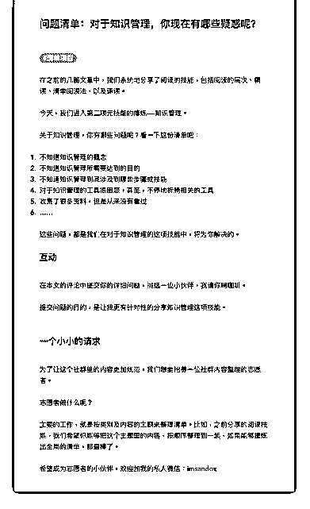

# 32.

《20190125 对于知识管理，你现在有哪些疑惑呢？》 在之前的几篇文章中，我们系统地分享了阅读的技能，包括阅读的层次、精

读、清单阅读法，以及速读。

今天，我们进入第二项元技能的修炼——知识管理。 关于知识管理，你有哪些问题呢？看一下这份清单吧： 1\. 不知道知识管理的概念

2\. 不知道知识管理所需要达到的目的

3\. 不知道知识管理到底涉及到哪些步骤或技能

4\. 对于知识管理的工具很困惑，甚至，不停地折腾相关的工具

5\. 收集了很多资料，但是从来没有看过

*   ……

这些问题，都是我们在对于知识管理的这项技能中，将为你解决的。

【互动】

在本文的评论中提交你的详细问题，挑选一位小伙伴，我请你喝咖啡。 提交问题的目的，是让我更有针对性的分享知识管理这项技能。

【一个小小的请求】

为了让这个社群里的内容更加规范，我们想要招募一位社群内容整理的志愿 者。

志愿者做什么呢？ 主要的工作，就是按类别及内容的主题来整理清单。比如，之前分享的阅读技

能，我们希望你能够把这个主题里的内容，按顺序整理到一起，如果能够提炼

出全局的清单，那最棒了。

希望成为志愿者的小伙伴，欢迎加我的私人微信：imsandox 评论：

