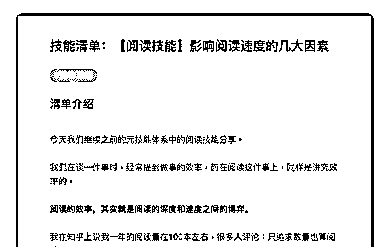
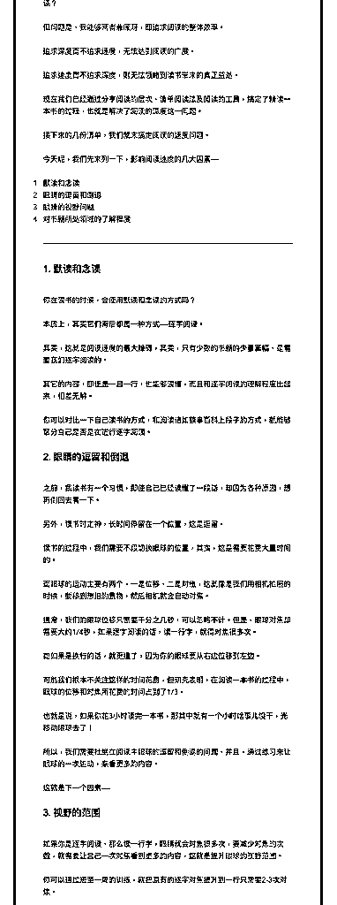
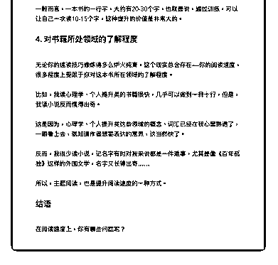

# 33.

《

《20190123 影响阅读速度的几大因素》

【清单介绍】 今天我们继续之前的元技能体系中的阅读技能分享。

我们在谈一件事时，经常提到做事的效率，而在阅读这件事上，同样是讲究效 率的。

**阅读的效率，其实就是阅读的深度和速度之间的博弈。**

我在知乎上说我一年的阅读量在 100 本左右，很多人评论：只追求数量也算阅 读？

但问题是，我能够两者兼顾呀，即追求阅读的整体效率。

追求深度而不追求速度，无法达到阅读的广度。 追求速度而不追求深度，则无法领略到读书带来的真正益处。 现在我们已经通过分享阅读的层次、清单阅读法及阅读的工具，搞定了精读一

本书的过程，也就是解决了阅读的深度这一问题。

接下来的几份清单，我们就来搞定阅读的速度问题。 今天呢，我们先来列一下，影响阅读速度的几大因素—— 1\. 默读和念读

2\. 眼睛的逗留和倒退

3\. 眼睛的视野问题

4\. 对书籍所处领域的了解程度

---

【1\. 默读和念读】 你在读书的时候，会使用默读和念读的方式吗？ 本质上，其实它们背后都是一种方式——逐字阅读。

其实，这就是阅读速度的最大障碍，其实，只有少数的书籍的少量篇幅，是需 要我们逐字阅读的。

其它的内容，即使是一目一行，也能够读懂，而且和逐字阅读的理解程度比起 来，相差无解。

你可以对比一下自己读书的方式，和阅读诸如糗事百科上段子的方式，就能够 区分自己是否是在进行逐字阅读。

【2\. 眼睛的逗留和倒退】 之前，我读书有一个习惯，即使自己已经读懂了一段话，却因为各种原因，想

再倒回去看一下。

另外，读书时走神，长时间停留在一个位置，这是逗留。 读书的过程中，我们需要不段切换眼球的位置，其实，这是需要花费大量时间

的。

而眼球的运动主要有两个，一是位移，二是对焦，这就像是我们用相机拍照的 时候，要移到想拍的景物，然后相机就会自动对焦。

通常，我们的眼球位移只需要千分之几秒，可以忽略不计。但是，眼球对焦却 需要大约 1/4 秒，如果逐字阅读的话，读一行字，就得对焦很多次。

而如果是换行的话，就更遭了，因为你的眼球要从右边位移到左边。 可能我们根本不关注这样的时间花费，但研究表明，在阅读一本书的过程中，

眼球的位移和对焦所花费的时间占到了 1/3。

也就是说，如果你花 3 小时读完一本书，那其中就有一个小时啥事儿没干，光 移动眼球去了！

所以，我们需要杜绝在阅读中眼球的逗留和倒退的问题，并且，通过练习来让 眼球的一次运动，来看更多的内容。

这就是下一个因素——

【3\. 视野的范围】 如果你是逐字阅读，那么读一行字，眼睛就会对焦很多次，要减少对焦的次

数，就需要让自己一次对焦看到更多的内容，这就是提升眼球的视野范围。

你可以通过短至一周的训练，就把原有的逐字对焦提升到一行只需要 2-3 次对 焦。

一般而言，一本书的一行字，大约有 20-30 个字，也就是说，通过训练，可以 让自己一次读 10-15 个字，这种提升的价值是非常大的。

【4\. 对书籍所处领域的了解程度】 无论你的速读技巧修炼得多么炉火纯青，这个现实总会存在——你的阅读速

度，很多程度上受限于你对这本书所在领域的了解程度。

比如，我读心理学、个人提升类的书籍很快，几乎可以做到一目十行，但是， 我读小说反而慢得出奇。

这是因为，心理学、个人提升类这些领域的概念、词汇已经在我心里熟透了， 一眼看上去，就知道作者想要表达的意思，这当然快了。

反而，我很少读小说，记名字有时对我来说都是一件难事，尤其是像《百年孤 独》这样的外国文学，名字又长得出奇……

所以，主题阅读，也是提升阅读速度的一种方式。

【结语】 在阅读速度上，你有哪些问题呢？

评论：

